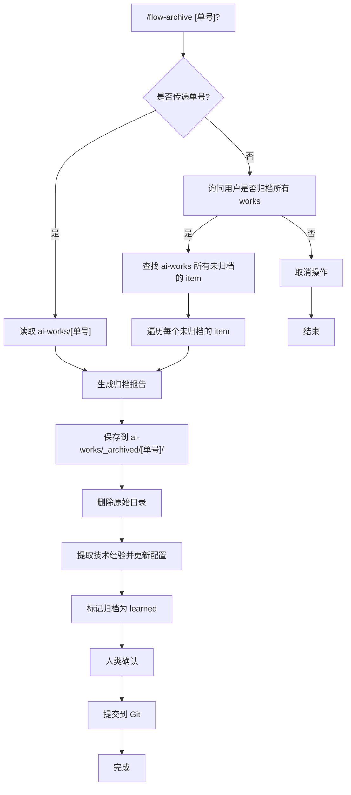

# 工作流归档指令

> 归档已完成或已终止的工作流，生成总结报告并清理文件。

## 触发指令

```
/flow-archive [单号]
```

示例：

- `/flow-archive PRD_001` - 归档指定工作流
- `/flow-archive PRD_002` - 归档指定工作流
- `/flow-archive` - 不传参数，归档所有未归档的工作流

## 适用场景

- 工作流已完成（status: completed）
- 工作流已终止（status: cancelled）
- 需要清理 ai-works 目录，保留归档记录
- 需要从已完成的工作流中提取技术经验并更新到项目配置

**注意**：归档时会自动执行学习流程，提取技术经验并更新配置文件，无需单独执行 `/flow-learn` 指令。

## 执行流程



---

## 步骤 0: 参数处理

### 0.1 检查参数

- 如果传递了 `[单号]`，进入步骤 1，处理单个工作流
- 如果未传递参数，进入步骤 0.2

### 0.2 批量归档询问

如果未传递参数：

1. **询问用户**：是否归档所有未归档的 works？
   - 提示：这将查找 `ai-works/` 目录下所有未归档的 item（不在 `_archived/` 目录中的）
   - 如果用户选择"否"，终止操作
   - 如果用户选择"是"，继续执行

2. **查找未归档的 works**：
   - 扫描 `ai-works/` 目录
   - 排除 `_archived/` 目录
   - 列出所有子目录（这些是未归档的 works）
   - 显示找到的 works 列表，让用户确认

3. **批量处理**：
   - 对每个未归档的 work，按照步骤 1-4 执行归档流程
   - 每个 work 独立生成归档报告
   - 所有归档完成后，统一询问是否提交到 Git

---

## 步骤 1: 读取工作流文件

读取 `ai-works/[单号]/` 目录下的关键文件：

### 必须读取的文件

1. **overview.json** - 工作流元数据和状态
2. **01_requirements/requirements.md** - 需求文档
3. **01_requirements/summary.md** - 需求摘要
4. **02_prd/prd.md** - PRD 文档（如果存在）
5. **02_prd/summary.md** - PRD 摘要（如果存在）
6. **06_validation/report.md** - 验证报告（如果存在）
7. **07_deploy/** - 部署相关文档（如果存在）

### 可选读取的文件

- 各阶段的 `summary.md`
- `history.json` 文件（用于时间线分析）

---

## 步骤 2: 生成归档报告

生成 `ai-works/_archived/[单号]/archive.md`，必须包含以下四个部分：

### 2.1 需求是什么

从 `requirements.md` 和 `prd.md` 提取：

- 背景与痛点
- 用户定义
- 功能范围（Must Have / Nice to Have / 不做）
- 成功指标

### 2.2 做了什么

从各阶段 `summary.md` 和 `overview.json` 提取：

- 完成的阶段列表
- 实现的功能清单（对照 PRD 中的用户故事）
- 创建的组件/API/数据表
- 代码统计（文件数、行数等，从 overview.json 的 metrics 获取）

### 2.3 还有什么没做

从 `prd.md` 和 `validation/report.md` 提取：

- Nice to Have 功能中未实现的部分
- 验证报告中的待改进项
- 已知问题或技术债务
- 后续迭代建议

### 2.4 质量如何

从 `validation/report.md` 和 `overview.json` 提取：

- 验证结果（通过/未通过）
- 代码质量指标：
  - P0 功能覆盖率
  - 类型安全检查结果
  - 文件大小合规性
  - TODO/FIXME 数量
- 文档同步率
- 测试覆盖率（如果有）
- 部署状态（如果已完成部署）

---

## 步骤 3: 归档文件

### 3.1 创建归档目录

```
ai-works/_archived/[单号]/
├── archive.md          # 归档报告
└── overview.json       # 原始 overview.json 备份（可选）
```

### 3.2 保存归档报告

将生成的 `archive.md` 保存到 `ai-works/_archived/[单号]/archive.md`

### 3.3 删除原始目录

删除 `ai-works/[单号]/` 整个目录及其所有内容

---

## 步骤 4: 提取技术经验并更新配置

在归档完成后，自动从归档报告中提取技术设计和技术经验，更新到项目配置文件中。

### 4.1 提取技术内容

从刚生成的 `archive.md` 中提取以下内容：

**技术设计相关**：
- 架构决策和设计模式
- 技术选型理由
- API 设计规范
- 数据模型设计
- 组件设计模式
- 性能优化方案
- 安全实践

**技术经验相关**：
- 遇到的问题和解决方案
- 最佳实践
- 反模式（应避免的做法）
- 代码质量改进建议
- 技术债务处理方式
- 测试策略

### 4.2 简化内容

对提取的内容进行简化：
- 去除项目特定的细节
- 保留通用的技术原则和模式
- 将经验总结为可复用的规则或约定
- 合并相似的内容，避免重复

### 4.3 更新配置文件

将提取的技术经验更新到以下配置文件：

1. **更新 `ai-coding/context/tech-config.md`**：
   - 在相应的章节中添加新的约定或规范
   - 如果内容属于新类别，创建新的章节
   - 保持文档结构清晰

2. **更新 `.cursorrules`**：
   - 在相应的章节中添加新的规则或约定
   - 保持与现有内容的一致性

3. **更新 `CLAUDE.md`**：
   - 在相应的章节中添加新的配置或约定
   - 保持与现有内容的一致性

### 4.4 标记归档为已学习

更新 `ai-works/_archived/[单号]/overview.json`：
- 添加 `learned: true` 字段
- 添加 `learned_at: [ISO 日期时间]` 字段
- 添加 `learned_summary` 字段，记录从该归档中提取的关键经验（简要描述）
- 保留原有的所有字段

**注意事项**：
- 如果提取的内容与现有配置冲突，需要人工判断或合并
- 保持内容简洁，不要添加过于详细的项目特定信息
- 遵循 Markdown 输出规范

---

## 步骤 5: 提交

**确认提示**:
向用户展示归档和学习操作的结果，包括：

- 归档报告已保存到 `ai-works/_archived/[单号]/archive.md`
- 原始目录 `ai-works/[单号]/` 已删除
- 技术经验已提取并更新到配置文件
- 归档已标记为 learned
- 询问是否提交到 Git

**提交操作** (经用户确认后):

1. 添加归档文件到 Git 暂存区：
   - `ai-works/_archived/[单号]/archive.md`
   - `ai-works/_archived/[单号]/overview.json` (如果存在)
2. 添加更新的配置文件到 Git 暂存区：
   - `ai-coding/context/tech-config.md`
   - `.cursorrules`
   - `CLAUDE.md`
3. 添加删除操作到 Git 暂存区（如果原始目录在 Git 中）
4. 创建提交，提交信息格式：`chore: archive workflow [单号] and learn from it`
5. 显示提交结果

**注意事项**:

- 如果用户拒绝提交，跳过此步骤
- 如果 Git 仓库未初始化，提示用户先初始化仓库
- 如果文件无变更，跳过提交
- 删除操作会通过 Git 自动检测到

---

## 归档报告模板

```markdown
# 工作流归档报告

> [单号] | [标题] | [状态] | [归档日期]

## 1. 需求是什么

### 背景与痛点

[从 requirements.md 提取]

### 功能范围

- **Must Have**: [列表]
- **Nice to Have**: [列表]
- **不做**: [列表]

### 成功指标

[从 requirements.md 或 prd.md 提取]

## 2. 做了什么

### 完成阶段

[从 overview.json 的 stages 提取]

### 实现功能

[对照 PRD 用户故事，列出已实现的功能]

### 代码统计

- 创建文件: [metrics.files_created]
- 修改文件: [metrics.files_modified]
- 新增行数: [metrics.lines_added]
- 删除行数: [metrics.lines_removed]

## 3. 还有什么没做

### 未实现功能

[从 Nice to Have 和验证报告中提取]

### 待改进项

[从验证报告的"待改进项"提取]

### 技术债务

[如果有，列出]

## 4. 质量如何

### 验证结果

[从 validation/report.md 提取]

### 代码质量

- P0 功能覆盖率: [百分比]
- 类型安全: [通过/未通过]
- 文件大小合规: [通过/未通过]
- TODO/FIXME: [数量]

### 文档同步率

[从验证报告提取]

### 部署状态

[如果已完成部署，说明部署情况]
```

---

## 注意事项

1. **备份重要数据**：归档前确保 overview.json 中的关键指标已保存
2. **验证文件存在**：如果某些阶段文件不存在，应在报告中标注"未执行"
3. **保持简洁**：归档报告应简洁明了，重点突出关键信息
4. **遵循 Markdown 规范**：遵循 [shared/markdown-style.md](./shared/markdown-style.md)

---

## Markdown 输出规范

所有生成的 Markdown 文档必须遵循 [shared/markdown-style.md](./shared/markdown-style.md)
