# 新建项目指令

> 交互式创建新项目的 AI Coding 工作流配置。

## 触发指令

```
/flow-create
```

## 执行流程

```mermaid
flowchart TD
    A["/flow-create"] --> B["生成 project.md"]
    
    subgraph STAGE1["阶段 1: 项目规划"]
        B --> B1["询问项目名称"]
        B1 --> B2["询问目标用户"]
        B2 --> B3["询问核心功能"]
        B3 --> B4["询问页面结构"]
        B4 --> B5["询问优先级"]
        B5 --> B6["生成文档"]
        B6 --> B7{"用户确认?"}
        B7 -->|"修改"| B6
    end
    
    B7 -->|"确认"| C["生成 ui-config.md"]
    
    subgraph STAGE2["阶段 2: UI 配置"]
        C --> C1["选择视觉风格"]
        C1 --> C2["选择主题模式"]
        C2 --> C3["选择主色调"]
        C3 --> C4["选择字体/动画"]
        C4 --> C5["选择组件库"]
        C5 --> C6["生成文档"]
        C6 --> C7{"用户确认?"}
        C7 -->|"修改"| C6
    end
    
    C7 -->|"确认"| D["生成 tech-config.md"]
    
    subgraph STAGE3["阶段 3: 技术配置"]
        D --> D1["选择前端框架"]
        D1 --> D2["选择数据库/ORM"]
        D2 --> D3["选择状态管理"]
        D3 --> D4["选择 AI 集成"]
        D4 --> D5["选择部署平台"]
        D5 --> D6["生成文档"]
        D6 --> D7{"用户确认?"}
        D7 -->|"修改"| D6
    end
    
    D7 -->|"确认"| E["安装依赖"]
    
    subgraph STAGE4["阶段 4: 初始化"]
        E --> E1["检查 Node.js 版本"]
        E1 --> E2["pnpm install"]
        E2 --> E3["创建目录结构"]
        E3 --> E4["初始化配置"]
        E4 --> E5["pnpm dev 验证"]
    end
    
    E5 --> F["初始化完成"]
    F --> G["可执行 /flow-start"]
```



---

## 阶段 1: 生成 project.md

**输出**: `ai-coding/context/project.md`

### 询问用户

1. **项目名称和定位**
   - 项目叫什么名字？
   - 一句话描述项目定位？

2. **目标用户**
   - 目标用户是谁？

3. **核心功能**
   - 主要功能模块有哪些？（列举）
   - 每个模块的核心功能点？

4. **页面结构**
   - 需要哪些页面？
   - 哪些需要登录才能访问？

5. **开发优先级**
   - 哪些功能是 P0 必须先做的？
   - 哪些可以后续迭代？

### 生成后

展示 project.md 内容，询问：
- `确认` - 进入下一阶段
- `修改 [具体内容]` - 根据反馈修改

---

## 阶段 2: 生成 ui-config.md

**依赖**: project.md
**输出**: `ai-coding/context/ui-config.md`

### 询问用户（提供可选项）

1. **视觉风格**
   - [ ] 赛博朋克
   - [ ] 极简现代
   - [ ] 企业商务
   - [ ] 活泼多彩
   - [ ] 其他: ___

2. **主题模式**
   - [ ] 仅深色
   - [ ] 仅浅色
   - [ ] 深色+浅色切换
   - [ ] 跟随系统

3. **主色调**
   - [ ] 绿色系 (如 #00FF41)
   - [ ] 蓝色系 (如 #00D4FF)
   - [ ] 紫色系 (如 #BF00FF)
   - [ ] 橙色系 (如 #FF6B35)
   - [ ] 自定义: ___

4. **字体风格**
   - [ ] 像素/复古
   - [ ] 等宽/代码风
   - [ ] 无衬线现代
   - [ ] 系统默认

5. **动画强度**
   - [ ] 丰富动效
   - [ ] 适度动效
   - [ ] 最小动效

6. **组件库**
   - [ ] Chakra UI
   - [ ] Shadcn/ui
   - [ ] Ant Design
   - [ ] MUI
   - [ ] 其他: ___

### 生成后

展示 ui-config.md 内容，询问：
- `确认` - 进入下一阶段
- `修改 [具体内容]` - 根据反馈修改

---

## 阶段 3: 生成 tech-config.md

**依赖**: project.md
**输出**: `ai-coding/context/tech-config.md`

### 询问用户（提供可选项）

1. **前端框架**
   - [ ] Next.js (App Router)
   - [ ] Next.js (Pages Router)
   - [ ] React + Vite
   - [ ] Vue + Nuxt
   - [ ] 其他: ___

2. **数据库**
   - [ ] PostgreSQL + Supabase
   - [ ] PostgreSQL + 自建
   - [ ] MySQL
   - [ ] MongoDB
   - [ ] SQLite
   - [ ] 其他: ___

3. **ORM**
   - [ ] Drizzle
   - [ ] Prisma
   - [ ] TypeORM
   - [ ] 无 ORM

4. **数据获取**
   - [ ] TanStack Query
   - [ ] 原生 fetch
   - [ ] 其他: ___

5. **状态管理**
   - [ ] Zustand
   - [ ] Jotai
   - [ ] Redux Toolkit
   - [ ] Context API
   - [ ] 无需全局状态

6. **AI 集成** (如需要)
   - [ ] LangChain + LangGraph
   - [ ] Vercel AI SDK
   - [ ] 直接调用 API
   - [ ] 不需要 AI

7. **部署平台**
   - [ ] Vercel
   - [ ] Cloudflare Pages
   - [ ] Railway
   - [ ] Docker 自建
   - [ ] 其他: ___

8. **代码规范**
   - TypeScript 严格模式? [是/否]
   - 文件大小限制? [如 300 行]
   - 测试覆盖要求? [是/否]

### 生成后

展示 tech-config.md 内容，询问：
- `确认` - 进入下一阶段
- `修改 [具体内容]` - 根据反馈修改

---

## 阶段 4: 安装依赖和初始化项目

**依赖**: project.md, tech-config.md

### 执行步骤

1. **检查环境**
   ```bash
   node -v  # 检查 Node.js 版本
   ```

2. **安装依赖** (基于 tech-config.md 选择)
   ```bash
   pnpm install
   # 根据选择安装额外依赖
   ```

3. **初始化项目结构** (如需要)
   - 创建目录结构
   - 初始化配置文件

4. **验证**
   ```bash
   pnpm dev  # 确认项目可运行
   ```

### 完成提示

```
初始化完成！

已创建配置文件：
- ai-coding/context/project.md
- ai-coding/context/ui-config.md
- ai-coding/context/tech-config.md

项目依赖已安装，可以使用 /flow-start [需求] 开始工作流。
```

---

## 用户响应格式

详见 [shared/response-format.md](./shared/response-format.md)