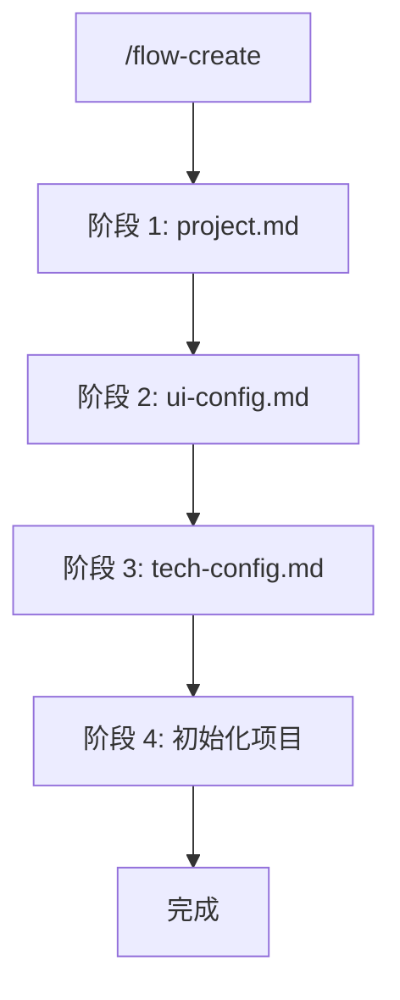

# 新建项目指令

> 交互式创建新项目的 AI Coding 工作流配置。

## 触发指令

```
/flow-create
```

## 执行流程



## 阶段说明

### 阶段 1: 生成 project.md

- **询问清单**: [shared/config-questions/project-questions.md](./shared/config-questions/project-questions.md)
- **默认配置**: [shared/config-defaults/project-defaults.md](./shared/config-defaults/project-defaults.md)
- **流程**: 按问题列表询问 → 结合默认值生成

### 阶段 2: 生成 ui-config.md

- **询问清单**: [shared/config-questions/ui-config-questions.md](./shared/config-questions/ui-config-questions.md)
- **默认配置**: [shared/config-defaults/ui-config-defaults.md](./shared/config-defaults/ui-config-defaults.md)
- **流程**: 按问题列表询问（提供可选项）→ 结合默认值生成

### 阶段 3: 生成 tech-config.md

- **询问清单**: [shared/config-questions/tech-config-questions.md](./shared/config-questions/tech-config-questions.md)
- **默认配置**: [shared/config-defaults/tech-config-defaults.md](./shared/config-defaults/tech-config-defaults.md)
- **流程**: 按问题列表询问（提供可选项）→ 结合默认值生成
- **额外**: 如启用 VSCode 自动格式化，生成 `.vscode/settings.json`

### 阶段 4: 初始化项目

1. 检查 Node.js 版本
2. `pnpm install` 安装依赖
3. 创建目录结构，初始化配置文件
4. `pnpm dev` 验证

## 完成提示

```
初始化完成！

已创建配置文件：
- ai-coding/context/project.md
- ai-coding/context/ui-config.md
- ai-coding/context/tech-config.md

项目依赖已安装，可以使用 /flow-start [需求] 开始工作流。
```

## 使用说明

详见 [shared/config-questions/README.md](./shared/config-questions/README.md)

## 用户响应格式

详见 [shared/response-format.md](./shared/response-format.md)
