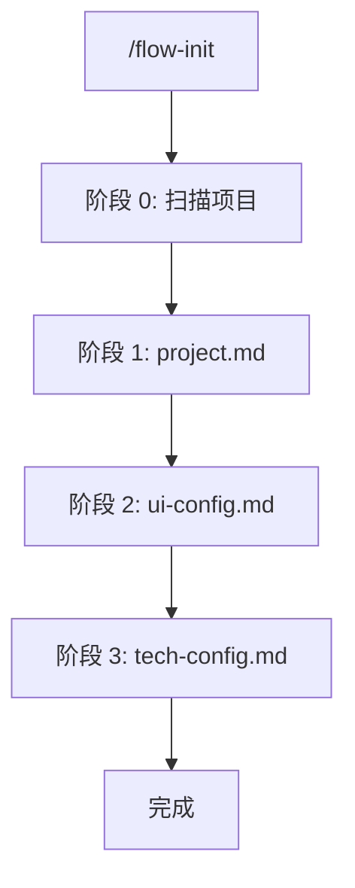

# 初始化已有项目指令

> 扫描现有代码库，生成 AI Coding 工作流配置。

## 触发指令

```
/flow-init
```

## 执行流程



## 阶段说明

### 阶段 0: 扫描项目

扫描内容用于填充询问清单：
- **项目结构**: `package.json`, `src/` 目录
- **技术栈**: 框架、数据库、ORM、UI库、状态管理、i18n、ESLint、Prettier
- **UI配置**: 主题文件、颜色、字体
- **开发工具**: VSCode 配置

### 阶段 1: 生成 project.md

- **询问清单**: [shared/config-questions/project-questions.md](./shared/config-questions/project-questions.md)
- **默认配置**: [shared/config-defaults/project-defaults.md](./shared/config-defaults/project-defaults.md)
- **流程**: 用扫描结果填充 → 询问确认/修改 → 结合默认值生成

### 阶段 2: 生成 ui-config.md

- **询问清单**: [shared/config-questions/ui-config-questions.md](./shared/config-questions/ui-config-questions.md)
- **默认配置**: [shared/config-defaults/ui-config-defaults.md](./shared/config-defaults/ui-config-defaults.md)
- **流程**: 用扫描结果填充 → 询问确认/修改 → 结合默认值生成

### 阶段 3: 生成 tech-config.md

- **询问清单**: [shared/config-questions/tech-config-questions.md](./shared/config-questions/tech-config-questions.md)
- **默认配置**: [shared/config-defaults/tech-config-defaults.md](./shared/config-defaults/tech-config-defaults.md)
- **流程**: 用扫描结果填充 → 询问确认/修改 → 结合默认值生成
- **额外**: 如启用 VSCode 自动格式化且配置缺失，生成 `.vscode/settings.json`

## 完成提示

```
初始化完成！

已基于现有项目生成配置文件：
- ai-coding/context/project.md
- ai-coding/context/ui-config.md
- ai-coding/context/tech-config.md

可以使用 /flow-start [需求] 开始工作流。
```

## 使用说明

详见 [shared/config-questions/README.md](./shared/config-questions/README.md)

## 用户响应格式

详见 [shared/response-format.md](./shared/response-format.md)
