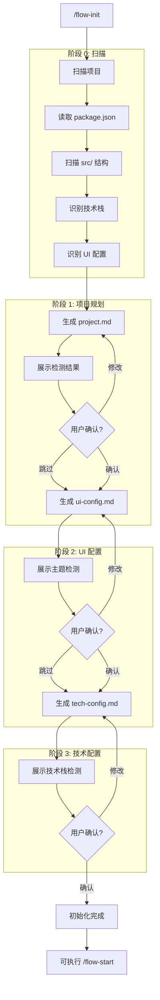

# 初始化已有项目指令

> 扫描现有代码库，生成 AI Coding 工作流配置。

## 触发指令

```
/flow-init
```

## 执行流程



---

## 阶段 0: 扫描项目

### 扫描内容

1. **项目结构**
   - 读取 `package.json` 获取项目名称、依赖
   - 扫描 `src/` 目录结构

2. **技术栈识别**
   - 框架: Next.js / React / Vue
   - 数据库: 通过 ORM 配置识别
   - UI 库: Chakra / Shadcn / Ant Design
   - 状态管理: Zustand / Redux / Jotai

3. **UI 配置识别**
   - 主题文件: `theme.ts` / `tailwind.config.js`
   - 颜色变量、字体配置

---

## 阶段 1: 生成 project.md

**输出**: `ai-coding/context/project.md`

### 基于扫描结果，询问用户确认

1. **项目名称和定位**
   - 检测到项目名: `xxx`，是否正确？
   - 请用一句话描述项目定位

2. **核心功能**
   - 检测到以下页面/模块: `[列表]`
   - 是否有遗漏或需要修改？

3. **开发优先级**
   - 哪些是核心功能 (P0)?
   - 哪些可以后续迭代?

### 生成后

展示 project.md 内容，询问：
- `确认` - 进入下一阶段
- `修改 [具体内容]` - 根据反馈修改

---

## 阶段 2: 生成 ui-config.md

**依赖**: project.md, 扫描结果
**输出**: `ai-coding/context/ui-config.md`

### 基于扫描结果，询问用户确认

1. **检测到的 UI 库**
   - 如: Chakra UI v3
   - 是否正确？

2. **检测到的主题配置**
   - 主色调: `#xxx`
   - 字体: `xxx`
   - 是否需要调整？

3. **补充信息**
   - 视觉风格描述？
   - 动画偏好？

### 生成后

展示 ui-config.md 内容，询问：
- `确认` - 进入下一阶段
- `修改 [具体内容]` - 根据反馈修改

---

## 阶段 3: 生成 tech-config.md

**依赖**: project.md, 扫描结果
**输出**: `ai-coding/context/tech-config.md`

### 基于扫描结果，询问用户确认

1. **检测到的技术栈**
   ```
   框架: Next.js (App Router)
   数据库: PostgreSQL + Supabase
   ORM: Drizzle
   数据获取: TanStack Query
   状态管理: Zustand
   AI: LangChain + LangGraph
   ```
   - 是否正确？需要补充？

2. **检测到的项目结构**
   ```
   src/
   ├── app/        # 路由
   ├── components/ # 组件
   ├── hooks/      # Hooks
   ├── lib/        # 服务
   ├── types/      # 类型
   └── utils/      # 工具
   ```
   - 是否需要调整？

3. **代码规范**
   - 检测到 ESLint 配置
   - 是否有额外规范要求？

### 生成后

展示 tech-config.md 内容，询问：
- `确认` - 完成初始化
- `修改 [具体内容]` - 根据反馈修改

---

## 完成提示

```
初始化完成！

已基于现有项目生成配置文件：
- ai-coding/context/project.md
- ai-coding/context/ui-config.md
- ai-coding/context/tech-config.md

可以使用 /flow-start [需求] 开始工作流。
```

---

## 用户响应格式

详见 [shared/response-format.md](./shared/response-format.md)