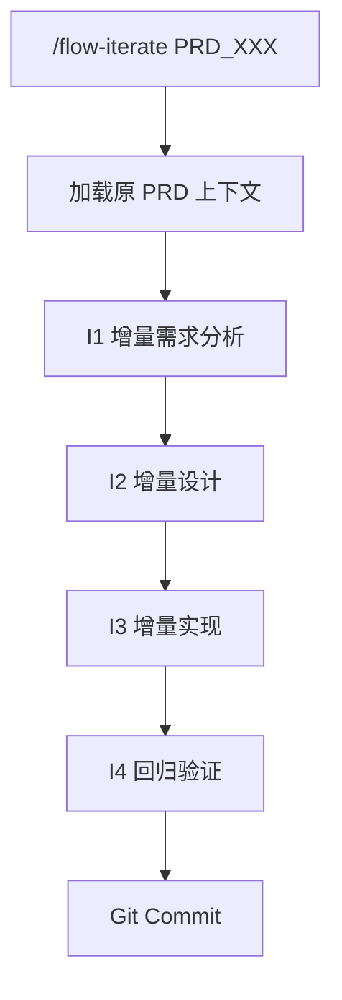

# 迭代工作流指令

> 在已完成的 PRD 基础上进行功能迭代，复用已有设计文档。

## 适用场景

- **功能增强**: 给列表增加批量操作
- **需求变更**: 修改验证规则
- **版本迭代**: 登录模块 V2
- **补充功能**: 补充数据导出功能

## 触发指令

```
/flow-iterate [PRD_XXX] [迭代需求]
```

**示例**:
```
/flow-iterate PRD_001 给行为记录列表增加搜索和筛选功能
```

## 与完整模式对比

迭代模式复用原 PRD 上下文，生成补丁文档而非完整文档，增加回归测试。

详细流程对比见 [action-work.md](./action-work.md)

## 流程详情



---

## I1: 增量需求分析

1. 加载原 PRD 上下文
2. 对比分析：识别变更类型（新增/修改/删除）
3. 影响范围分析

**输出**: `ai-works/ITR_XXX/i1_analysis/analysis.md`

---

## I2: 增量设计

生成补丁文档而非重写：

**输出**:
```
ai-works/ITR_XXX/i2_design/
├── prd-patch.md       # PRD 补丁
├── ui-patch.md        # UI 设计补丁 (如涉及)
└── tech-patch.md      # 技术设计补丁
```

---

## I3: 增量实现

按补丁文档修改代码，遵循原代码风格。

**输出**: `ai-works/ITR_XXX/i3_implementation/changes.md`

---

## I4: 回归验证

1. 增量测试：为新增/修改的 AC 编写测试
2. 回归测试：运行原 PRD 的测试用例

**输出**: `ai-works/ITR_XXX/i4_validation/report.md`

---

## 工作目录结构

```
ai-works/ITR_XXX/
├── overview.json
├── i1_analysis/
├── i2_design/
├── i3_implementation/
└── i4_validation/
```

## 单号规则

- 迭代单号: `ITR_XXX`
- Git 分支: `feat/ITR_XXX` 或 `feat/PRD_XXX-v2`

---

## Markdown 输出规范

所有生成的 Markdown 文档必须遵循 [shared/markdown-style.md](./shared/markdown-style.md)
