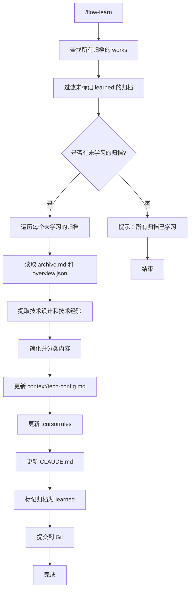

# 工作流学习指令（已合并到 archive 指令）

> **注意**：此指令已合并到 `/flow-archive` 指令中。归档工作流时会自动执行学习流程，无需单独执行此指令。

从归档的工作流中提取技术设计和技术经验，更新到项目配置文件中，确保后续 AI flow 可以吸取教训。

## 触发指令

```
/flow-learn
```

**已废弃**：请使用 `/flow-archive` 指令，归档时会自动执行学习流程。

## 适用场景

- 归档的工作流中包含有价值的技术设计经验
- 需要将技术教训沉淀到项目配置中
- 确保后续开发能够避免重复错误或采用已验证的最佳实践

## 执行流程



---

## 步骤 1: 查找归档的 works

### 1.1 扫描归档目录

扫描 `ai-works/_archived/` 目录，查找所有归档的工作流：

- 每个子目录代表一个归档的工作流
- 读取每个归档目录下的 `archive.md` 和 `overview.json`

### 1.2 检查学习状态

对于每个归档，检查是否已标记为 `learned`：

- 如果 `overview.json` 中存在 `learned: true`，跳过该归档
- 如果不存在 `learned` 字段或 `learned: false`，标记为未学习

### 1.3 列出未学习的归档

向用户展示：

- 找到的未学习归档数量
- 每个归档的单号和标题
- 询问是否继续学习这些归档

---

## 步骤 2: 提取技术内容

### 2.1 读取归档文件

对于每个未学习的归档，读取以下文件：

- `ai-works/_archived/[单号]/archive.md` - 归档报告
- `ai-works/_archived/[单号]/overview.json` - 工作流元数据

### 2.2 提取技术设计内容

从 `archive.md` 中提取以下内容：

**技术设计相关**：

- 架构决策和设计模式
- 技术选型理由
- API 设计规范
- 数据模型设计
- 组件设计模式
- 性能优化方案
- 安全实践

**技术经验相关**：

- 遇到的问题和解决方案
- 最佳实践
- 反模式（应避免的做法）
- 代码质量改进建议
- 技术债务处理方式
- 测试策略

### 2.3 简化内容

对提取的内容进行简化：

- 去除项目特定的细节
- 保留通用的技术原则和模式
- 将经验总结为可复用的规则或约定
- 合并相似的内容，避免重复

---

## 步骤 3: 更新配置文件

### 3.1 更新 tech-config.md

将提取的技术设计内容添加到 `ai-coding/context/tech-config.md`：

- 在相应的章节中添加新的约定或规范
- 如果内容属于新类别，创建新的章节
- 保持文档结构清晰，使用适当的标题层级
- 遵循 Markdown 输出规范

**更新位置示例**：

- 架构约定：添加新的架构模式
- 代码质量：添加新的质量要求
- 集成约定：添加新的集成规范
- 类型约定：添加新的类型规范
- API 约定：添加新的 API 规范
- 数据库约定：添加新的数据库规范

### 3.2 更新 .cursorrules

将提取的技术经验添加到 `.cursorrules`：

- 在相应的章节中添加新的规则或约定
- 如果内容属于新类别，创建新的章节
- 保持与现有内容的一致性
- 遵循 Markdown 输出规范

**更新位置示例**：

- 代码质量：添加新的质量规则
- 集成约定：添加新的集成规则
- 类型约定：添加新的类型规则
- API 约定：添加新的 API 规则
- 数据库约定：添加新的数据库规则

### 3.3 更新 CLAUDE.md

将提取的技术经验添加到 `CLAUDE.md`：

- 在相应的章节中添加新的配置或约定
- 如果内容属于新类别，创建新的章节
- 保持与现有内容的一致性
- 遵循 Markdown 输出规范

**更新位置示例**：

- 代码质量：添加新的质量要求
- 集成约定：添加新的集成规范
- 类型约定：添加新的类型规范
- API 约定：添加新的 API 规范
- 数据库约定：添加新的数据库规范

---

## 步骤 4: 标记为已学习

### 4.1 更新 overview.json

对于每个已处理的归档，更新 `ai-works/_archived/[单号]/overview.json`：

- 添加 `learned: true` 字段
- 添加 `learned_at: [ISO 日期时间]` 字段
- 保留原有的所有字段

### 4.2 记录学习摘要

可选：在 `overview.json` 中添加 `learned_summary` 字段，记录从该归档中提取的关键经验（简要描述）。

---

## 步骤 5: 提交

**确认提示**:
向用户展示学习操作的结果，包括：

- 处理的归档数量
- 更新的配置文件列表
- 提取的关键技术经验摘要
- 询问是否提交到 Git

**提交操作** (经用户确认后):

1. 添加更新的文件到 Git 暂存区：
   - `ai-coding/context/tech-config.md`
   - `.cursorrules`
   - `CLAUDE.md`
   - 所有更新的 `ai-works/_archived/[单号]/overview.json` 文件
2. 创建提交，提交信息格式：`chore: learn from archived works [归档单号列表]`
3. 显示提交结果

**注意事项**:

- 如果用户拒绝提交，跳过此步骤
- 如果 Git 仓库未初始化，提示用户先初始化仓库
- 如果文件无变更，跳过提交

---

## 内容提取指南

### 技术设计内容识别

重点关注以下部分：

1. **架构决策**：
   - 为什么选择某个技术方案
   - 架构模式的采用理由
   - 系统设计的权衡考虑

2. **设计模式**：
   - 使用的设计模式
   - 模式的应用场景
   - 模式的优缺点

3. **API 设计**：
   - RESTful 设计规范
   - 请求/响应格式约定
   - 错误处理方式

4. **数据模型**：
   - 数据库设计原则
   - 表结构设计规范
   - 索引和查询优化

5. **组件设计**：
   - 组件拆分原则
   - 组件复用策略
   - 状态管理方式

### 技术经验内容识别

重点关注以下部分：

1. **问题与解决方案**：
   - 遇到的技术问题
   - 问题的根本原因
   - 有效的解决方案

2. **最佳实践**：
   - 验证有效的开发方式
   - 推荐的代码组织方式
   - 性能优化技巧

3. **反模式**：
   - 应避免的做法
   - 常见错误和陷阱
   - 不推荐的技术选型

4. **技术债务**：
   - 已知的技术债务
   - 债务的处理方式
   - 预防债务的方法

### 内容简化原则

1. **通用化**：去除项目特定细节，保留通用原则
2. **结构化**：将经验组织为清晰的规则或约定
3. **去重**：合并相似内容，避免重复
4. **优先级**：优先保留重要的、可复用的经验
5. **简洁性**：保持内容简洁明了，易于理解

---

## 注意事项

1. **保持一致性**：更新的内容应与现有配置保持一致
2. **避免冲突**：如果提取的内容与现有内容冲突，需要人工判断或合并
3. **保持简洁**：不要添加过于详细的项目特定信息
4. **遵循规范**：所有更新的文档必须遵循 Markdown 输出规范
5. **验证更新**：更新后检查文档格式和内容是否正确

---

## Markdown 输出规范

所有生成的 Markdown 文档必须遵循 [shared/markdown-style.md](./shared/markdown-style.md)
