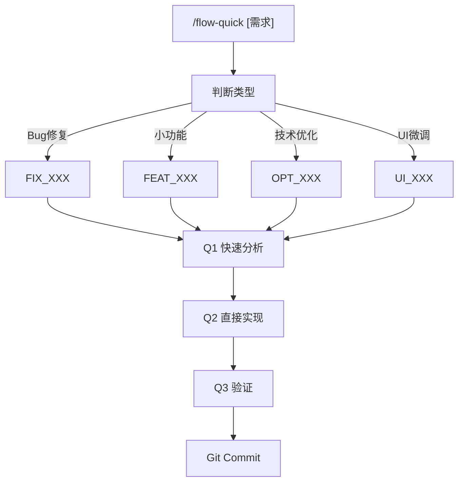

# 轻量工作流指令

> 快速迭代模式，跳过产品设计阶段，直接进入技术实现。

## 适用场景

- **Bug 修复**: 修复登录页面的表单验证错误
- **小功能迭代**: 给列表增加排序功能
- **技术优化**: 优化 API 响应速度
- **UI 微调**: 调整按钮间距和颜色

## 触发指令

```
/flow-quick [需求描述]
```

## 与完整模式对比

轻量模式跳过 PRD、UI设计阶段，简化技术设计为修改清单，前后端合并实施。

详细流程对比见 [action-work.md](./action-work.md)

## 流程详情



---

## Q1: 快速分析

**目标**: 5分钟内确认修改范围

1. 理解需求（Bug: 复现/期望/实际；功能: 具体要求；优化: 目标指标）
2. 定位相关代码
3. 生成修改清单

**输出**: `ai-works/[单号]/quick-analysis.md`

---

## Q2: 直接实现

1. 按清单逐一修改
2. 每个文件修改后运行 `pnpm tsc --noEmit`
3. 运行验证脚本

**输出**: `ai-works/[单号]/changes.md`

---

## Q3: 验证

- **功能验证**: 手动测试 - 问题已解决
- **编译检查**: `pnpm tsc --noEmit` - 无错误
- **Lint检查**: `pnpm lint` - 无错误
- **单元测试**: `pnpm test` - 全部通过

### 回归检查范围

- **`src/lib/*-service.ts`**: 对应 API + 前端页面
- **`src/app/api/**`**: 调用该 API 的前端功能
- **`src/components/**`**: 包含该组件的页面

---

## 工作目录结构

```
ai-works/[单号]/
├── quick-analysis.md
├── changes.md
└── history.json
```

## 何时升级到完整模式

- **修改文件 > 10**: 影响范围过大
- **需要新增数据表**: 涉及数据模型变更
- **需要新增 API > 3**: 接口设计复杂
- **需要新增页面**: 涉及 UI 设计

---

## Markdown 输出规范

所有生成的 Markdown 文档必须遵循 [shared/markdown-style.md](./shared/markdown-style.md)
