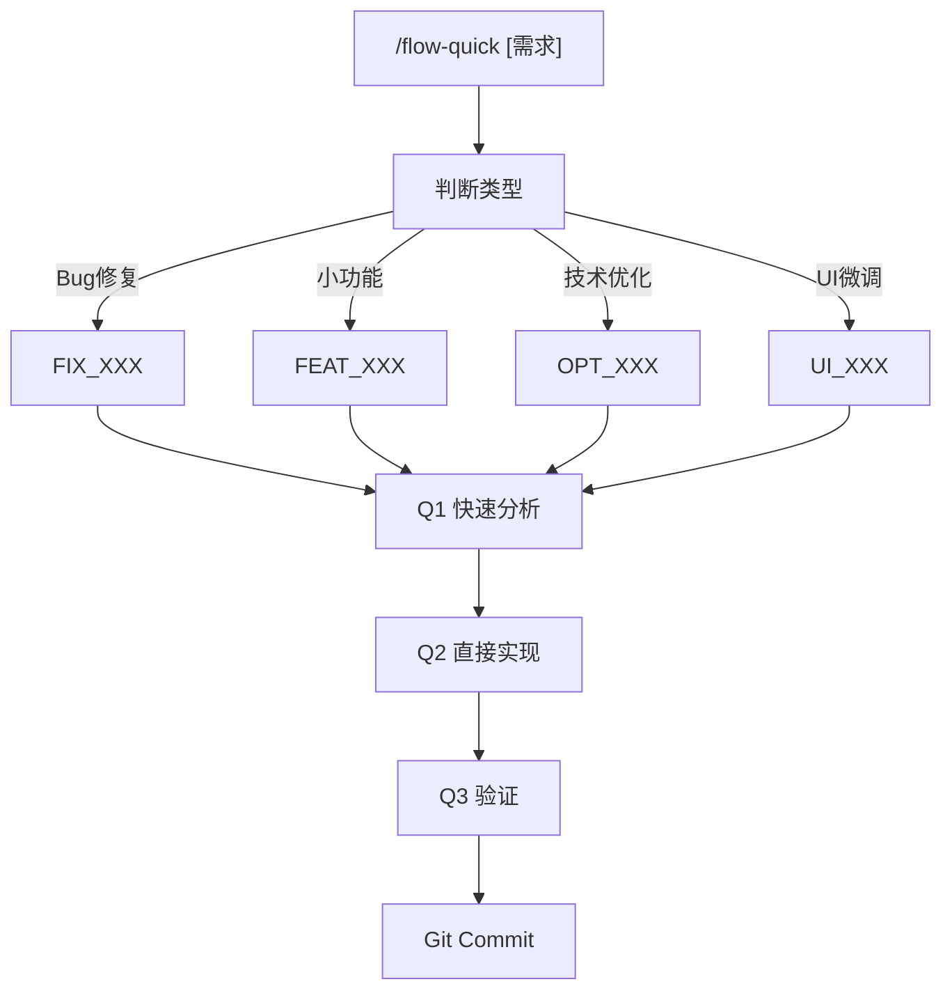

# 轻量工作流指令

> 快速迭代模式，跳过产品设计阶段，直接进入技术实现。

## 适用场景

- **Bug 修复**: 修复登录页面的表单验证错误
- **小功能迭代**: 给列表增加排序功能
- **技术优化**: 优化 API 响应速度
- **UI 微调**: 调整按钮间距和颜色

## 触发指令

```
/flow-quick [需求描述]
```

轻量模式跳过 PRD、UI设计阶段，简化技术设计为修改清单。

## 流程详情



---

## Q1: 快速分析

1. 理解需求（Bug: 复现/期望/实际；功能: 具体要求；优化: 目标指标）
2. 定位相关代码
3. 生成修改清单

**输出**: `ai-works/[单号]/quick-analysis.md`

---

## Q2: 直接实现

1. 按清单逐一修改
2. 每个文件修改后运行 `pnpm tsc --noEmit`
3. 运行验证脚本

**输出**: `ai-works/[单号]/changes.md`

---

## Q3: 验证

- 功能验证: 手动测试
- 编译检查: `pnpm tsc --noEmit`
- Lint检查: `pnpm lint`
- 单元测试: `pnpm test`

## 何时升级到完整模式

- 修改文件 > 10
- 需要新增数据表
- 需要新增 API > 3
- 需要新增页面

## Markdown 输出规范

所有生成的 Markdown 文档必须遵循 [shared/markdown-style.md](./shared/markdown-style.md)
