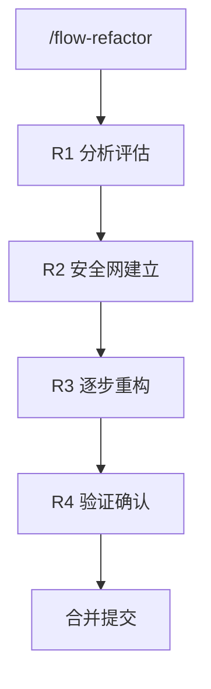

# 重构工作流指令

> 纯技术重构，不改变功能行为，跳过产品设计阶段。

## 适用场景

- **性能优化**: 优化数据库查询
- **代码质量**: 拆分大文件、提取公共逻辑
- **架构调整**: 重构 Service 层
- **技术升级**: 升级 React 18 → 19
- **债务清理**: 移除废弃 API

## 触发指令

```
/flow-refactor [范围] [目标]
```

**示例**: `/flow-refactor src/server/services/auth-service.ts 拆分为多个小文件`

## 重构原则

1. **行为不变**: 重构前后功能完全一致
2. **小步快跑**: 每次只做一小步，频繁提交
3. **测试保障**: 有测试覆盖才能放心重构
4. **可回滚**: 每个提交都是可回滚的状态

## 流程详情



---

## R1: 分析评估

1. 扫描目标代码
2. 识别问题点（代码异味、重复代码、过大文件）
3. 评估风险
4. 制定重构计划（分解为小步骤）

**输出**: `ai-works/REF_XXX/r1_analysis/plan.md`

---

## R2: 安全网建立

1. 检查测试覆盖率
2. 补充测试（如覆盖不足）
3. 运行基准测试

**输出**: `ai-works/REF_XXX/r2_safety/baseline.md`

---

## R3: 逐步重构

- 每次只做一件事
- 每步验证：`pnpm tsc --noEmit && pnpm lint && pnpm test`
- 每步提交：`refactor: [REF_XXX] step N - 具体操作`
- 失败就回滚

---

## R4: 验证确认

1. 运行全量测试
2. 对比基准（测试数量、通过率、性能）
3. 生成报告

**输出**: `ai-works/REF_XXX/r4_validation/report.md`

## 单号规则

- 重构单号: `REF_XXX`
- Git 分支: `refactor/REF_XXX`
