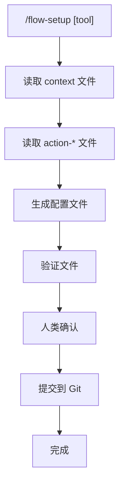

# 初始化 AI Coding Tool 配置

> 为不同的 AI coding tool 生成 prompts 配置文件。

## 触发指令

```
/flow-setup [tool]
```

**支持的 tool**:
- `claude` - Claude Code (Claude Desktop)
- `cursor` - Cursor IDE

## 执行流程



## 执行步骤

### 步骤 1: 检查 context 文件

检查以下文件是否存在：
- `ai-coding/context/project.md`
- `ai-coding/context/ui-config.md`
- `ai-coding/context/tech-config.md`

如缺失，提示用户先运行 `/flow-init`。

### 步骤 2: 生成配置文件

#### Claude Code (`claude`)

**生成 CLAUDE.md** (项目根目录)
- 从 `project.md`, `tech-config.md`, `ui-config.md` 提取内容

**生成 .claude/commands/*.md**

#### Cursor (`cursor`)

**生成 .cursorrules** (项目根目录)
- 从 `project.md`, `tech-config.md`, `ui-config.md` 提取内容

**生成 .cursor/commands/*.md**

### 步骤 3: 生成命令文件

**命令映射规则**:
- `action-init.md` → `flow-init.md`
- `action-work.md` → `flow-start.md`
- `action-quick.md` → `flow-quick.md`
- `action-iterate.md` → `flow-iterate.md`
- `action-refactor.md` → `flow-refactor.md`
- `action-archive.md` → `flow-archive.md`
- `action-status.md` → 拆分为 `flow-status.md`, `flow-list.md`, `flow-sync-check.md`, `read-full.md`

**命令文件格式** (必须包含):
```markdown
# [命令名称]

[简要说明]

## 触发指令
```
[触发指令]
```

## 重要提示

**在执行此命令前，必须先读取完整的详细说明文件：**

`ai-coding/action-[name].md`

该文件包含完整的执行流程、详细步骤、输出格式等所有必要信息。请先读取该文件，然后按照其中的详细说明执行。

## 执行流程

[简化版流程说明 - 仅作为快速参考]

## 参数说明

[参数说明，如有]

## 详细说明

完整的工作流说明、执行步骤、输出格式等详细信息，请参考：

`ai-coding/action-[name].md`

**请务必在执行前阅读该文件的完整内容。**
```

### 步骤 4: 验证

- 检查生成的配置文件是否存在
- 验证每个命令文件都包含"重要提示"和"详细说明"部分，指向正确的原始 action 文件

### 步骤 5: 提交

展示已生成的文件列表，询问是否提交到 Git。

**提交信息**: `chore: setup [tool] AI coding tool configuration`

