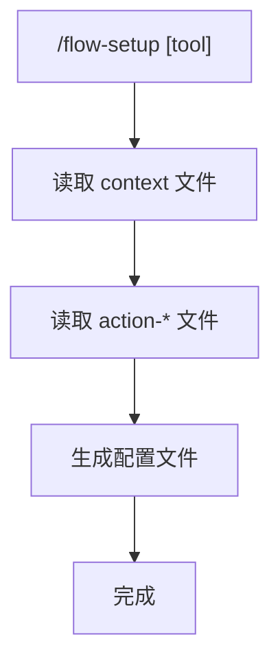

# 初始化 AI Coding Tool 配置

> 为不同的 AI coding tool 生成 prompts 配置文件。

## 触发指令

```
/flow-setup [tool]
```

**支持的 tool**:
- `claude` - Claude Code (Claude Desktop)
- `cursor` - Cursor IDE

## 执行流程



## Claude Code 配置 (`claude`)

### 1. 生成 CLAUDE.md

### 1. 生成 CLAUDE.md

**读取**: `ai-coding/context/project.md`, `ai-coding/context/ui-config.md`, `ai-coding/context/tech-config.md`

**生成**: 项目根目录 `CLAUDE.md`

**内容结构**:
```markdown
# [项目名称]

## 项目概述
[从 project.md 提取：名称、定位、核心价值、目标用户]

## 技术栈
[从 tech-config.md 提取：框架、数据库、ORM、状态管理、i18n 等]

## UI 配置
[从 ui-config.md 提取：品牌、配色、字体、组件库等]

## 项目结构
[从 tech-config.md 提取项目结构说明]

## 代码规范
[从 tech-config.md 提取：TypeScript、ESLint、Prettier、测试等]
```

### 2. 生成 .claude/commands

**读取**: `ai-coding/action-*.md` 文件

**生成**: `.claude/commands/*.md` 命令文件

**命令映射规则**:
- `action-init.md` → `flow-init.md`
- `action-work.md` → `flow-start.md`
- `action-quick.md` → `flow-quick.md`
- `action-iterate.md` → `flow-iterate.md`
- `action-refactor.md` → `flow-refactor.md`
- `action-status.md` → 拆分为多个命令文件：
  - `flow-status.md`
  - `flow-list.md`
  - `flow-sync-check.md`
  - `read-full.md`

**命令文件格式**:
每个命令文件应包含：
- 触发指令（从 action 文件中提取）
- 简要说明（从 action 文件描述中提取）
- 详细说明在映射的原始md文件路径
- 执行流程（简化版流程图或步骤）
- 关键参数说明（如有）

## 执行步骤

### 步骤 1: 检查 context 文件

检查以下文件是否存在：
- `ai-coding/context/project.md`
- `ai-coding/context/ui-config.md`
- `ai-coding/context/tech-config.md`

如缺失，提示用户先运行 `/flow-init`。

## Cursor 配置 (`cursor`)

### 1. 生成 .cursorrules

**读取**: `ai-coding/context/project.md`, `ai-coding/context/ui-config.md`, `ai-coding/context/tech-config.md`

**生成**: 项目根目录 `.cursorrules`

**内容结构**:
```
[项目名称] - [项目定位]

## 技术栈
[从 tech-config.md 提取：框架、数据库、ORM、状态管理、i18n 等]

## 项目结构
[从 tech-config.md 提取项目结构说明]

## 代码规范
[从 tech-config.md 提取：TypeScript、ESLint、Prettier、测试等]

## UI 配置
[从 ui-config.md 提取：品牌、配色、字体、组件库等]
```

### 2. 生成 .cursor/commands

**读取**: `ai-coding/action-*.md` 文件

**生成**: `.cursor/commands/*.md` 命令文件

**命令映射规则**: 与 Claude Code 相同

---

## 执行步骤

### 步骤 1: 检查 context 文件

检查以下文件是否存在：
- `ai-coding/context/project.md`
- `ai-coding/context/ui-config.md`
- `ai-coding/context/tech-config.md`

如缺失，提示用户先运行 `/flow-init`。

### 步骤 2: 根据 tool 类型生成配置

#### Claude Code (`claude`)

**生成 CLAUDE.md**

**读取内容**:
- 从 `project.md` 提取：项目名称、定位、核心价值、目标用户、功能模块
- 从 `tech-config.md` 提取：技术栈、项目结构、代码规范、约定
- 从 `ui-config.md` 提取：品牌、配色、字体、组件规范

**生成格式**:
```markdown
# [项目名称]

> [项目定位]

## 项目概述
[从 project.md 提取]

## 技术栈
[从 tech-config.md 提取]

## UI 配置
[从 ui-config.md 提取]

## 项目结构
[从 tech-config.md 提取]

## 代码规范
[从 tech-config.md 提取]
```

**生成 .claude/commands**

#### Cursor (`cursor`)

**生成 .cursorrules**

**读取内容**:
- 从 `project.md` 提取：项目名称、定位
- 从 `tech-config.md` 提取：技术栈、项目结构、代码规范、约定
- 从 `ui-config.md` 提取：品牌、配色、字体、组件规范

**生成格式**: 纯文本格式，简洁明了，适合作为 AI 规则

**生成 .cursor/commands**

### 步骤 3: 生成命令文件

**扫描 action 文件**:
- `ai-coding/action-init.md`
- `ai-coding/action-work.md`
- `ai-coding/action-quick.md`
- `ai-coding/action-iterate.md`
- `ai-coding/action-refactor.md`
- `ai-coding/action-status.md`

**生成规则**:

1. **单个命令文件** (action-init, action-work, action-quick, action-iterate, action-refactor):
   - 提取触发指令
   - 提取简要说明（文件描述）
   - 提取执行流程（简化）
   - 提取关键参数

2. **多个命令文件** (action-status):
   - 根据文件中的多个触发指令，拆分为多个命令文件
   - `flow-status.md` - 提取 `/flow-status` 相关说明
   - `flow-list.md` - 提取 `/flow-list` 相关说明
   - `flow-sync-check.md` - 提取 `/flow-sync-check` 相关说明
   - `read-full.md` - 提取 `/read-full` 相关说明

**命令文件格式**:
```markdown
# [命令名称]

[简要说明]

## 触发指令

```
[触发指令]
```

## 执行流程

[简化版流程说明]

## 参数说明

[参数说明，如有]
```

### 步骤 4: 验证

**Claude Code**:
- 检查 `CLAUDE.md` 是否存在且格式正确
- 检查 `.claude/commands/` 目录下的所有命令文件是否存在

**Cursor**:
- 检查 `.cursorrules` 是否存在且格式正确
- 检查 `.cursor/commands/` 目录下的所有命令文件是否存在

验证命令文件内容完整性

## 完成提示

### Claude Code (`claude`)

```
配置生成完成！

已生成文件：
- CLAUDE.md
- .claude/commands/flow-init.md
- .claude/commands/flow-start.md
- .claude/commands/flow-quick.md
- .claude/commands/flow-iterate.md
- .claude/commands/flow-refactor.md
- .claude/commands/flow-status.md
- .claude/commands/flow-list.md
- .claude/commands/flow-sync-check.md
- .claude/commands/read-full.md

现在可以在 Claude Code 中使用这些命令了。
```

### Cursor (`cursor`)

```
配置生成完成！

已生成文件：
- .cursorrules
- .cursor/commands/flow-init.md
- .cursor/commands/flow-start.md
- .cursor/commands/flow-quick.md
- .cursor/commands/flow-iterate.md
- .cursor/commands/flow-refactor.md
- .cursor/commands/flow-status.md
- .cursor/commands/flow-list.md
- .cursor/commands/flow-sync-check.md
- .cursor/commands/read-full.md

现在可以在 Cursor 中使用这些命令了。
```

