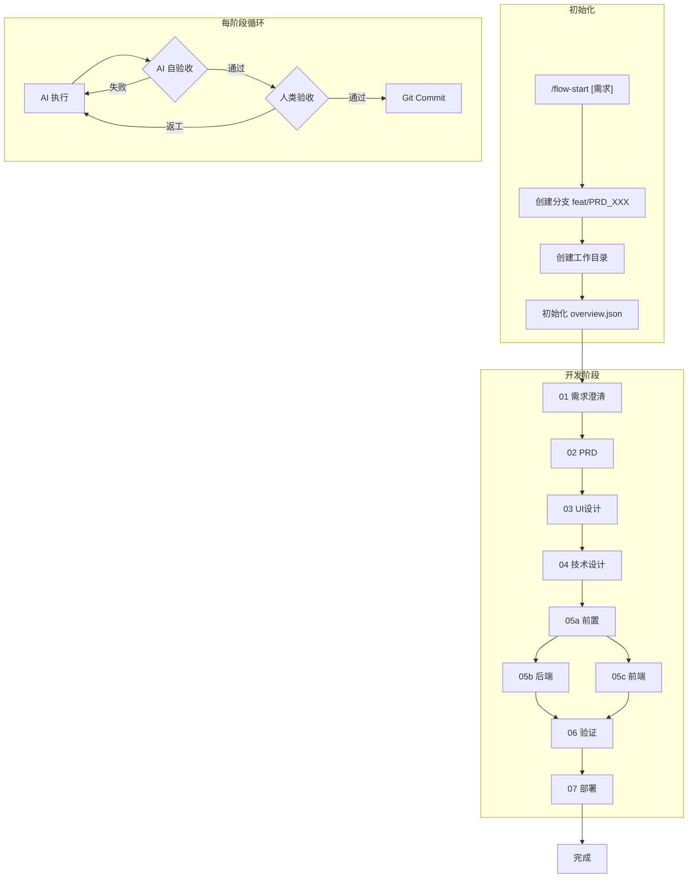

# 工作流指令

> 执行 AI Coding 工作流，管理需求开发全流程。

## 触发指令

- **`/flow-start [需求]`**: 初始化流程：生成单号 `PRD_XXX`，创建分支，创建目录，开始执行

## 流程总览

## 阶段定义

- **01-需求澄清**: [01-requirements.md](./workflow/01-requirements.md) - 风险: 高, 人类介入: 必须
- **02-PRD**: [02-prd.md](./workflow/02-prd.md) - 风险: 中, 人类介入: 可选, 并行: 与03
- **03-UI设计**: [03-ui-design.md](./workflow/03-ui-design.md) - 风险: 中, 人类介入: 可选, 并行: 与02
- **04-技术设计**: [04-tech-design.md](./workflow/04-tech-design.md) - 风险: 高, 人类介入: 必须
- **05a-前置**: [05a-implementation-prep.md](./workflow/05a-implementation-prep.md) - 风险: 低, 人类介入: 自动
- **05b-后端**: [05b-implementation-backend.md](./workflow/05b-implementation-backend.md) - 风险: 中, 人类介入: 可选, 并行: 与05c
- **05c-前端**: [05c-implementation-frontend.md](./workflow/05c-implementation-frontend.md) - 风险: 中, 人类介入: 可选, 并行: 与05b
- **06-验证**: [06-validation.md](./workflow/06-validation.md) - 风险: 高, 人类介入: 必须
- **07-部署**: [07-deploy.md](./workflow/07-deploy.md) - 风险: 高, 人类介入: 必须

## 测试左移策略

- **04 技术设计**: 测试用例草案
- **05a 前置**: 类型测试
- **05b 后端**: 同步编写单元测试
- **05c 前端**: 同步编写组件测试
- **06 验证**: E2E + 回归测试

## 文档代码同步机制

### 同步检查矩阵

- **api-spec.md**: API 端点 - `src/app/api/**`
- **tech-design.md**: 数据模型 - `src/db/schema.ts`
- **ui-design.md**: 组件清单 - `src/components/**`

### 检查触发时机

- 05 阶段完成后（自动）
- 06 验证阶段（自动）
- 07 部署前（自动）
- 任意时刻：`/flow-sync-check`（详见 [action-status.md](./action-status.md)）

### 同步率门槛

- **05 完成**: ≥ 90%
- **06 验证**: ≥ 95%
- **07 部署**: = 100%

## 执行模式

AI **自动连续执行**，根据风险等级决定暂停：

- **高**: 人类介入必须 - 阶段: 01、04、06、07
- **中**: 人类介入可选 - 阶段: 02、03、05b、05c
- **低**: 人类介入自动 - 阶段: 05a

### 自动通过条件

可选阶段满足以下条件时自动通过：
1. AI 自验收全部通过
2. 验证脚本通过（详见 [validation-scripts.md](./shared/validation-scripts.md)，推荐 `flow-stage-validate.sh`）
3. 无新增 TODO/FIXME

### AI 交叉验证

- **02-PRD**: 反向推导：用 PRD 反推原始需求
- **03-UI**: 故事覆盖：每个 US 有对应 UI
- **04-技术**: 数据流模拟：模拟 API 调用链
- **05a**: 类型一致性：Client ↔ Server ↔ Schema
- **05b**: API 契约：实现与 api-spec.md 一致
- **05c**: UI 还原：组件与 03 设计一致
- **06**: 验收覆盖：每个 AC 有测试用例

## 自动提交

每阶段人类验收通过后自动 Git Commit，格式：`docs/feat/fix/test: [PRD_XXX_XX] description`

数据格式详见 [shared/data-structures.md](./shared/data-structures.md)

## Context 缓存机制

### 读取规则

- **project.md**: 首次读取时机: 01 阶段开始, 缓存范围: 整个流程
- **ui-config.md**: 首次读取时机: 03 阶段开始, 缓存范围: 03, 05c, 06
- **tech-config.md**: 首次读取时机: 04 阶段开始, 缓存范围: 04, 05a, 05b, 05c, 06

**规范口径**: 技术规范以 `context/tech-config.md` 为唯一口径；如与阶段文档冲突，必须先修订再继续。

### 阶段可用上下文

- **01**: 可用缓存: PROJECT, 阶段产出依赖: -
- **02**: 可用缓存: PROJECT, 阶段产出依赖: 01/summary
- **03**: 可用缓存: PROJECT, UI, 阶段产出依赖: 01/summary
- **04**: 可用缓存: PROJECT, UI, TECH, 阶段产出依赖: 02/summary, 03/summary
- **05a**: 可用缓存: PROJECT, UI, TECH, 阶段产出依赖: 04/summary
- **05b**: 可用缓存: TECH, 阶段产出依赖: 05a/summary
- **05c**: 可用缓存: UI, TECH, 阶段产出依赖: 05a/summary, 03/summary
- **06**: 可用缓存: UI, TECH, 阶段产出依赖: 02/prd, 05b/summary, 05c/summary
- **07**: 可用缓存: -, 阶段产出依赖: 06/report

## Context 压缩机制

每阶段完成后生成 `summary.md`（~50-100行），后续阶段优先读取摘要。

### summary.md 格式

包含：核心结论、关键产出、供后续阶段使用、注意事项、关键词索引

当摘要不足时，通过关键词索引定位原文章节，或使用 `/read-full [阶段]`（详见 [action-status.md](./action-status.md)）。

## 并行阶段协调

### 同步检查点

- **02 & 03**: 检查点: 用户故事覆盖、术语一致性, 下一阶段: 04
- **05b & 05c**: 检查点: API 契约、类型一致性、文件冲突, 下一阶段: 06

### 05b & 05c 职责边界

- **`src/types/*`**: 05b 后端: 只读, 05c 前端: 只读
- **`src/lib/*-service.ts`**: 05b 后端: 创建/修改, 05c 前端: -
- **`src/app/api/**`**: 05b 后端: 创建/修改, 05c 前端: -
- **`src/hooks/*`**: 05b 后端: -, 05c 前端: 创建/修改
- **`src/components/**`**: 05b 后端: -, 05c 前端: 创建/修改

### 前端 Mock 策略

05c 开发时可使用 Mock，后端完成后切换 `NEXT_PUBLIC_USE_MOCK=false` 联调。

### 进入 06 前置条件

1. 05b、05c 都已完成
2. 同步检查点通过
3. 合并分支（如使用独立分支）

---

## Markdown 输出规范

所有生成的 Markdown 文档必须遵循 [shared/markdown-style.md](./shared/markdown-style.md)

