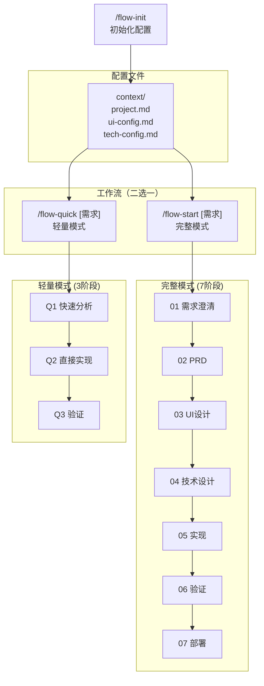

# AI Coding 指令中心

> 统一管理 AI Coding 工作流的所有指令。

## 整体流程



## 指令总览

### 初始化指令

- **`/flow-init`**: 创建或初始化配置（可选择是否从现有项目扫描） - [action-init.md](./action-init.md)

### 工作流指令

- **`/flow-start [需求]`**: 完整工作流（7阶段） - [action-work.md](./action-work.md)
- **`/flow-quick [需求]`**: 轻量工作流（3阶段） - [action-quick.md](./action-quick.md)
- **`/flow-iterate [PRD_XXX]`**: 在已有 PRD 基础上迭代 - [action-iterate.md](./action-iterate.md)
- **`/flow-refactor [范围]`**: 纯技术重构 - [action-refactor.md](./action-refactor.md)

### 状态管理指令

- **`/flow-status`**: 查看当前工作流状态
- **`/flow-list`**: 列出所有工作流
- **`/flow-sync-check [单号]?`**: 检查文档与代码同步状态
- **`/read-full [阶段] [关键词]?`**: 强制读取完整文档

> 状态管理指令详情见 [action-work.md](./action-work.md)

---

## 目录结构

```
ai-coding/
├── action.md              ← 当前文件（指令中心）
├── action-init.md         ← 初始化配置指令
├── action-work.md         ← 完整工作流指令
├── action-quick.md        ← 轻量工作流指令
├── action-iterate.md      ← 迭代工作流指令
├── action-refactor.md     ← 重构工作流指令
├── shared/                ← 共享定义
│   ├── data-structures.md ← 数据结构定义
│   └── validation-scripts.md ← 验证脚本
├── context/               ← 项目配置
│   ├── project.md
│   ├── ui-config.md
│   └── tech-config.md
├── workflow/              ← 工作流阶段定义
│   ├── 01-requirements.md
│   ├── 02-prd.md
│   ├── 03-ui-design.md
│   ├── 04-tech-design.md
│   ├── 05a-implementation-prep.md
│   ├── 05b-implementation-backend.md
│   ├── 05c-implementation-frontend.md
│   ├── 06-validation.md
│   └── 07-deploy.md
ai-works/                  ← 工作记录（与 ai-coding 同级）
    └── PRD_XXX/
        ├── overview.json
        └── [阶段目录]/
```

---

## Markdown 输出规范

所有工作流生成的 Markdown 文档必须遵循 [shared/markdown-style.md](./shared/markdown-style.md)：

- 不使用 emoji
- 不使用冗余的样式
- 优先使用列表而非表格
