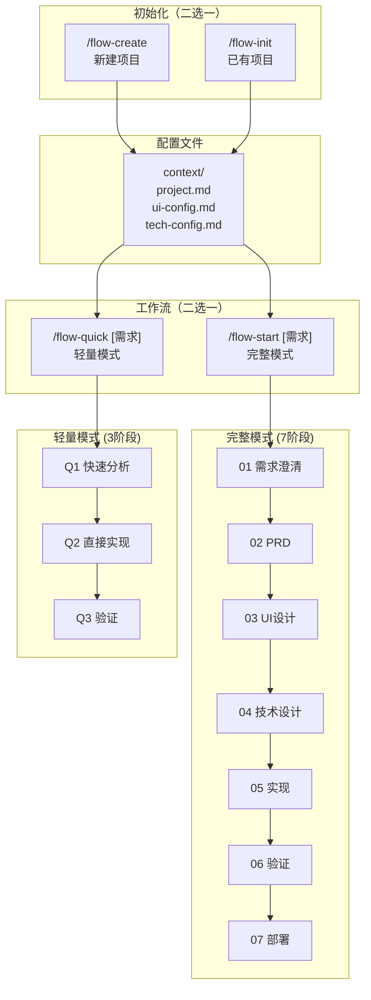

# AI Coding 指令中心

> 统一管理 AI Coding 工作流的所有指令。

## 整体流程



## 指令总览

### 初始化指令

| 指令 | 说明 | 详细文档 |
|------|------|---------|
| `/flow-create` | 新建项目，交互式生成配置 | [action-create.md](./action-create.md) |
| `/flow-init` | 初始化已有项目，扫描并生成配置 | [action-init.md](./action-init.md) |

### 工作流指令

| 指令 | 说明 | 详细文档 |
|------|------|---------|
| `/flow-start [需求]` | 完整工作流（7阶段） | [action-work.md](./action-work.md) |
| `/flow-quick [需求]` | 轻量工作流（3阶段） | [action-quick.md](./action-quick.md) |
| `/flow-iterate [PRD_XXX]` | 在已有 PRD 基础上迭代 | [action-iterate.md](./action-iterate.md) |
| `/flow-refactor [范围]` | 纯技术重构 | [action-refactor.md](./action-refactor.md) |

### 状态管理指令

| 指令 | 说明 |
|------|------|
| `/flow-status` | 查看当前工作流状态 |
| `/flow-list` | 列出所有工作流 |
| `/flow-continue [单号]?` | 从快照恢复，继续工作流 |
| `/flow-save [备注]?` | 手动保存当前进度快照 |
| `/flow-rollback [快照ID]` | 回滚到指定快照 |
| `/flow-sync-check [单号]?` | 检查文档与代码同步状态 |
| `/read-full [阶段] [关键词]?` | 强制读取完整文档 |

> 状态管理指令详情见 [action-work.md](./action-work.md)

---

## 目录结构

```
ai-coding/
├── action.md              ← 当前文件（指令中心）
├── action-create.md       ← 新建项目指令
├── action-init.md         ← 初始化已有项目指令
├── action-work.md         ← 完整工作流指令
├── action-quick.md        ← 轻量工作流指令
├── action-iterate.md      ← 迭代工作流指令
├── action-refactor.md     ← 重构工作流指令
├── shared/                ← 共享定义
│   ├── response-format.md ← 用户响应格式
│   ├── data-structures.md ← 数据结构定义
│   └── validation-scripts.md ← 验证脚本
├── context/               ← 项目配置
│   ├── project.md
│   ├── ui-config.md
│   └── tech-config.md
├── workflow/              ← 工作流阶段定义
│   ├── 01-requirements.md
│   ├── 02-prd.md
│   ├── 03-ui-design.md
│   ├── 04-tech-design.md
│   ├── 05a-implementation-prep.md
│   ├── 05b-implementation-backend.md
│   ├── 05c-implementation-frontend.md
│   ├── 06-validation.md
│   └── 07-deploy.md
└── works/                 ← 工作记录
    └── PRD_XXX/
        ├── overview.json
        ├── snapshots/
        └── [阶段目录]/
```

---

## 用户响应格式

详见 [shared/response-format.md](./shared/response-format.md)
