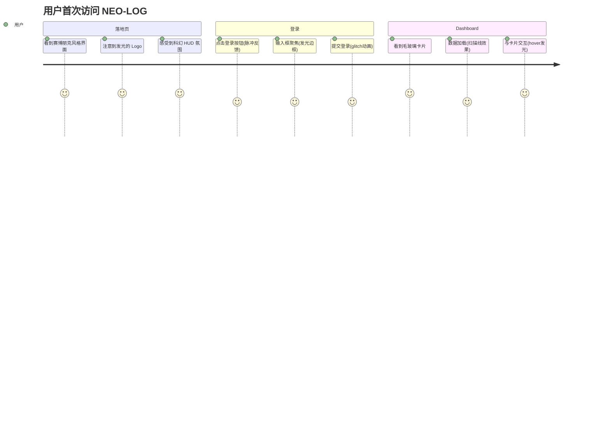
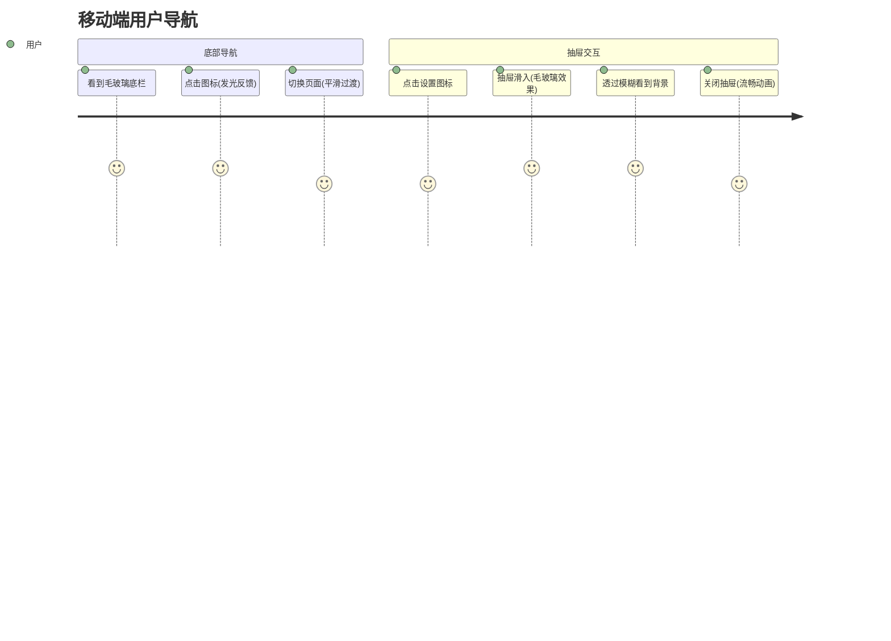
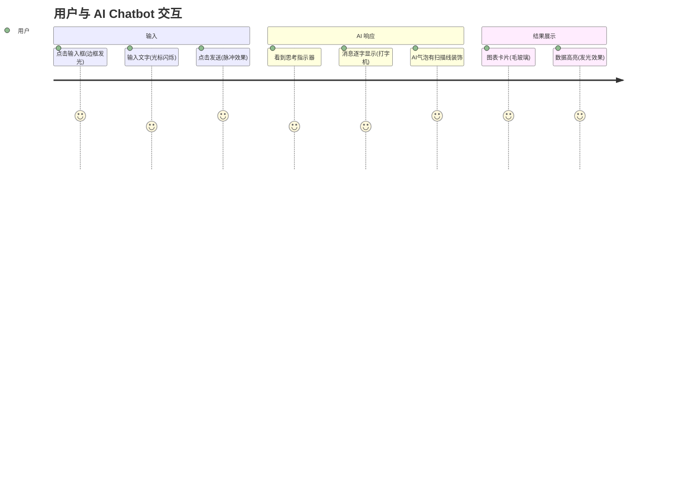
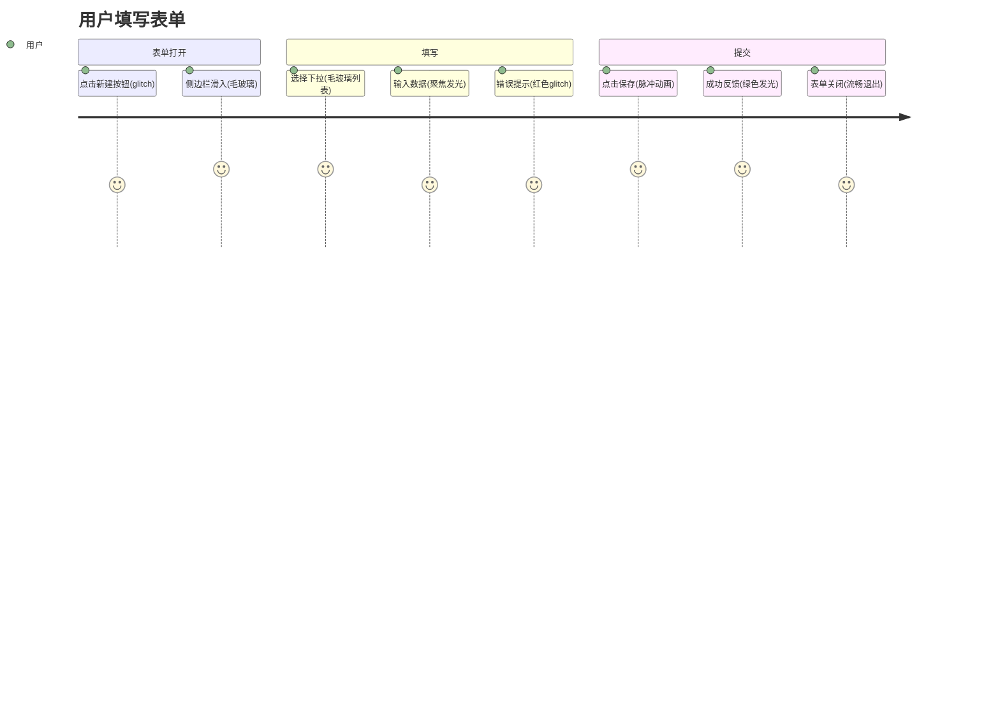

# PRD_003 用户旅程图

## 旅程 1: 首次访问体验



## 旅程 2: 移动端导航体验



## 旅程 3: AI 对话体验



## 旅程 4: 表单交互体验



## 关键触点与视觉效果映射

| 触点 | 组件 | 视觉效果 | 优先级 |
|------|------|----------|--------|
| 页面背景 | - | 网格纹理 + 扫描线 | P0 |
| 卡片容器 | Card | 毛玻璃 + 边框发光 | P0 |
| 底部导航 | BottomNav | 毛玻璃 + 图标发光 | P0 |
| 抽屉面板 | Drawer | 毛玻璃 + 边缘光晕 | P0 |
| 下拉菜单 | Select/Menu | 毛玻璃 + 发光边框 | P0 |
| 主按钮 | Button | 渐变 + hover脉冲 | P0 |
| 输入框 | Input | 聚焦发光 + 扫描线 | P0 |
| 标签/徽章 | Badge | 半透明 + 发光边框 | P1 |
| AI 气泡 | - | 扫描线装饰 | P1 |
| 加载状态 | - | 矩阵雨/扫描线 | P1 |

## 情感曲线

```
满意度
  ^
5 |     ●───●           ●───●
  |    /     \         /     \
4 |   /       ●───────●       \
  |  /                         \
3 | ●                           ●
  |
  +-----------------------------------> 时间
    登录  Dashboard  交互  表单  完成
```

**情感高点**:
- 首次看到赛博朋克界面的惊艳感
- 毛玻璃效果带来的层次感
- 交互反馈的科技感

**需关注点**:
- 确保动画不影响操作流畅度
- 毛玻璃模糊度不影响内容可读性
