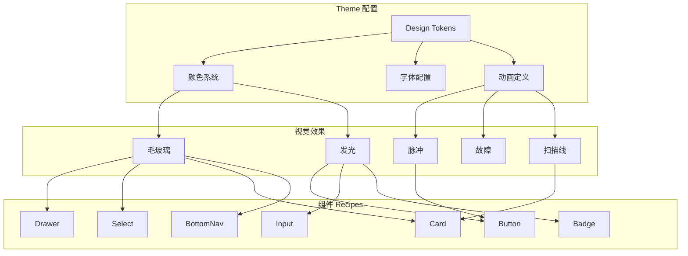
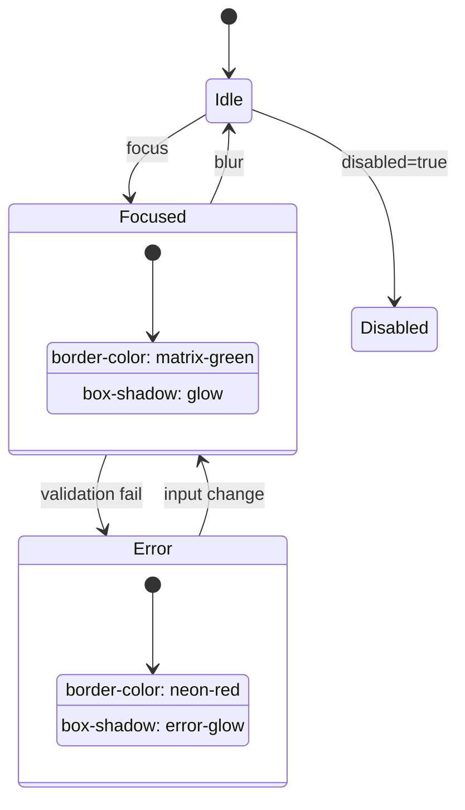
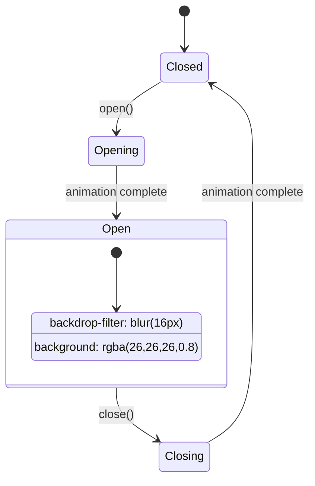
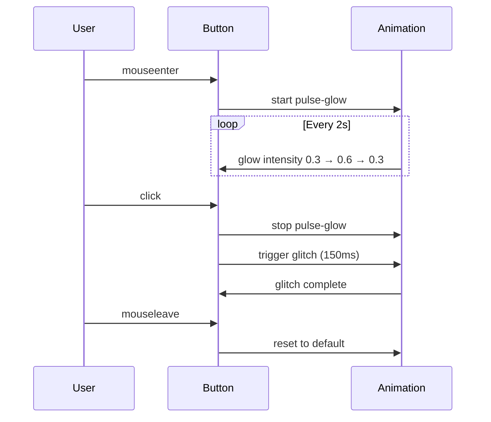
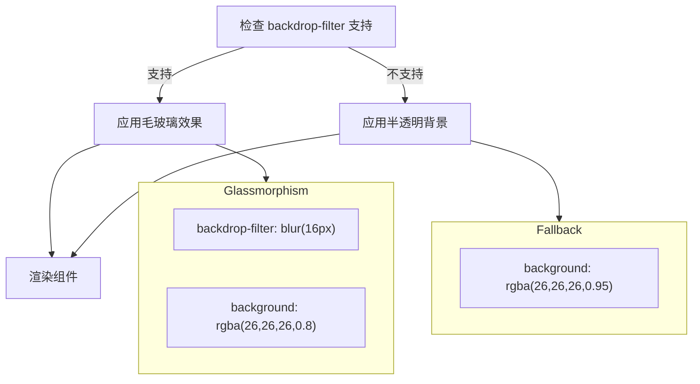
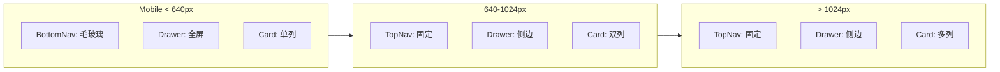

# PRD_003 功能流程图

## 样式系统架构



## 组件状态流转

### Button 状态

```mermaid
stateDiagram-v2
    [*] --> Default
    Default --> Hover: mouseenter
    Hover --> Default: mouseleave
    Hover --> Active: click
    Active --> Hover: release
    Default --> Disabled: disabled=true
    Disabled --> Default: disabled=false

    state Hover {
        [*] --> GlowPulse
        GlowPulse --> GlowPulse: animation loop
    }

    state Active {
        [*] --> GlitchEffect
        GlitchEffect --> [*]: 150ms
    }
```

### Input 状态



### Drawer 状态



## 动画时序



## 降级策略



## 响应式适配


