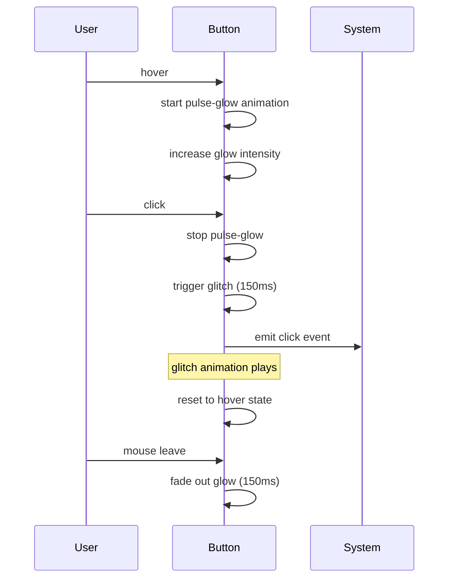
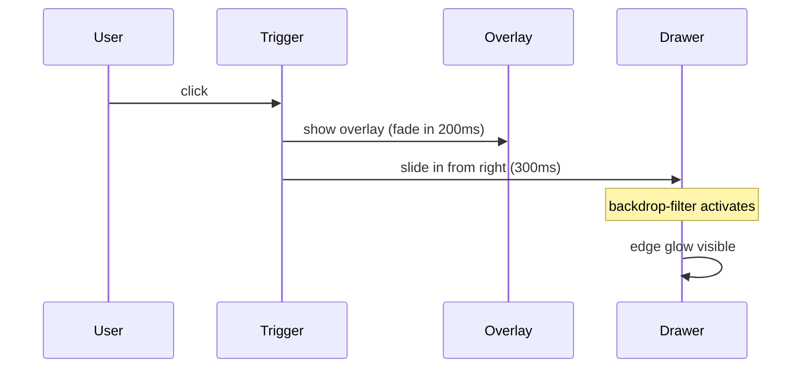
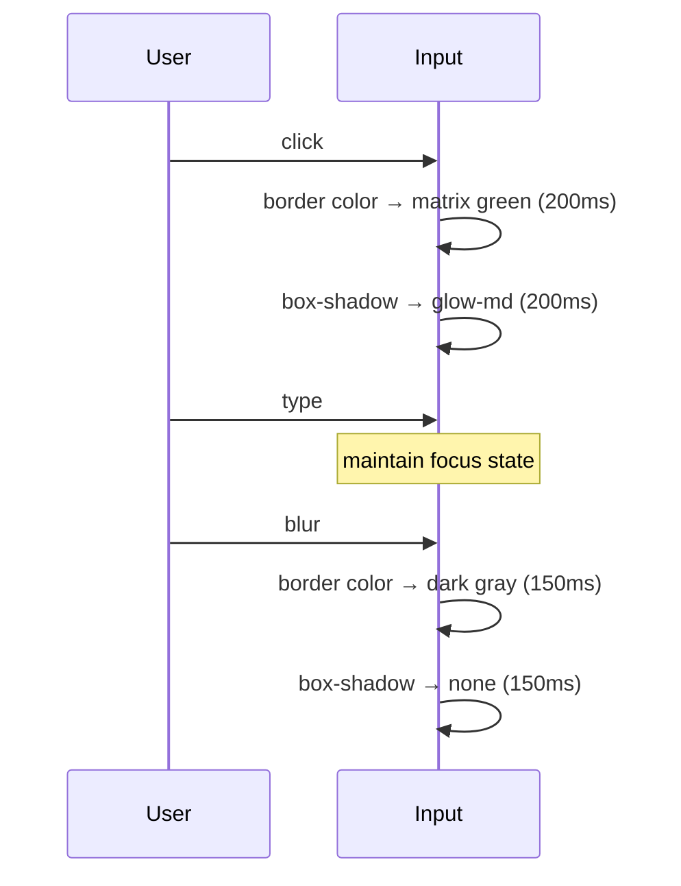

# PRD_003 UI 设计文档：赛博朋克风格样式重构

## 1. 设计变量

### 字体

```
heading: 'Orbitron', 'SF Pro Display', -apple-system, sans-serif
body: 'Rajdhani', 'SF Pro Display', -apple-system, sans-serif
mono: 'JetBrains Mono', 'Fira Code', monospace
```

### 颜色

**主色**:
- matrix: #00FF41 (矩阵绿)
- alert: #FF6B35 (警报橙)
- cyber: #00D4FF (电光蓝)

**背景色**:
- deep: #0A0A0A (深空黑)
- carbon: #1A1A1A (碳灰)
- dark: #2A2A2A (暗灰)

**文字色**:
- neon: #E0E0E0 (荧光白)
- mist: #888888 (灰雾)
- dim: #555555 (暗淡灰)

**语义色**:
- success: #00FF41
- warning: #FFD700
- error: #FF3366
- info: #00D4FF

**透明度变体**:
- matrix/10: rgba(0, 255, 65, 0.1)
- matrix/20: rgba(0, 255, 65, 0.2)
- matrix/30: rgba(0, 255, 65, 0.3)
- matrix/50: rgba(0, 255, 65, 0.5)

### 毛玻璃预设

```css
/* 标准毛玻璃 */
--glass-bg: rgba(26, 26, 26, 0.8);
--glass-border: rgba(0, 255, 65, 0.2);
--glass-blur: 16px;

/* 降级方案 */
--glass-fallback: rgba(26, 26, 26, 0.95);
```

### 发光预设

```css
/* 边框发光 */
--glow-sm: 0 0 5px rgba(0, 255, 65, 0.3);
--glow-md: 0 0 10px rgba(0, 255, 65, 0.3), 0 0 20px rgba(0, 255, 65, 0.1);
--glow-lg: 0 0 15px rgba(0, 255, 65, 0.4), 0 0 30px rgba(0, 255, 65, 0.2);

/* 文字发光 */
--text-glow: 0 0 10px rgba(0, 255, 65, 0.5);
```

## 2. 组件复用分析

| 组件 | 现有状态 | 操作 | 改动范围 |
|------|----------|------|----------|
| Button | 已有基础 recipe | 扩展 | 新增 variant、动画 |
| Input | 已有基础 recipe | 扩展 | 增强发光效果 |
| Select | 已有 slot recipe | 扩展 | 添加毛玻璃 |
| Drawer | 已有 slot recipe | 扩展 | 添加毛玻璃 |
| Card | 无 | 新建 | 完整 recipe |
| Badge | 无 | 新建 | 完整 recipe |
| BottomNav | 无 | 新建 | 完整 recipe |
| Popover | 无 | 新建 | 完整 recipe |

## 3. 组件规格

### 3.1 Button

**变体**:

| Variant | 背景 | 边框 | 文字 | 发光 |
|---------|------|------|------|------|
| primary | 渐变 #00FF41→#00CC33 | 无 | #0A0A0A | hover 脉冲 |
| secondary | 透明 | 1px #00FF41 | #00FF41 | 边框发光 |
| danger | 透明 | 1px #FF3366 | #FF3366 | 边框发光 |
| ghost | 透明 | 无 | #E0E0E0 | 无 |

**尺寸**:

| Size | Height | Padding | Font Size |
|------|--------|---------|-----------|
| sm | 32px | 12px 16px | 12px |
| md | 40px | 14px 20px | 14px |
| lg | 48px | 16px 24px | 16px |

**状态**:
- Default: 基础样式
- Hover: 发光强度增加，primary 有脉冲动画
- Active: Glitch 效果 (150ms)
- Disabled: opacity 0.5, cursor not-allowed

### 3.2 Input

**变体**:

| Variant | 背景 | 边框 |
|---------|------|------|
| outline | #0A0A0A | 1px #2A2A2A |
| solid | #1A1A1A | 1px #2A2A2A |
| subtle | transparent | 无 |

**状态**:
- Default: 暗灰边框
- Focused: 矩阵绿边框 + 外发光 (glow-md)
- Error: 霓虹红边框 + 红色发光
- Disabled: opacity 0.5

**尺寸**:

| Size | Height | Font Size |
|------|--------|-----------|
| sm | 32px | 12px |
| md | 40px | 14px |
| lg | 48px | 16px |

### 3.3 Card

**基础样式**:
```
背景: var(--glass-bg)
边框: 1px solid var(--glass-border)
圆角: 8px
模糊: backdrop-filter: blur(16px)
发光: box-shadow: var(--glow-sm)
```

**状态**:
- Default: 基础毛玻璃
- Hover: 发光强度增加 (glow-md)，边框亮度提升

**边角装饰** (可选):
```
伪元素绘制 L 形角标
颜色: rgba(0, 255, 65, 0.5)
尺寸: 8px × 8px
位置: 四角
```

### 3.4 Drawer

**背景面板**:
```
背景: var(--glass-bg)
边框: 左边框 1px solid var(--glass-border)
模糊: backdrop-filter: blur(16px)
发光: 左边缘 box-shadow: -5px 0 15px rgba(0, 255, 65, 0.1)
```

**遮罩层**:
```
背景: rgba(0, 0, 0, 0.6)
```

**尺寸**:
- Mobile: 100% 宽度
- Desktop: 320px - 480px

### 3.5 Select

**触发器**: 同 Input outline 样式

**下拉面板**:
```
背景: var(--glass-bg)
边框: 1px solid var(--glass-border)
圆角: 4px
模糊: backdrop-filter: blur(16px)
发光: box-shadow: var(--glow-md)
```

**选项**:
- Default: 透明背景
- Hover: rgba(0, 255, 65, 0.1) 背景
- Selected: rgba(0, 255, 65, 0.2) 背景，左边框 2px 矩阵绿

### 3.6 Badge

**变体**:

| Variant | 背景 | 边框 | 文字 |
|---------|------|------|------|
| success | rgba(0, 255, 65, 0.2) | 1px #00FF41 | #00FF41 |
| warning | rgba(255, 215, 0, 0.2) | 1px #FFD700 | #FFD700 |
| error | rgba(255, 51, 102, 0.2) | 1px #FF3366 | #FF3366 |
| info | rgba(0, 212, 255, 0.2) | 1px #00D4FF | #00D4FF |

**样式**:
```
圆角: 4px
字号: 10px
字重: 600
字母间距: 0.05em
文字转换: uppercase
内边距: 2px 8px
```

### 3.7 BottomNav

**容器**:
```
高度: 64px + safe-area-inset-bottom
背景: var(--glass-bg)
边框: 顶部 1px solid var(--glass-border)
模糊: backdrop-filter: blur(16px)
位置: fixed bottom
```

**导航项**:
- Default: 图标 #888888，文字 #888888
- Active: 图标 #00FF41 + 发光，文字 #00FF41

**图标发光**:
```
filter: drop-shadow(0 0 4px #00FF41)
```

### 3.8 Popover / Menu

**面板**:
```
背景: var(--glass-bg)
边框: 1px solid var(--glass-border)
圆角: 4px
模糊: backdrop-filter: blur(16px)
发光: box-shadow: var(--glow-sm)
```

**菜单项**:
- Default: 透明背景
- Hover: rgba(0, 255, 65, 0.1) 背景
- Disabled: opacity 0.5

## 4. 动画规格

### 4.1 pulse-glow (脉冲发光)

```css
@keyframes pulse-glow {
  0%, 100% {
    box-shadow: 0 0 10px rgba(0, 255, 65, 0.3);
  }
  50% {
    box-shadow: 0 0 20px rgba(0, 255, 65, 0.6);
  }
}

/* 使用 */
animation: pulse-glow 2s ease-in-out infinite;
```

### 4.2 glitch (故障效果)

```css
@keyframes glitch {
  0% { transform: translate(0); }
  20% { transform: translate(-2px, 2px); }
  40% { transform: translate(-2px, -2px); }
  60% { transform: translate(2px, 2px); }
  80% { transform: translate(2px, -2px); }
  100% { transform: translate(0); }
}

/* 使用 */
animation: glitch 150ms ease-in-out;
```

### 4.3 scan-line (扫描线)

```css
@keyframes scan-line {
  0% {
    background-position: 0 0;
  }
  100% {
    background-position: 0 100%;
  }
}

/* 背景 */
background: repeating-linear-gradient(
  0deg,
  transparent,
  transparent 2px,
  rgba(0, 255, 65, 0.03) 2px,
  rgba(0, 255, 65, 0.03) 4px
);
animation: scan-line 4s linear infinite;
```

### 4.4 过渡时长

| 场景 | 时长 | 缓动 |
|------|------|------|
| hover | 150ms | ease-out |
| focus | 200ms | ease-out |
| drawer open | 300ms | ease-out |
| drawer close | 200ms | ease-in |
| dropdown | 200ms | ease-out |

## 5. 交互流程

### 按钮点击



### 抽屉打开



### 输入框交互



## 6. 响应式规格

### 断点

| 名称 | 范围 | 布局特点 |
|------|------|----------|
| mobile | < 640px | BottomNav, 单列, Drawer 全屏 |
| tablet | 640-1024px | TopNav, 双列, Drawer 侧边 |
| desktop | > 1024px | TopNav, 多列网格, Drawer 侧边 |

### 组件响应式

**BottomNav**:
- mobile: 显示，fixed bottom
- tablet+: 隐藏

**Drawer**:
- mobile: 宽度 100%
- tablet+: 宽度 320-480px

**Card**:
- mobile: 单列，宽度 100%
- tablet: 双列，宽度 calc(50% - 8px)
- desktop: 多列，最小宽度 300px

## 7. 无障碍

### 对比度

- 主文字 (#E0E0E0) 在背景 (#0A0A0A) 上: 12.6:1 ✓
- 次要文字 (#888888) 在背景 (#0A0A0A) 上: 5.3:1 ✓
- 矩阵绿 (#00FF41) 在背景 (#0A0A0A) 上: 10.5:1 ✓

### Reduced Motion

```css
@media (prefers-reduced-motion: reduce) {
  * {
    animation: none !important;
    transition-duration: 0.01ms !important;
  }
}
```

### 焦点指示

所有可交互元素在键盘聚焦时显示发光边框，确保可见性。
