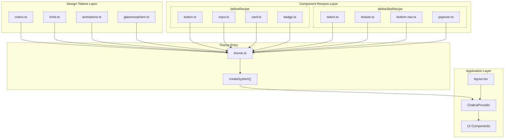
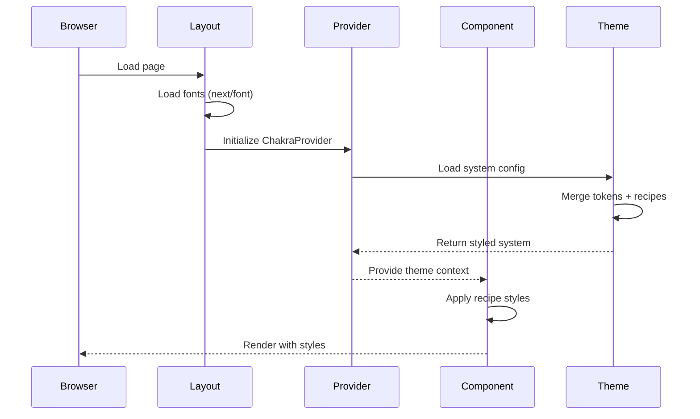
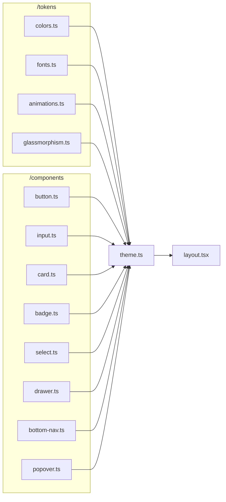
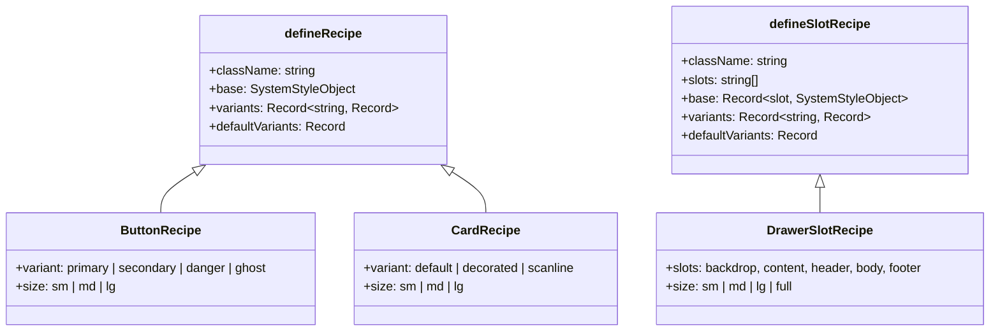
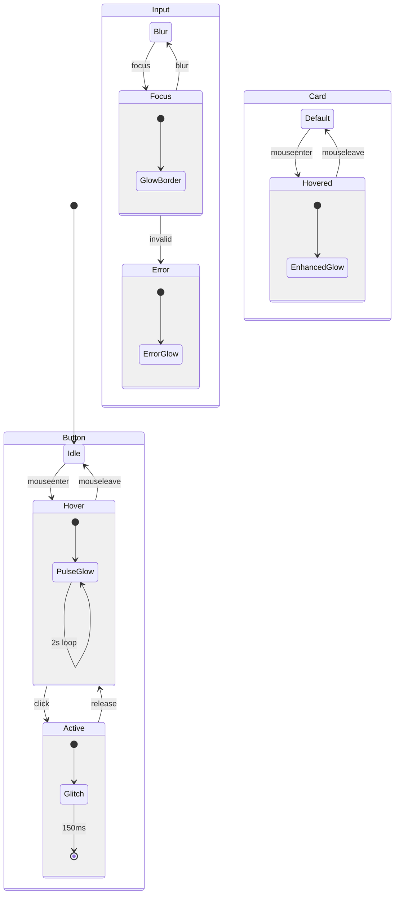
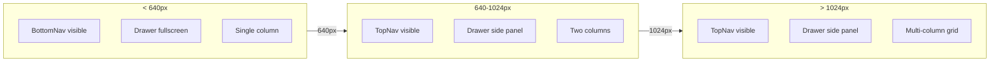
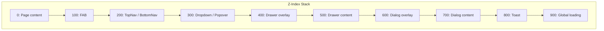
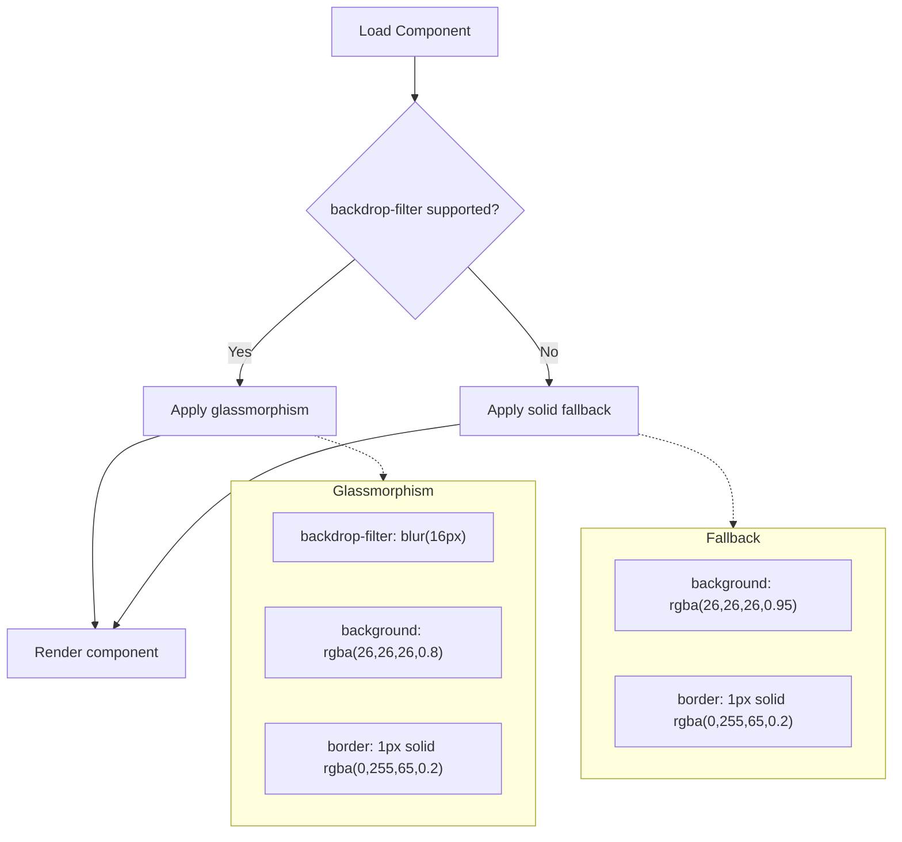

# PRD_003 架构设计：样式系统

## 系统架构图

```mermaid
flowchart TB
    subgraph Tokens["Design Tokens Layer"]
        COLORS["colors.ts"]
        FONTS["fonts.ts"]
        ANIM["animations.ts"]
        GLASS["glassmorphism.ts"]
    end

    subgraph Recipes["Component Recipes Layer"]
        subgraph SimpleRecipes["defineRecipe"]
            BTN["button.ts"]
            INPUT["input.ts"]
            CARD["card.ts"]
            BADGE["badge.ts"]
        end
        subgraph SlotRecipes["defineSlotRecipe"]
            SELECT["select.ts"]
            DRAWER["drawer.ts"]
            NAV["bottom-nav.ts"]
            POP["popover.ts"]
        end
    end

    subgraph Theme["Theme Entry"]
        CONFIG["theme.ts"]
        SYSTEM["createSystem()"]
    end

    subgraph App["Application Layer"]
        PROVIDER["ChakraProvider"]
        LAYOUT["layout.tsx"]
        COMPONENTS["UI Components"]
    end

    COLORS --> CONFIG
    FONTS --> CONFIG
    ANIM --> CONFIG
    GLASS --> CONFIG

    BTN --> CONFIG
    INPUT --> CONFIG
    CARD --> CONFIG
    BADGE --> CONFIG
    SELECT --> CONFIG
    DRAWER --> CONFIG
    NAV --> CONFIG
    POP --> CONFIG

    CONFIG --> SYSTEM
    SYSTEM --> PROVIDER
    LAYOUT --> PROVIDER
    PROVIDER --> COMPONENTS
```

## 数据流

```mermaid
sequenceDiagram
    participant Browser
    participant Layout
    participant Provider
    participant Component
    participant Theme

    Browser->>Layout: Load page
    Layout->>Layout: Load fonts (next/font)
    Layout->>Provider: Initialize ChakraProvider
    Provider->>Theme: Load system config
    Theme->>Theme: Merge tokens + recipes
    Theme-->>Provider: Return styled system
    Provider-->>Component: Provide theme context
    Component->>Component: Apply recipe styles
    Component-->>Browser: Render with styles
```

## 文件依赖图

```mermaid
flowchart LR
    subgraph tokens["/tokens"]
        C[colors.ts]
        F[fonts.ts]
        A[animations.ts]
        G[glassmorphism.ts]
    end

    subgraph components["/components"]
        B[button.ts]
        I[input.ts]
        CA[card.ts]
        BA[badge.ts]
        S[select.ts]
        D[drawer.ts]
        BN[bottom-nav.ts]
        P[popover.ts]
    end

    T[theme.ts]

    C --> T
    F --> T
    A --> T
    G --> T

    B --> T
    I --> T
    CA --> T
    BA --> T
    S --> T
    D --> T
    BN --> T
    P --> T

    T --> L[layout.tsx]
```

## Recipe 类型架构

```mermaid
classDiagram
    class defineRecipe {
        +className: string
        +base: SystemStyleObject
        +variants: Record~string, Record~
        +defaultVariants: Record
    }

    class defineSlotRecipe {
        +className: string
        +slots: string[]
        +base: Record~slot, SystemStyleObject~
        +variants: Record~string, Record~
        +defaultVariants: Record
    }

    class ButtonRecipe {
        +variant: primary | secondary | danger | ghost
        +size: sm | md | lg
    }

    class CardRecipe {
        +variant: default | decorated | scanline
        +size: sm | md | lg
    }

    class DrawerSlotRecipe {
        +slots: backdrop, content, header, body, footer
        +size: sm | md | lg | full
    }

    defineRecipe <|-- ButtonRecipe
    defineRecipe <|-- CardRecipe
    defineSlotRecipe <|-- DrawerSlotRecipe
```

## 动画状态机

```mermaid
stateDiagram-v2
    [*] --> Idle

    state Button {
        Idle --> Hover: mouseenter
        Hover --> Idle: mouseleave
        Hover --> Active: click

        state Hover {
            [*] --> PulseGlow
            PulseGlow --> PulseGlow: 2s loop
        }

        state Active {
            [*] --> Glitch
            Glitch --> [*]: 150ms
        }

        Active --> Hover: release
    }

    state Input {
        Blur --> Focus: focus
        Focus --> Blur: blur
        Focus --> Error: invalid

        state Focus {
            [*] --> GlowBorder
        }

        state Error {
            [*] --> ErrorGlow
        }
    }

    state Card {
        Default --> Hovered: mouseenter
        Hovered --> Default: mouseleave

        state Hovered {
            [*] --> EnhancedGlow
        }
    }
```

## 响应式断点

```mermaid
flowchart LR
    subgraph Mobile["< 640px"]
        M1[BottomNav visible]
        M2[Drawer fullscreen]
        M3[Single column]
    end

    subgraph Tablet["640-1024px"]
        T1[TopNav visible]
        T2[Drawer side panel]
        T3[Two columns]
    end

    subgraph Desktop["> 1024px"]
        D1[TopNav visible]
        D2[Drawer side panel]
        D3[Multi-column grid]
    end

    Mobile -->|640px| Tablet
    Tablet -->|1024px| Desktop
```

## Z-Index 层级

```mermaid
flowchart TB
    subgraph ZIndex["Z-Index Stack"]
        Z0["0: Page content"]
        Z100["100: FAB"]
        Z200["200: TopNav / BottomNav"]
        Z300["300: Dropdown / Popover"]
        Z400["400: Drawer overlay"]
        Z500["500: Drawer content"]
        Z600["600: Dialog overlay"]
        Z700["700: Dialog content"]
        Z800["800: Toast"]
        Z900["900: Global loading"]
    end

    Z0 --> Z100 --> Z200 --> Z300 --> Z400 --> Z500 --> Z600 --> Z700 --> Z800 --> Z900
```

## 降级策略

```mermaid
flowchart TD
    START[Load Component]
    CHECK{backdrop-filter supported?}
    GLASS[Apply glassmorphism]
    FALLBACK[Apply solid fallback]
    RENDER[Render component]

    START --> CHECK
    CHECK -->|Yes| GLASS
    CHECK -->|No| FALLBACK
    GLASS --> RENDER
    FALLBACK --> RENDER

    subgraph Glassmorphism
        G1["backdrop-filter: blur(16px)"]
        G2["background: rgba(26,26,26,0.8)"]
        G3["border: 1px solid rgba(0,255,65,0.2)"]
    end

    subgraph Fallback
        F1["background: rgba(26,26,26,0.95)"]
        F2["border: 1px solid rgba(0,255,65,0.2)"]
    end

    GLASS -.-> Glassmorphism
    FALLBACK -.-> Fallback
```
