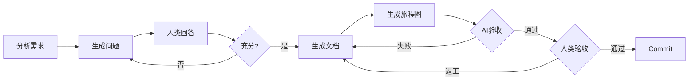

# 阶段 01: 需求澄清

> 将模糊的需求雏形转化为明确、可验证的需求规格。

## 依赖输入

| 来源 | 说明 |
|------|------|
| 用户输入 | 本次需求描述 |
| `PROJECT_CONTEXT` | 由 action-work 缓存提供 |

## 流程

## 执行步骤

1. **分析需求雏形**: 识别核心功能点、用户角色、使用场景、隐含假设
2. **生成澄清问题**: 覆盖用户、痛点、场景、功能、边界、成功标准
3. **与人类交互**: 输出问题清单 → 等待回答 → 追问
4. **生成需求文档**: `requirements.md`
5. **生成旅程图**: `journey.md`

## 产出物

| 文件 | 路径 |
|------|------|
| 需求文档 | `01_requirements/requirements.md` |
| 旅程图 | `01_requirements/journey.md` |
| 阶段摘要 | `01_requirements/summary.md` |
| 操作历史 | `01_requirements/history.json` |

### requirements.md 结构

1. 背景与痛点
2. 用户定义
3. 功能范围 (Must/Nice/不做)
4. 使用场景
5. 边界条件
6. 成功指标
7. 约束与假设

## AI 自验收

| 检查项 | 通过标准 |
|--------|---------|
| 结构完整 | 包含全部 7 个章节 |
| 用户完整 | 用户定义表格行数 ≥ 1 |
| 范围明确 | 含 Must/Nice/不做 |
| 指标可量化 | 含数值或百分比 |

## 人类验收要点

1. 需求理解正确
2. 功能范围合理
3. 优先级正确
4. 无重要遗漏

## summary.md 关键词索引

| 索引类型 | 示例 |
|---------|------|
| 用户角色 | 普通用户, 管理员 |
| 核心功能 | 行为记录, 目标追踪 |
| 使用场景 | 登录流程, 记录流程 |
| 边界条件 | 密码强度, 频率限制 |
