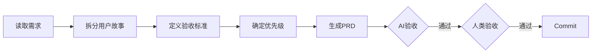

# 阶段 02: PRD 编写

> 基于需求澄清文档，生成完整的产品需求文档。

## 依赖输入

| 阶段产出 | 按需读取 |
|---------|---------|
| `01_requirements/summary.md` | `01_requirements/requirements.md` |

> Context 缓存: `PROJECT_CONTEXT`
>
> **职责边界**: 详见 [responsibility-boundaries.md](../shared/responsibility-boundaries.md)

## 流程

## 执行步骤

1. **分析需求文档**: 提取核心功能、用户角色、使用场景
2. **拆分用户故事**: `作为 [角色]，我希望 [操作]，以便 [目标]`
3. **定义验收标准**: `Given [条件] When [操作] Then [结果]`
4. **确定优先级**: P0 (Must) / P1 (Should) / P2 (Could)
5. **生成 PRD 文档**
6. **生成功能流程图**

## 产出物

| 文件 | 路径 |
|------|------|
| PRD文档 | `02_prd/prd.md` |
| 流程图 | `02_prd/flow.md` |
| 阶段摘要 | `02_prd/summary.md` |
| 操作历史 | `02_prd/history.json` |

### prd.md 结构

1. 概述（背景、目标、成功指标）
2. 用户故事（US-XXX 格式，含优先级和验收标准）
3. 功能规格（业务层面描述，详见职责边界文档）
4. 非功能需求（指标层面，如性能指标、可用性要求）
5. 约束与依赖（业务约束，如数据依赖、业务规则）
6. 里程碑（阶段产出，如"API 接口"、"Dashboard 组件"）
7. 开放问题

## AI 自验收

| 检查项 | 通过标准 |
|--------|---------|
| 故事格式 | 含 "作为.*我希望.*以便" |
| 验收标准 | 每个 US 含 Given/When/Then |
| 优先级 | 每个 US 含 P0/P1/P2 |
| 需求覆盖 | 功能点 ≥ 需求文档功能点 |
| **职责边界** | **不包含 TypeScript 类型、SQL 查询、API 详细规格、算法步骤** |

### 交叉验证: 反向推导

基于 PRD 反推原始需求，对比 01 阶段理解是否一致，覆盖率需达 100%。

## 人类验收要点

1. 功能范围正确
2. 优先级合理
3. 验收标准可行
4. 边界异常已覆盖

## summary.md 关键词索引

| 索引类型 | 示例 |
|---------|------|
| 用户故事ID | US-001, US-002 |
| 验收标准ID | AC-001-1, AC-001-2 |
| 功能模块 | 登录模块, 记录模块 |
| 业务规则 | 密码重试限制, 会话超时 |
