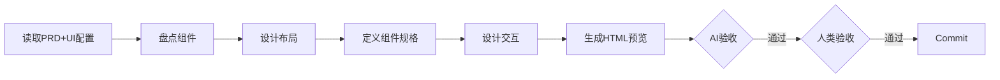

# 阶段 03: UI 设计 (无设计师)

> 基于 PRD 和项目 Theme 配置，生成详细的 UI 设计文档。

## 依赖输入

- **阶段产出**: `01_requirements/summary.md`
- **按需读取**: `02_prd/summary.md` (若02先完成)

> Context 缓存: `PROJECT_CONTEXT`, `UI_CONTEXT`
>
> **并行模式**: 可与 02 并行执行，基于 01 产出即可开始。

## 流程

## 执行步骤

1. **读取设计系统**: 从 ui-config.md 提取颜色、字体、间距等
2. **盘点现有组件**: 标注可复用性（直接复用/需扩展/需新建）
3. **设计页面布局**: 每页定义路由、关联US、桌面/移动端布局
4. **定义组件规格**: 新增组件需描述结构、Props、状态变体
5. **设计交互流程**: Mermaid 图描述状态流转
6. **生成 HTML 预览**: 静态 HTML 便于验收

## 产出物

- **UI设计文档**: `03_ui_design/ui-design.md`
- **页面布局**: `03_ui_design/layouts/`
- **组件规格**: `03_ui_design/components/`
- **HTML 预览**: `03_ui_design/preview/`
- **阶段摘要**: `03_ui_design/summary.md`
- **操作历史**: `03_ui_design/history.json`

### ui-design.md 结构

1. 设计变量（引用的 theme 变量）
2. 组件复用分析
3. 页面设计
4. 组件规格（外观和交互层面）
5. 交互流程

### 职责边界

**应该包含**:
- 页面布局：视觉结构，Desktop/Tablet/Mobile 布局，组件排列、间距、对齐
- 组件外观：样式、颜色、字体、间距，Loading/Error/Empty 状态，响应式断点
- 交互流程：用户操作（点击、悬停、输入），状态流转，反馈机制
- 设计变量：主题变量引用（颜色、字体、间距）
- 组件功能描述：业务层面描述（如"显示目标列表"、"接收目标列表"），不包含 TypeScript 类型定义

**不应该包含**:
- TypeScript Props 定义（TypeScript 接口、Props 类型）→ 应在 `04-tech-design/tech-design.md`
- API 调用逻辑（数据获取方式、错误处理）→ 应在 `04-tech-design`
- 数据流设计（数据流转、状态管理）→ 应在 `04-tech-design/architecture.md`
- 算法设计（计算逻辑）→ 应在 `04-tech-design/tech-design.md`

## AI 自验收

- **布局完整**: 每页含 desktop/mobile
- **组件定义**: 新组件含功能描述/状态变体
- **设计变量**: 颜色/字体引用正确
- **故事覆盖**: 每个 US 有对应页面
- **HTML 预览**: index.html + 各页面存在
- **职责边界**: 不包含 TypeScript Props 定义、API 调用逻辑、数据流设计

## 人类验收要点

1. 布局合理
2. 交互逻辑正确
3. 风格一致
4. **HTML 预览效果符合预期**

**验收流程**: 打开 `preview/index.html` 检查

## summary.md 关键词索引

- **页面名称**: /login, /dashboard
- **组件名称**: LoginForm, UserCard
- **设计变量**: colors.primary, fonts.heading
- **交互流程**: 表单提交, 加载状态
