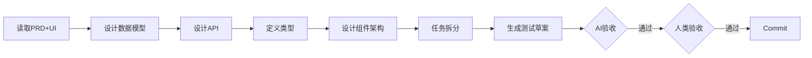

# 阶段 04: 技术设计

> 基于 PRD 和 UI 设计，生成完整的技术设计方案。

## 依赖输入

- **阶段产出**: `02_prd/summary.md`, `03_ui_design/summary.md`
- **按需读取**: `02_prd/prd.md`, `03_ui_design/ui-design.md`

> Context 缓存: `PROJECT_CONTEXT`, `UI_CONTEXT`, `TECH_CONTEXT`
>
> **职责边界**: 详见 [responsibility-boundaries.md](../shared/responsibility-boundaries.md)

## 流程

## 执行步骤

1. **分析现有架构**: 根据 tech-config.md 确保新设计一致
2. **设计数据模型**: 表名、字段、索引、ER 图
3. **设计 API 接口**: 接口列表、请求/响应、错误码
4. **定义 TypeScript 类型**: Client/Server 分离
5. **设计组件架构**: 组件层次、Hooks 设计
6. **任务拆分**: 05a/05b/05c 任务清单
7. **生成测试用例草案** (测试左移)

## 产出物

- **技术设计文档**: `04_tech_design/tech-design.md`
- **架构图**: `04_tech_design/architecture.md`
- **API规格**: `04_tech_design/api-spec.md`
- **测试草案**: `04_tech_design/test-plan.md`
- **阶段摘要**: `04_tech_design/summary.md`
- **操作历史**: `04_tech_design/history.json`

### tech-design.md 结构

1. 数据模型（表结构、SQL 查询、计算逻辑，详见职责边界文档）
2. API 接口（详细规格，详见职责边界文档）
3. 类型定义 (Client/Server)（TypeScript 类型，详见职责边界文档）
4. 组件架构（Props、Hooks、数据流，详见职责边界文档）
5. 任务拆分
6. 测试策略

## AI 自验收

- **数据模型**: 含表结构定义、SQL 查询
- **API 完整**: 每个功能有详细规格（请求/响应/错误码）
- **类型定义**: 含 Server/Client 类型、TypeScript 接口
- **任务拆分**: 含 05a/05b/05c 任务
- **职责边界**: 包含所有技术实现细节，不包含用户故事和业务规则

### 交叉验证: 数据流模拟

模拟 P0 用户故事的完整数据流，检查前端→API→服务→数据库→响应无断点。

## 人类验收要点

1. 架构合理
2. 接口设计正确
3. 类型定义准确
4. 任务拆分清晰

## summary.md 关键词索引

- **数据表名**: users, behaviors
- **API端点**: POST /api/auth/login
- **类型名称**: UserModel, AuthRequest
- **任务分配**: 05b: auth-service.ts
