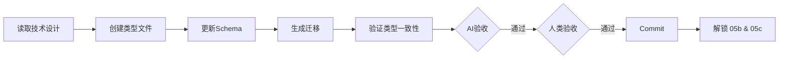

# 阶段 05a: 实施前置工作

> 在前后端并行开发前，完成必要的共享基础设施。

## 依赖输入

- **阶段产出**: `04_tech_design/summary.md`
- **按需读取**: `04_tech_design/tech-design.md`, `api-spec.md`

> Context 缓存: `TECH_CONTEXT`

## 流程

## 执行步骤

1. **创建 TypeScript 类型文件**
   - 服务端: `src/types/xxx-server.ts`
   - 客户端: `src/types/xxx-client.ts`

2. **创建/更新数据库 Schema**
   - 更新 `src/db/schema.ts`

3. **生成数据库迁移**
   - 检查 SQL 正确性

4. **验证类型一致性**
   - Client ↔ Server ↔ Schema 映射

5. **生成类型测试** (测试左移)
   - `src/types/__tests__/xxx.test.ts`

## 产出物

- **前置说明**: `05a_prep/prep.md`
- **阶段摘要**: `05a_prep/summary.md`
- **操作历史**: `05a_prep/history.json`

**代码产出**:
- `src/types/xxx-server.ts`
- `src/types/xxx-client.ts`
- `src/db/schema.ts` (更新)
- `supabase/migrations/xxx.sql`
- `src/types/__tests__/*.test.ts`

## AI 自验收

- **类型文件**: xxx-server.ts + xxx-client.ts 存在
- **Schema**: schema.ts 已更新
- **迁移**: 迁移文件已生成
- **类型测试**: types/__tests__/ 存在且通过
- **编译**: `pnpm tsc --noEmit` 无错误

> 验证命令详见 [validation-scripts.md](../shared/validation-scripts.md)

## 人类验收要点

1. 类型定义正确
2. Schema 设计合理
3. 迁移安全

## 后续阶段解锁

完成后可并行开始 **05b-后端** 和 **05c-前端**
