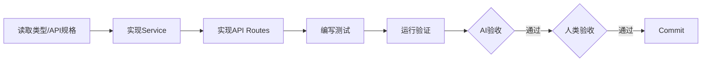

# 阶段 05b: 后端实施

> 基于类型定义和 Schema，实现完整的后端功能。

## 依赖输入

| 阶段产出 | 按需读取 |
|---------|---------|
| `05a_prep/summary.md` | `05a_prep/prep.md` |
| `04_tech_design/api-spec.md` | `04_tech_design/tech-design.md` |

> Context 缓存: `TECH_CONTEXT`

## 流程

## 执行步骤

1. **实现 Service 层**
   - `src/lib/xxx-service.ts`
   - CRUD 方法、权限隔离

2. **实现 API Routes**
   - `src/app/api/xxx/route.ts`
   - `src/app/api/xxx/[id]/route.ts`

3. **同步编写测试** (测试左移)
   - 每实现一个方法，立即编写测试
   - `src/lib/__tests__/xxx-service.test.ts`

4. **运行验证**
   - `pnpm test && pnpm lint && pnpm tsc --noEmit`

### 测试覆盖要求

| 类型 | 覆盖率要求 |
|------|----------|
| Service 方法 | 100% 方法覆盖 |
| 正常路径 | 每个方法至少 1 个 |
| 异常路径 | 每个方法至少 1 个 |

## 产出物

| 文件 | 路径 |
|------|------|
| 实现说明 | `05b_backend/implementation.md` |
| 阶段摘要 | `05b_backend/summary.md` |
| 操作历史 | `05b_backend/history.json` |

**代码产出**:
- `src/lib/xxx-service.ts`
- `src/app/api/xxx/route.ts`
- `src/app/api/xxx/[id]/route.ts`
- `src/lib/__tests__/xxx-service.test.ts`

## AI 自验收

| 检查项 | 通过标准 |
|--------|---------|
| Service | xxx-service.ts 存在 |
| API | route.ts + [id]/route.ts 存在 |
| 测试 | 全部通过 |
| 编译 | 无错误 |

> 验证命令详见 [validation-scripts.md](../shared/validation-scripts.md)

## 人类验收要点

1. 代码质量符合规范
2. 业务逻辑正确
3. 认证授权安全
4. 测试覆盖充分
