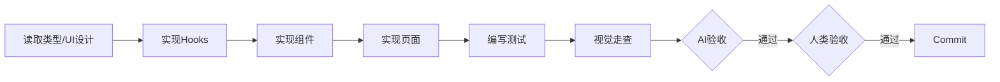

# 阶段 05c: 前端实施

> 基于类型定义和 UI 设计，实现完整的前端功能。可与 05b 并行执行。

## 依赖输入

- **阶段产出**: `05a_prep/summary.md`, `03_ui_design/summary.md`
- **按需读取**: `05a_prep/prep.md`, `03_ui_design/ui-design.md`, `components/`

> Context 缓存: `UI_CONTEXT`, `TECH_CONTEXT`

## 架构

```
数据层: Hooks → API调用 → TanStack Query 缓存
组件层: Page → Container → List/Form → Card
UI层: Chakra UI
```

## 流程



## Mock 策略

若 05b 未完成，使用 Mock 数据开发：

```typescript
if (process.env.NEXT_PUBLIC_USE_MOCK === 'true') {
  return { data: MOCK_DATA, isLoading: false };
}
return useQuery({ queryKey: ['xxx'], queryFn: fetcher });
```

**切换时机**: 05b 完成后设置 `NEXT_PUBLIC_USE_MOCK=false`

## 执行步骤

1. **实现 Hooks**: `src/client/hooks/use-xxx.ts`
2. **实现 UI 组件**: `src/client/components/xxx/`
3. **实现页面**: `src/app/xxx/page.tsx`
4. **同步编写测试**: 每实现一个组件，立即编写测试
5. **视觉走查**: 对照 UI 设计检查

### 测试覆盖要求

- **组件渲染**: 每个组件至少 1 个
- **交互行为**: 关键交互至少 1 个
- **状态变体**: loading/error/empty

## 产出物

- **实现说明**: `05c_frontend/implementation.md`
- **阶段摘要**: `05c_frontend/summary.md`
- **操作历史**: `05c_frontend/history.json`

**代码产出**:
- `src/client/hooks/use-xxx.ts`
- `src/client/components/xxx/*.tsx`
- `src/app/xxx/page.tsx`
- `src/client/components/xxx/__tests__/*.test.tsx`

## AI 自验收

- **Hooks**: use-xxx.ts 存在
- **组件**: components/xxx/ 存在
- **页面**: app/xxx/page.tsx 存在
- **测试**: 全部通过
- **编译**: 无错误

> 验证命令详见 [validation-scripts.md](../shared/validation-scripts.md)

## 人类验收要点

1. UI 还原度与设计稿一致
2. 交互体验流畅
3. 响应式各端显示正常
4. 组件拆分合理
