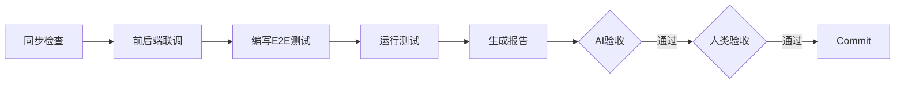

# 阶段 06: 验证

> 验证实现是否满足 PRD 中定义的验收标准。

## 依赖输入

| 阶段产出 | 按需读取 |
|---------|---------|
| `02_prd/prd.md` (验收标准) | - |
| `05b_backend/summary.md` | `05b_backend/implementation.md` |
| `05c_frontend/summary.md` | `05c_frontend/implementation.md` |

> Context 缓存: `UI_CONTEXT`, `TECH_CONTEXT`

## 流程



## 执行步骤

### 0. 文档代码同步检查 (前置条件)

执行 `/flow-sync-check PRD_XXX`，同步率需 ≥ 95%。

推荐脚本：
```bash
bash ai-coding/scripts/flow-sync-check.sh --work-dir ai-works/PRD_XXX --min-rate 0.95
```

> 详见 [action-work.md](../action-work.md#文档代码同步机制)

### 1. 前后端联调

- API 连通性
- 数据流验证
- 错误处理

### 2. 编写 E2E 测试

- `e2e/xxx.spec.ts`
- 每个验收标准对应测试用例
- 测试命名包含 AC ID

### 3. 验证验收标准

逐条验证 PRD 验收标准。

### 4. 生成验证报告

**输出**: `06_validation/report.md`

包含: 验证摘要、功能验证结果、E2E测试结果、未通过项详情

## AI 自验收

| 检查项 | 通过标准 |
|--------|---------|
| 文档同步 | 同步率 ≥ 95% |
| E2E 文件 | e2e/xxx.spec.ts 存在 |
| E2E 覆盖 | 每个 AC 有测试用例 |
| E2E 通过 | 全部通过 |

### 交叉验证: 验收标准覆盖

| 优先级 | 覆盖率要求 |
|--------|----------|
| P0 | 100% |
| P1 | ≥ 90% |
| P2 | ≥ 50% |

## 人类验收要点

1. 功能完整
2. 验收标准达成
3. 用户体验流畅
4. 边界情况正确

## 产出物

| 文件 | 路径 |
|------|------|
| 验证报告 | `06_validation/report.md` |
| 操作历史 | `06_validation/history.json` |

**代码产出**:
- `e2e/xxx.spec.ts`
