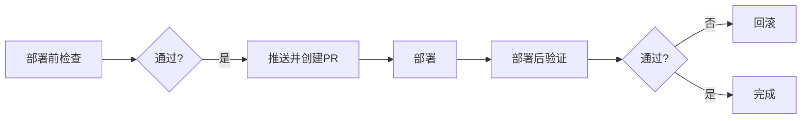
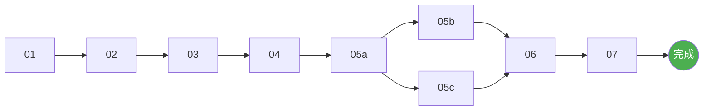

# 阶段 07: 部署

> 完全由人类控制的部署阶段。

## 依赖输入

- **验证报告**: `06_validation/report.md`

## 流程



## 环境

- **Development**: 开发调试
- **Staging**: 预发布验证
- **Production**: 正式服务

## 执行步骤 (人类操作)

### 1. 部署前检查

- 分支已推送、CI通过
- 迁移已准备、有回滚计划
- 环境变量已配置

### 1.1 生产质量门槛 (强制)

- 监控/告警已就绪（错误率、延迟、资源）
- SLO 与 Error Budget 明确
- 回滚策略与负责人明确
- 数据迁移已演练或有可回滚方案

### 2. 推送并创建 PR

```bash
git push origin feat/PRD_XXX
# 创建 PR，等待 Review
```

### 3. 执行部署

```bash
vercel --prod           # 或其他部署方式
pnpm drizzle-kit push  # 数据库迁移
```

### 4. 部署后验证

- 健康检查
- 功能验证
- 性能检查

### 4.1 稳定性观察 (Soak)

- 观察窗口：30-60 分钟
- 指标阈值：错误率、延迟、CPU/内存
- 触发阈值即执行回滚并记录

### 4.2 生产质量报告

- 记录版本、时间、指标、告警、问题与处理
- 记录回滚/修复结果
- 输出 `07_deploy/quality-report.md`

### 5. 回滚 (如需要)

```bash
vercel rollback
```

## AI 辅助

- **AI 可以做**: 生成检查清单、提醒风险、生成回滚步骤
- **AI 不能做**: 执行部署命令、运行迁移、访问生产环境

## 监控指标

- **响应时间**: < 200ms
- **错误率**: < 0.1%
- **CPU**: < 70%
- **内存**: < 80%

## 产出物

- **操作历史**: `07_deploy/history.json`
- **生产质量报告**: `07_deploy/quality-report.md`

---

## 流程完成



### 后续事项

- 归档项目文档
- 更新 CHANGELOG
- 总结经验教训
