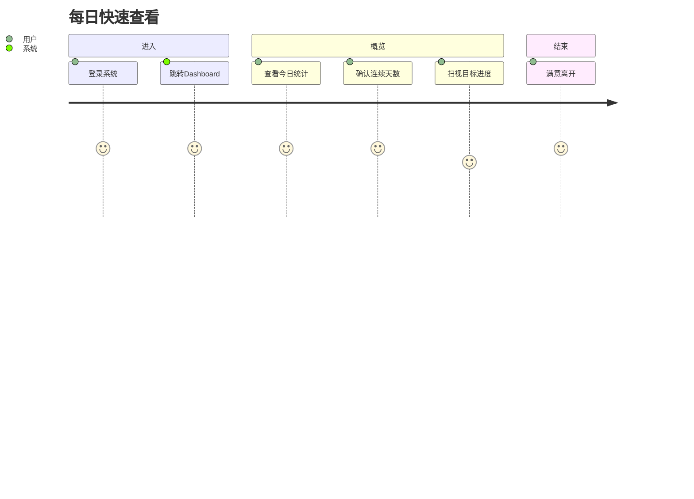
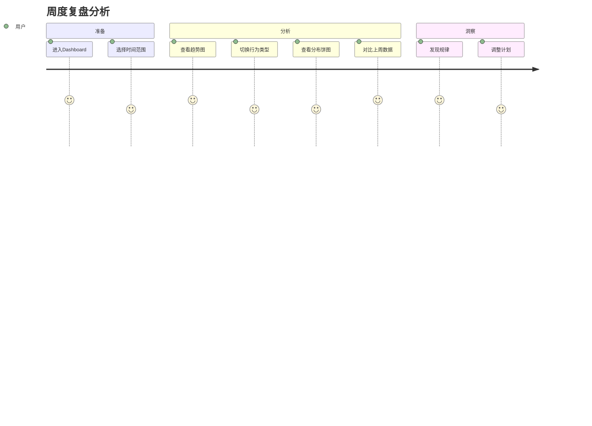
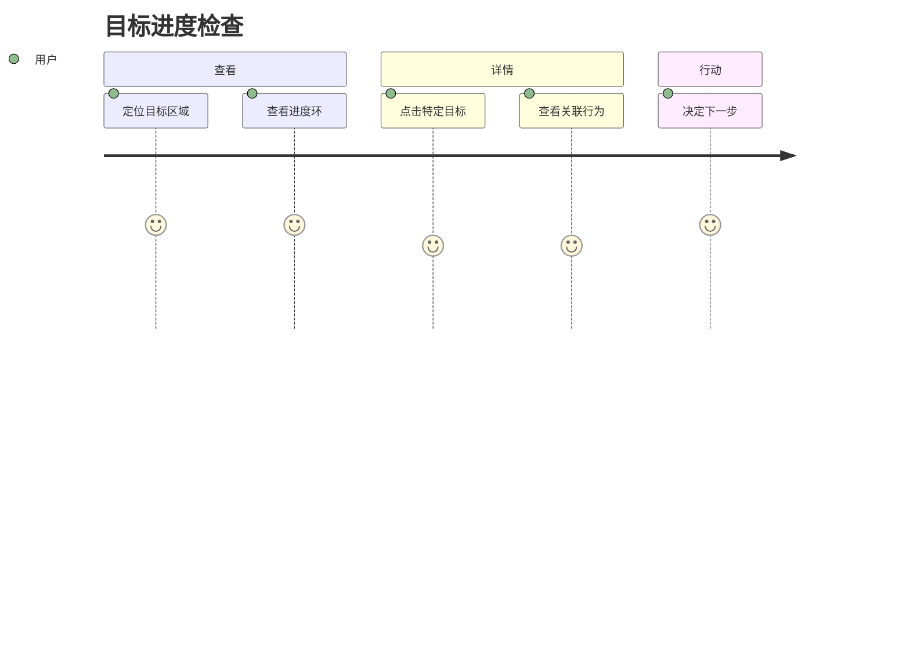
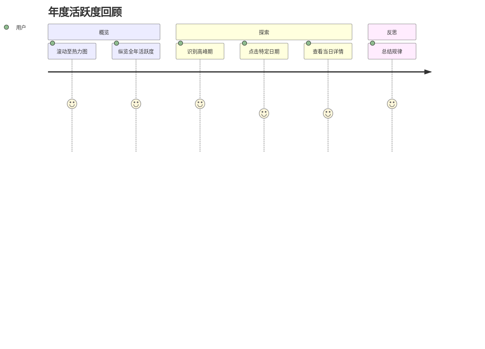

# 用户旅程图

> PRD_001 | 可视化模块

## 旅程概览

```
登录 → Dashboard首屏 → 查看概览 → 深入分析 → 采取行动
```

## 详细旅程

### 旅程 1: 日常快速查看



| 步骤 | 用户行为 | 系统响应 | 用户情绪 |
|------|----------|----------|----------|
| 1 | 登录后自动跳转 Dashboard | 加载首屏数据 | 期待 |
| 2 | 查看概览卡片 | 展示今日统计 + 连续天数 | 满足 |
| 3 | 扫视目标进度环 | 展示进度百分比 | 确认 |
| 4 | 离开或开始记录 | - | 满意 |

### 旅程 2: 深度分析



| 步骤 | 用户行为 | 系统响应 | 用户情绪 |
|------|----------|----------|----------|
| 1 | 点击时间选择器 | 展示时间范围选项 | 专注 |
| 2 | 选择"最近7天" | 刷新所有图表数据 | 期待 |
| 3 | 查看趋势折线图 | 展示7天行为趋势 | 分析 |
| 4 | 点击筛选特定行为 | 高亮显示该行为数据 | 专注 |
| 5 | 查看对比柱状图 | 展示本周 vs 上周 | 对比 |
| 6 | 发现异常或规律 | - | 洞察 |

### 旅程 3: 目标进度追踪



| 步骤 | 用户行为 | 系统响应 | 用户情绪 |
|------|----------|----------|----------|
| 1 | 滚动至目标区域 | 展示目标进度环组 | 寻找 |
| 2 | 查看整体进度 | 每个目标显示百分比 | 评估 |
| 3 | 点击某个目标 | 展开关联行为列表 | 探索 |
| 4 | 查看完成详情 | 显示已完成/待完成 | 确认 |

### 旅程 4: 热力图探索



| 步骤 | 用户行为 | 系统响应 | 用户情绪 |
|------|----------|----------|----------|
| 1 | 定位热力图区域 | 展示12个月日历 | 好奇 |
| 2 | 扫视颜色分布 | 颜色深浅表示活跃度 | 分析 |
| 3 | 发现活跃高峰 | Hover 显示具体数值 | 发现 |
| 4 | 点击某一天 | 弹出当日行为列表 | 探索 |

## 触点与情绪曲线

```
情绪
  5 |    ★━━━━━━★        ★━━━★
    |   /        \      /     \
  4 |  /          \    /       \
    | /            \  /         ★━━━
  3 |★              ★━
    |
  2 |
    +--------------------------------→ 时间
      登录  概览  分析  钻取  洞察  行动
```

## 关键体验指标

| 指标 | 目标 | 关键触点 |
|------|------|----------|
| 信息获取效率 | < 10秒获取核心状态 | 概览卡片 |
| 分析深度支持 | 支持3层钻取 | 图表交互 |
| 视觉愉悦度 | 赛博朋克沉浸感 | 全局样式 |
| 操作流畅度 | 无卡顿感 | 图表渲染 |
