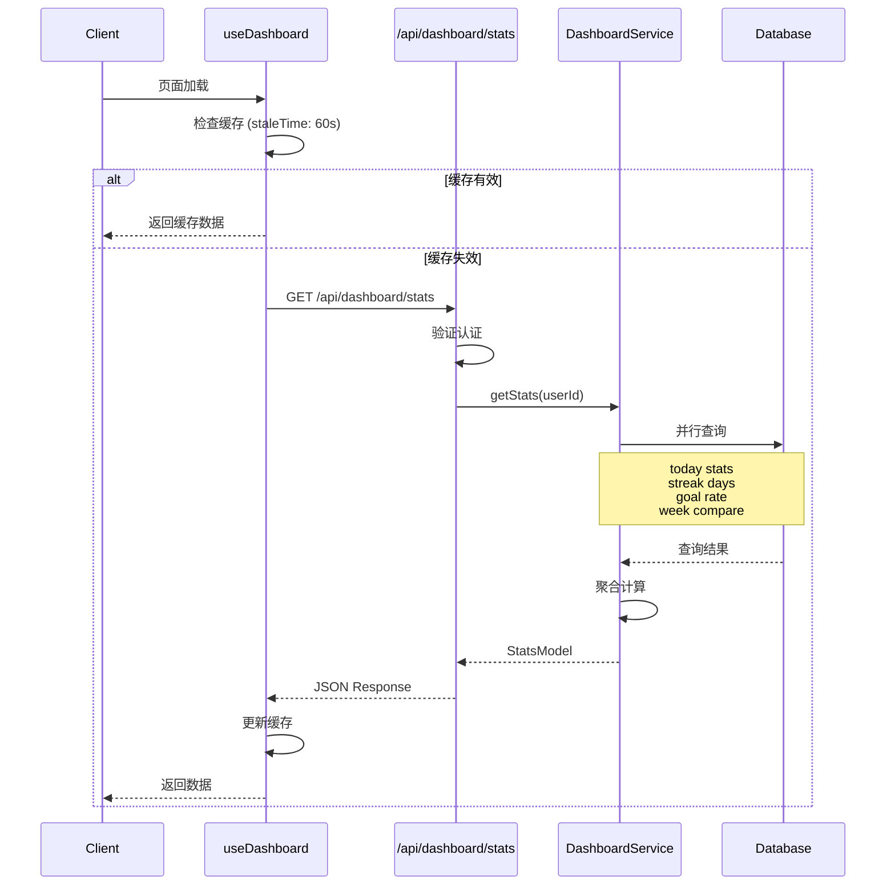
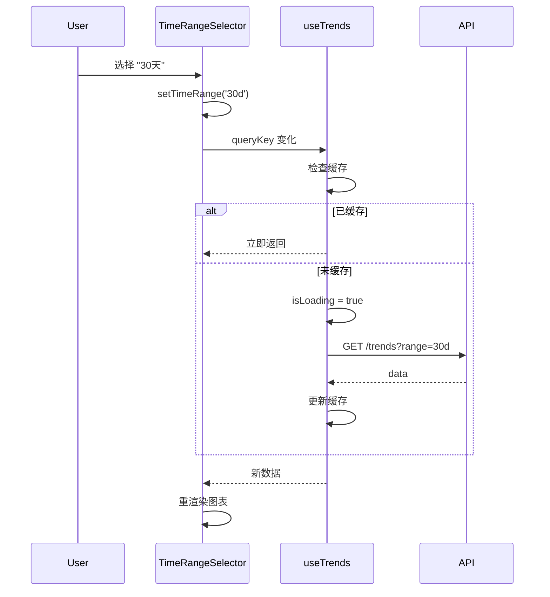

# 架构设计

> PRD_001 | 可视化模块

## 整体架构

```
┌─────────────────────────────────────────────────────────────────┐
│                         Client (Browser)                         │
├─────────────────────────────────────────────────────────────────┤
│  ┌─────────────────────────────────────────────────────────┐    │
│  │                    Dashboard Page                        │    │
│  │  ┌──────────┐ ┌──────────┐ ┌──────────┐ ┌──────────┐   │    │
│  │  │StatsCards│ │TrendChart│ │ Heatmap  │ │GoalRings │   │    │
│  │  └────┬─────┘ └────┬─────┘ └────┬─────┘ └────┬─────┘   │    │
│  │       │            │            │            │          │    │
│  │  ┌────┴────────────┴────────────┴────────────┴────┐    │    │
│  │  │              useDashboard Hook                  │    │    │
│  │  │   (TanStack Query: stats, trends, heatmap)     │    │    │
│  │  └──────────────────────┬─────────────────────────┘    │    │
│  └─────────────────────────┼───────────────────────────────┘    │
│                            │ HTTP                               │
├────────────────────────────┼────────────────────────────────────┤
│                         API Layer                                │
│  ┌─────────────────────────┴────────────────────────────────┐   │
│  │                   Next.js Route Handlers                  │   │
│  │  ┌────────────┐ ┌────────────┐ ┌────────────┐           │   │
│  │  │/api/       │ │/api/       │ │/api/       │           │   │
│  │  │dashboard/  │ │dashboard/  │ │dashboard/  │           │   │
│  │  │stats       │ │trends      │ │heatmap     │           │   │
│  │  └─────┬──────┘ └─────┬──────┘ └─────┬──────┘           │   │
│  │        │              │              │                   │   │
│  │  ┌─────┴──────────────┴──────────────┴──────────────┐   │   │
│  │  │                DashboardService                   │   │   │
│  │  │  getStats() | getTrends() | getHeatmap()         │   │   │
│  │  └────────────────────┬─────────────────────────────┘   │   │
│  └───────────────────────┼──────────────────────────────────┘   │
│                          │                                       │
├──────────────────────────┼───────────────────────────────────────┤
│                       Database                                    │
│  ┌───────────────────────┴──────────────────────────────────┐   │
│  │                    Supabase (PostgreSQL)                  │   │
│  │  ┌──────────────────┐  ┌──────────────────┐              │   │
│  │  │behavior_records  │  │     goals        │              │   │
│  │  │ • id             │  │ • id             │              │   │
│  │  │ • user_id        │  │ • user_id        │              │   │
│  │  │ • definition_id  │  │ • name           │              │   │
│  │  │ • recorded_at    │  │ • progress       │              │   │
│  │  │ • metadata       │  │ • status         │              │   │
│  │  └──────────────────┘  └──────────────────┘              │   │
│  └───────────────────────────────────────────────────────────┘   │
└─────────────────────────────────────────────────────────────────┘
```

## 数据流

### 查询流程 (Stats)



### 交互流程 (时间范围切换)



## 模块依赖

```
┌──────────────────────────────────────────────────────────────┐
│                        Frontend Layer                         │
│                                                               │
│  app/dashboard/page.tsx                                       │
│       │                                                       │
│       ├──▶ components/dashboard/*                             │
│       │         │                                             │
│       │         └──▶ hooks/use-dashboard.ts                   │
│       │                    │                                  │
│       │                    └──▶ types/dashboard-client.ts     │
│       │                                                       │
│       └──▶ Recharts (动态导入)                                │
│                                                               │
└──────────────────────────────────────────────────────────────┘
                              │
                              ▼ HTTP
┌──────────────────────────────────────────────────────────────┐
│                        Backend Layer                          │
│                                                               │
│  app/api/dashboard/*/route.ts                                 │
│       │                                                       │
│       ├──▶ lib/dashboard-service.ts                           │
│       │         │                                             │
│       │         ├──▶ types/dashboard-server.ts                │
│       │         │                                             │
│       │         └──▶ lib/supabase.ts (getSupabaseClient)      │
│       │                                                       │
│       └──▶ 复用: lib/behavior-service.ts                      │
│                 lib/goal-service.ts                           │
│                                                               │
└──────────────────────────────────────────────────────────────┘
                              │
                              ▼ SQL
┌──────────────────────────────────────────────────────────────┐
│                        Database Layer                         │
│                                                               │
│  db/schema.ts                                                 │
│       │                                                       │
│       ├──▶ neolog_behavior_records                            │
│       ├──▶ neolog_behavior_definitions                        │
│       └──▶ neolog_goals                                       │
│                                                               │
└──────────────────────────────────────────────────────────────┘
```

## 文件结构

```
src/
├── app/
│   ├── dashboard/
│   │   └── page.tsx                 # 重构
│   └── api/
│       └── dashboard/
│           ├── stats/
│           │   └── route.ts         # 新增
│           ├── trends/
│           │   └── route.ts         # 新增
│           └── heatmap/
│               └── route.ts         # 新增
├── components/
│   └── dashboard/                   # 新增目录
│       ├── time-range-selector.tsx
│       ├── stats-card.tsx
│       ├── stats-card-group.tsx
│       ├── trend-line-chart.tsx
│       ├── calendar-heatmap.tsx
│       ├── goal-progress-ring.tsx
│       ├── goal-progress-section.tsx
│       ├── day-detail-modal.tsx
│       └── __tests__/
│           └── *.test.tsx
├── hooks/
│   └── use-dashboard.ts             # 新增
├── lib/
│   ├── dashboard-service.ts         # 新增
│   └── __tests__/
│       └── dashboard-service.test.ts
└── types/
    ├── dashboard-server.ts          # 新增
    └── dashboard-client.ts          # 新增
```
