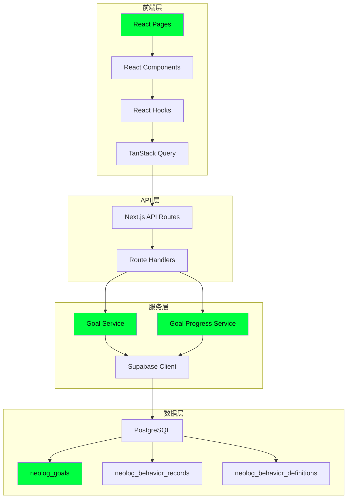
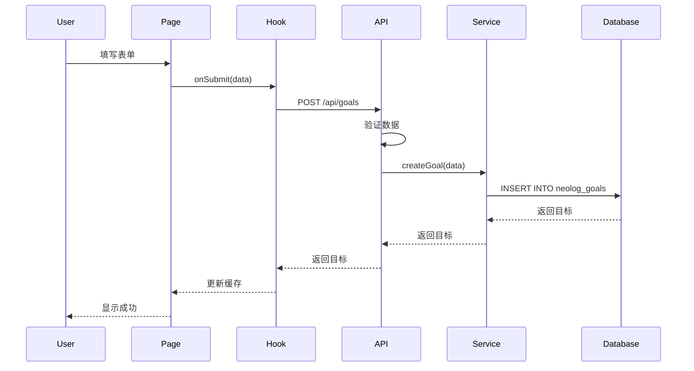
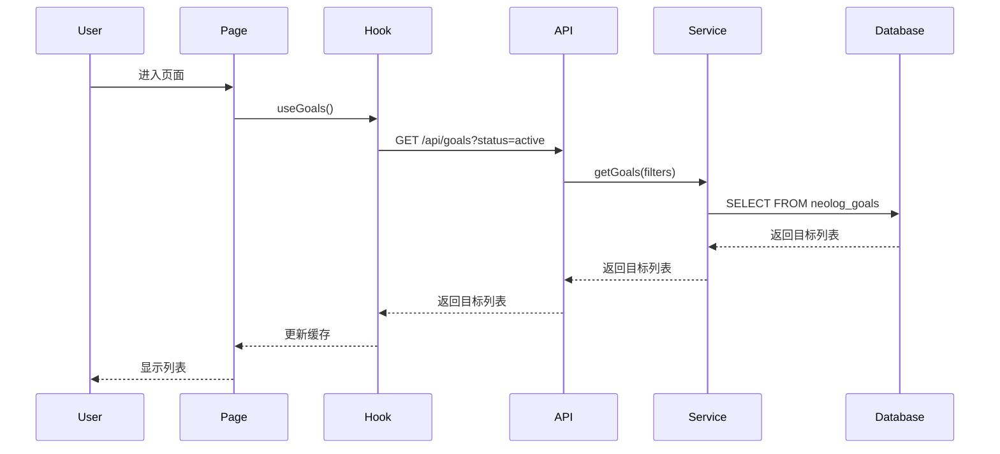
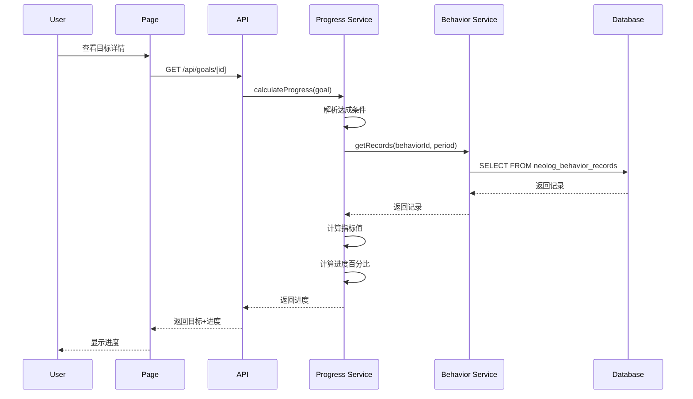

# 架构设计：目标管理模块

## 1. 系统架构图



## 2. 数据流图

### 2.1 创建目标流程



### 2.2 查看目标列表流程



### 2.3 计算目标进度流程



## 3. 组件层次结构

```
/goals Page
├── AuthenticatedLayout
│   └── TopNavbar
└── Container
    ├── PageHeader
    │   ├── Heading
    │   └── Button (创建目标)
    ├── GoalFilters
    │   ├── Select (状态)
    │   ├── Select (分类)
    │   ├── Select (排序)
    │   └── Input (搜索)
    └── GoalList
        └── GoalCard (×N)
            ├── GoalStatusBadge
            └── GoalProgressRing

/goals/[id] Page
├── AuthenticatedLayout
│   └── TopNavbar
└── Container
    ├── PageHeader
    │   ├── Button (返回)
    │   ├── Heading
    │   └── HStack
    │       ├── Button (编辑)
    │       ├── Button (删除)
    │       └── Button (标记为完成)
    └── GoalDetailCard
        ├── GoalInfo
        ├── GoalProgress
        │   ├── GoalProgressRing
        │   └── ProgressText
        ├── GoalProgressChart
        ├── GoalCriteria
        └── RelatedRecords
```

## 4. 服务层架构

```
goal-service.ts
├── getGoals(filters, sort, order)
│   └── 查询目标列表
├── getGoal(id)
│   └── 查询单个目标
├── createGoal(data)
│   └── 创建目标
├── updateGoal(id, data)
│   └── 更新目标
└── deleteGoal(id)
    └── 删除目标

goal-progress-service.ts
├── calculateProgress(goal)
│   ├── 解析达成条件
│   ├── 查询行为记录
│   ├── 计算指标值
│   ├── 判断是否达成
│   └── 计算进度百分比
└── calculateBatchProgress(goals)
    └── 批量计算进度
```

## 5. 状态管理

### 5.1 TanStack Query 缓存策略

```typescript
// 目标列表
queryKey: ['goals', filters]
staleTime: 60 * 1000 // 1分钟

// 单个目标
queryKey: ['goals', id]
staleTime: 30 * 1000 // 30秒

// 目标进度
queryKey: ['goals', id, 'progress']
staleTime: 10 * 1000 // 10秒
```

### 5.2 缓存更新策略

- **创建目标**: 使 `['goals']` 缓存失效
- **更新目标**: 更新 `['goals', id]` 缓存
- **删除目标**: 从 `['goals']` 缓存中移除

## 6. 错误处理架构

```
错误类型
├── 认证错误 (401)
│   └── 重定向到登录页
├── 权限错误 (403)
│   └── 显示权限不足提示
├── 未找到 (404)
│   └── 显示未找到提示
├── 验证错误 (400)
│   └── 显示表单错误
└── 服务器错误 (500)
    └── 显示错误提示，记录日志
```

## 7. 性能优化架构

### 7.1 前端优化

- **代码分割**: 页面级代码分割
- **懒加载**: 组件懒加载
- **虚拟滚动**: 大量目标时使用虚拟滚动
- **缓存**: TanStack Query 缓存

### 7.2 后端优化

- **数据库索引**: 确保必要索引存在
- **查询优化**: 使用索引查询
- **批量操作**: 批量计算进度
- **缓存**: 缓存计算结果

## 8. 安全架构

### 8.1 认证流程

```
用户请求
  ↓
检查 Authorization Header
  ↓
验证 Token
  ↓
获取用户信息
  ↓
继续处理请求
```

### 8.2 权限控制

```
RLS 策略
  ├── SELECT: auth.uid() = user_id
  ├── INSERT: auth.uid() = user_id
  ├── UPDATE: auth.uid() = user_id
  └── DELETE: auth.uid() = user_id
```

### 8.3 数据验证

```
输入数据
  ↓
Schema 验证
  ↓
业务规则验证
  ↓
数据库约束验证
  ↓
保存数据
```

