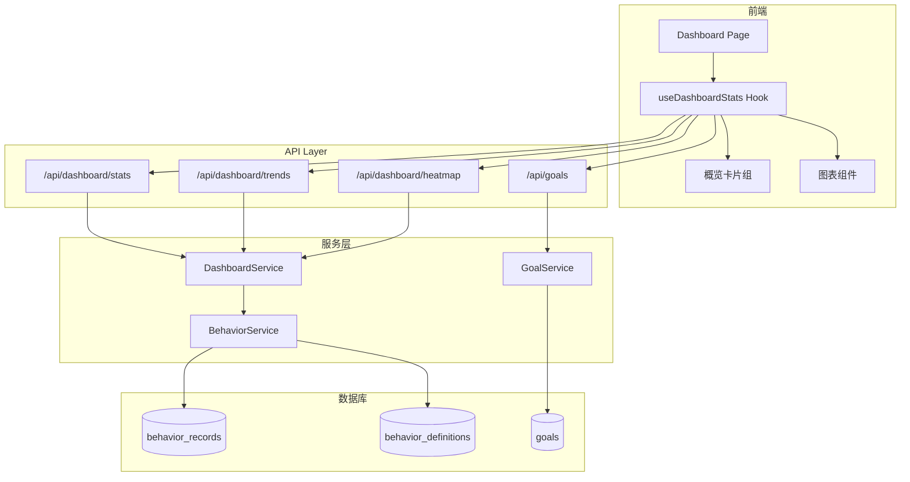
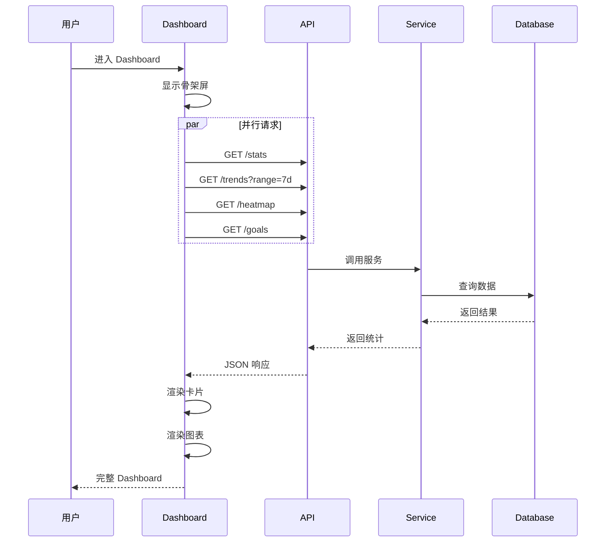
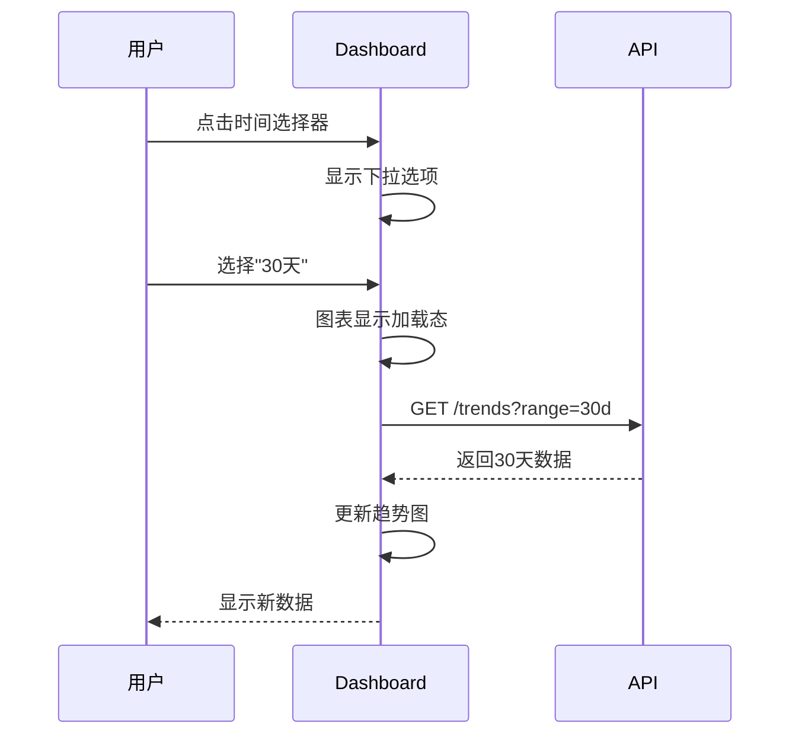
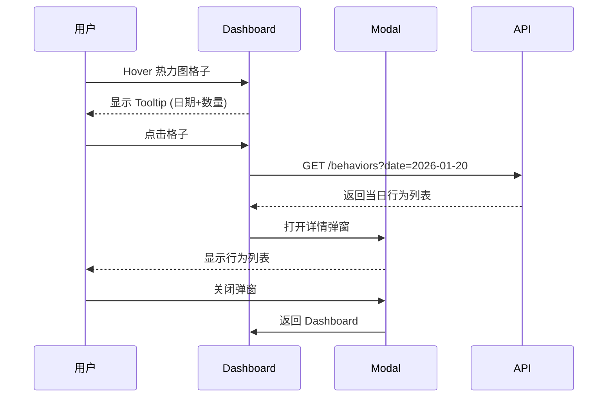
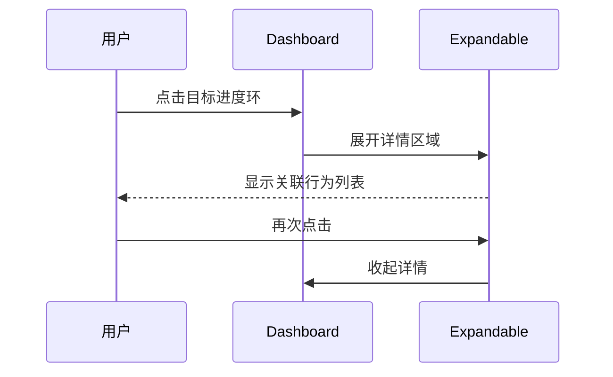

# 功能流程图

> PRD_001 | 可视化模块

## 整体架构

```
┌─────────────────────────────────────────────────────────────┐
│                      Dashboard Page                          │
├─────────────────────────────────────────────────────────────┤
│  ┌─────────────┐  ┌─────────────┐  ┌─────────────────────┐  │
│  │ 时间选择器  │  │ 刷新按钮   │  │     导出按钮        │  │
│  └─────────────┘  └─────────────┘  └─────────────────────┘  │
├─────────────────────────────────────────────────────────────┤
│  ┌──────────┐ ┌──────────┐ ┌──────────┐ ┌──────────┐       │
│  │今日统计  │ │连续天数  │ │目标达成率│ │ 周对比   │       │
│  │   Card   │ │   Card   │ │   Card   │ │   Card   │       │
│  └──────────┘ └──────────┘ └──────────┘ └──────────┘       │
├─────────────────────────────────────────────────────────────┤
│  ┌─────────────────────────────────────────────────────┐    │
│  │                   行为趋势折线图                      │    │
│  │              (支持类型筛选 + Hover 详情)              │    │
│  └─────────────────────────────────────────────────────┘    │
├─────────────────────────────────────────────────────────────┤
│  ┌─────────────────────────┐  ┌─────────────────────────┐  │
│  │     活跃度热力图        │  │      目标进度环组       │  │
│  │   (12个月日历视图)      │  │   (多个环形进度条)      │  │
│  └─────────────────────────┘  └─────────────────────────┘  │
├─────────────────────────────────────────────────────────────┤
│  ┌─────────────────────────────────────────────────────┐    │
│  │                   分类分布饼图 (P1)                   │    │
│  └─────────────────────────────────────────────────────┘    │
└─────────────────────────────────────────────────────────────┘
```

## 数据流



## 用户交互流

### 流程 1: 首次加载



### 流程 2: 切换时间范围



### 流程 3: 热力图钻取



### 流程 4: 目标进度钻取



## 状态管理

```
Dashboard State
├── timeRange: '7d' | '30d' | '90d' | 'custom'
├── customDateRange: { start: Date, end: Date }
├── selectedBehaviorType: string | null
├── expandedGoalId: string | null
└── isLoading: boolean

Derived State (TanStack Query)
├── stats: { todayCount, streakDays, goalRate, weekCompare }
├── trends: Array<{ date, count, type }>
├── heatmap: Array<{ date, count }>
└── goals: Array<{ id, name, progress }>
```

## 组件树

```
DashboardPage
├── TimeRangeSelector
├── StatsCardGroup
│   ├── TodayStatsCard
│   ├── StreakCard
│   ├── GoalRateCard
│   └── WeekCompareCard
├── TrendChart
│   ├── TypeFilter
│   └── LineChart
├── HeatmapSection
│   ├── CalendarHeatmap
│   └── DayDetailModal
├── GoalProgressSection
│   └── GoalProgressRing (multiple)
└── CategoryPieChart (P1)
```
