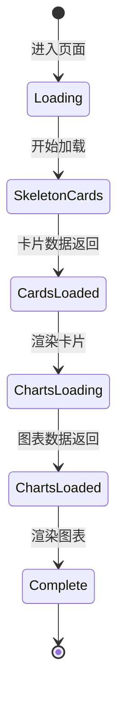
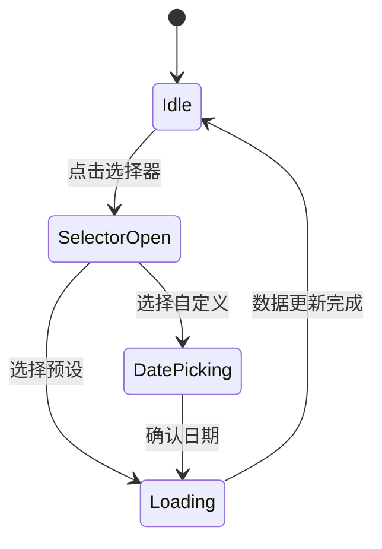
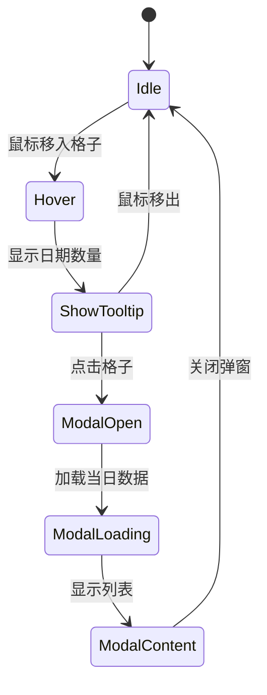

# UI 设计文档

> PRD_001 | 可视化模块 | 阶段 03-UI设计

## 1. 设计变量

### 1.1 颜色引用

| 变量名 | 色值 | 用途 |
|--------|------|------|
| `brand.matrix` | #00FF41 | 主强调、图表主色、成功状态 |
| `brand.alert` | #FF6B35 | 次强调、警告、下降趋势 |
| `brand.cyber` | #00D4FF | 链接、信息提示、数据点 |
| `bg.void` | #0A0A0A | 页面主背景 |
| `bg.carbon` | #1A1A1A | 卡片背景 |
| `bg.hover` | #2A2A2A | 悬停状态 |
| `text.neon` | #E0E0E0 | 主文字 |
| `text.mist` | #888888 | 次要文字 |

### 1.2 字体引用

| 变量名 | 字体 | 用途 |
|--------|------|------|
| `fonts.heading` | Press Start 2P | 页面标题 |
| `fonts.mono` | JetBrains Mono | 数据、代码 |
| `fonts.body` | VT323 | 正文 |

### 1.3 间距

| 变量 | 值 | 用途 |
|------|-----|------|
| `space.xs` | 4px | 最小间距 |
| `space.sm` | 8px | 紧凑间距 |
| `space.md` | 16px | 标准间距 |
| `space.lg` | 24px | 宽松间距 |
| `space.xl` | 32px | 区块间距 |

---

## 2. 组件复用分析

### 2.1 可直接复用

| 组件 | 路径 | 用途 |
|------|------|------|
| AuthenticatedLayout | `components/layout/` | 页面布局 |
| TopNavbar | `components/layout/` | 顶部导航 |

### 2.2 需扩展

| 组件 | 当前能力 | 扩展需求 |
|------|----------|----------|
| - | - | - |

### 2.3 需新建

| 组件 | 类型 | 优先级 |
|------|------|--------|
| TimeRangeSelector | 控件 | P0 |
| StatsCard | 卡片 | P0 |
| StreakCard | 卡片 | P0 |
| GoalRateCard | 卡片 | P0 |
| WeekCompareCard | 卡片 | P0 |
| TrendLineChart | 图表 | P0 |
| CalendarHeatmap | 图表 | P0 |
| GoalProgressRing | 图表 | P0 |
| CategoryPieChart | 图表 | P1 |
| ChartTooltip | 辅助 | P0 |
| EmptyState | 辅助 | P0 |
| DayDetailModal | 弹窗 | P0 |

---

## 3. 页面设计

### 3.1 Dashboard 页面 (`/dashboard`)

**关联 US**: US-001~US-010

#### Desktop 布局 (>1024px)

```
┌────────────────────────────────────────────────────────────────┐
│                        TopNavbar (64px)                        │
├────────────────────────────────────────────────────────────────┤
│  padding: 24px                                                 │
│  ┌─────────────────────────────────────────────────────────┐  │
│  │  DASHBOARD          [TimeRangeSelector] [刷新] [导出]   │  │
│  └─────────────────────────────────────────────────────────┘  │
│                                                                │
│  ┌──────────┐ ┌──────────┐ ┌──────────┐ ┌──────────┐         │
│  │ 今日统计 │ │ 连续天数 │ │ 目标达成 │ │ 周对比   │         │
│  │   Card   │ │   Card   │ │   Card   │ │   Card   │         │
│  │  180px   │ │  180px   │ │  180px   │ │  180px   │         │
│  └──────────┘ └──────────┘ └──────────┘ └──────────┘         │
│                          gap: 16px                             │
│  ┌─────────────────────────────────────────────────────────┐  │
│  │                    行为趋势折线图                        │  │
│  │                      height: 300px                       │  │
│  │  [类型筛选器]                                            │  │
│  └─────────────────────────────────────────────────────────┘  │
│                                                                │
│  ┌─────────────────────────┐  ┌─────────────────────────┐    │
│  │     活跃度热力图         │  │     目标进度环组        │    │
│  │     height: 200px       │  │     height: 200px       │    │
│  │  (12个月日历)           │  │  (3-4个进度环)          │    │
│  └─────────────────────────┘  └─────────────────────────┘    │
│                          gap: 16px                             │
│  ┌─────────────────────────────────────────────────────────┐  │
│  │                   分类分布饼图 (P1)                      │  │
│  │                     height: 250px                        │  │
│  └─────────────────────────────────────────────────────────┘  │
└────────────────────────────────────────────────────────────────┘
```

#### Mobile 布局 (<640px)

```
┌────────────────────────────┐
│      TopNavbar (56px)      │
├────────────────────────────┤
│  padding: 16px             │
│  ┌──────────────────────┐  │
│  │ DASHBOARD            │  │
│  │ [TimeRangeSelector]  │  │
│  └──────────────────────┘  │
│                            │
│  ┌──────────────────────┐  │
│  │  今日统计 + 连续天数  │  │
│  │  (2列 grid)          │  │
│  └──────────────────────┘  │
│  ┌──────────────────────┐  │
│  │  目标达成 + 周对比    │  │
│  │  (2列 grid)          │  │
│  └──────────────────────┘  │
│                            │
│  ┌──────────────────────┐  │
│  │    趋势图 (可横滚)    │  │
│  └──────────────────────┘  │
│                            │
│  ┌──────────────────────┐  │
│  │   热力图 (可横滚)     │  │
│  └──────────────────────┘  │
│                            │
│  ┌──────────────────────┐  │
│  │   目标进度 (纵向列表) │  │
│  └──────────────────────┘  │
│                            │
│      BottomTab (64px)      │
└────────────────────────────┘
```

---

## 4. 组件规格

详见 `components/` 目录下各组件规格文件。

### 4.1 组件列表

| 组件 | 规格文件 | 状态 |
|------|----------|------|
| TimeRangeSelector | `components/time-range-selector.md` | 已定义 |
| StatsCard | `components/stats-card.md` | 已定义 |
| TrendLineChart | `components/trend-line-chart.md` | 已定义 |
| CalendarHeatmap | `components/calendar-heatmap.md` | 已定义 |
| GoalProgressRing | `components/goal-progress-ring.md` | 已定义 |

---

## 5. 交互流程

### 5.1 首次加载



### 5.2 时间范围切换



### 5.3 热力图钻取



---

## 6. 动画规格

| 动画 | 触发 | 时长 | 效果 |
|------|------|------|------|
| 卡片入场 | 首次加载 | 300ms | fadeInUp, stagger 100ms |
| 图表绘制 | 数据加载完成 | 500ms | 从左到右绘制 |
| 热力图格子 | Hover | 150ms | scale(1.1) + 发光 |
| 进度环 | 首次加载 | 800ms | 从0到目标值动画 |
| Tooltip | Hover | 150ms | fadeIn |
| 数值变化 | 数据更新 | 300ms | 数字滚动动画 |

---

## 7. 空状态设计

| 场景 | 展示内容 |
|------|----------|
| 无任何记录 | 矩阵雨背景 + "开始你的第一条记录" + CTA按钮 |
| 无目标 | 虚线进度环 + "创建你的第一个目标" |
| 加载失败 | 故障动画 + "数据连接失败" + 重试按钮 |
| 时间范围无数据 | 淡色日历 + "该时段暂无记录" |
