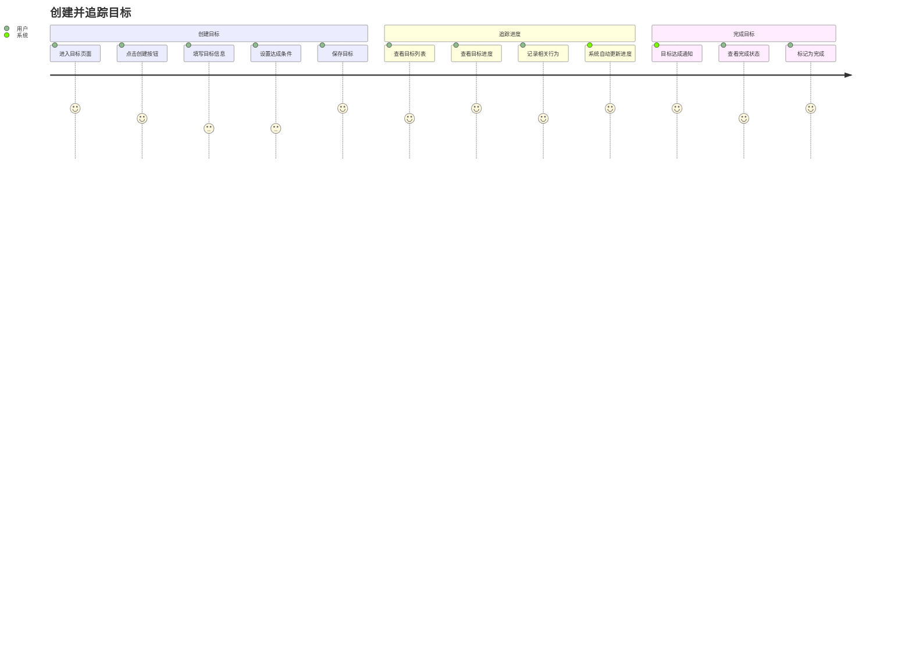
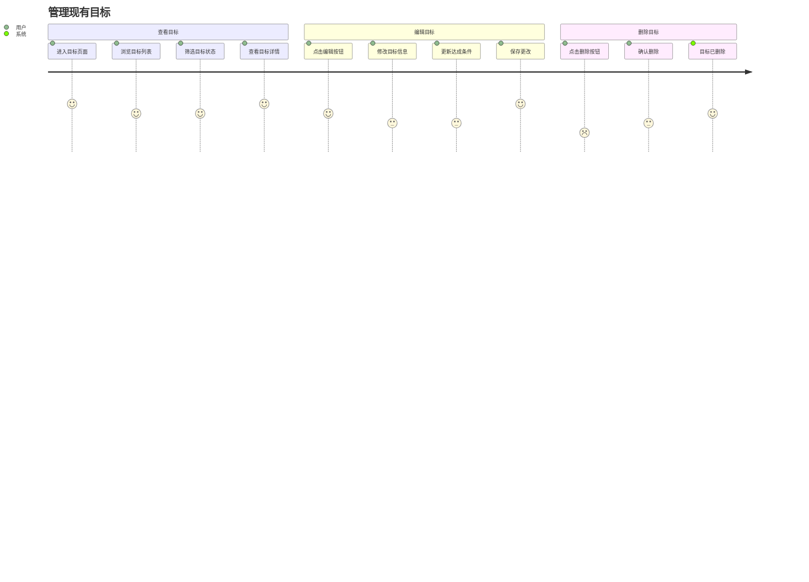

# 用户旅程图：目标管理

## 旅程概览

用户从创建目标到追踪完成的全流程体验。

## 主要旅程

### 旅程 1：创建并追踪目标

### 旅程 2：管理现有目标

## 详细步骤

### 步骤 1：创建目标

**触发点**：用户想要设定一个新目标

**步骤**：
1. 用户导航到 `/goals` 页面
2. 点击"创建目标"按钮（Primary 按钮，矩阵绿）
3. 打开目标创建表单（侧边栏或模态框）
4. 填写基本信息：
   - 目标名称（必填）
   - 描述（可选）
   - 分类（下拉选择：健康/财务/习惯/学习/其他）
   - 开始日期（日期选择器）
   - 结束日期（可选，日期选择器）
5. 设置达成条件：
   - 选择关联的行为定义
   - 选择指标类型（count/sum/avg）
   - 选择比较运算符（>/>=/</<=/==）
   - 输入目标值
   - 选择周期（daily/weekly/monthly）
6. 点击"保存"按钮
7. 系统验证数据
8. 创建成功，显示成功提示
9. 自动刷新目标列表

**情感曲线**：期待 → 填写中（可能困惑）→ 完成（满足）

### 步骤 2：查看目标进度

**触发点**：用户想了解目标完成情况

**步骤**：
1. 用户进入 `/goals` 页面
2. 查看目标列表（卡片或表格形式）
3. 每个目标显示：
   - 目标名称和描述
   - 分类标签
   - 进度百分比（进度环）
   - 当前值 / 目标值
   - 状态徽章（active/completed/abandoned）
   - 剩余时间（如果有结束日期）
4. 点击目标卡片查看详情
5. 查看详细进度信息：
   - 进度趋势图
   - 达成条件详情
   - 关联的行为记录列表

**情感曲线**：好奇 → 了解 → 激励/担忧

### 步骤 3：更新目标状态

**触发点**：目标已完成或需要放弃

**步骤**：
1. 用户在目标详情页面
2. 点击"标记为完成"或"放弃目标"按钮
3. 系统弹出确认对话框
4. 用户确认操作
5. 系统更新目标状态
6. 显示成功提示
7. 更新目标列表显示

**情感曲线**：决定 → 确认 → 完成（满足或遗憾）

## 痛点与机会

### 痛点
1. **创建目标流程复杂**：需要填写多个字段，设置达成条件可能不够直观
   - **机会**：提供模板、智能建议、简化流程

2. **进度计算不透明**：用户可能不理解进度是如何计算的
   - **机会**：显示计算逻辑、提供示例、可视化说明

3. **目标过多难以管理**：当目标数量增加时，列表可能变得混乱
   - **机会**：提供筛选、排序、分组功能

### 机会点
1. **自动化进度更新**：系统自动根据行为记录计算进度，减少用户操作
2. **智能提醒**：当进度落后时提醒用户
3. **目标分析**：提供目标完成率、趋势分析等洞察

## 关键指标

- **目标创建完成率**：创建流程的完成率
- **目标查看频率**：用户查看目标页面的频率
- **目标完成率**：用户设定的目标中实际完成的比例
- **平均目标数量**：每个用户平均拥有的目标数量

