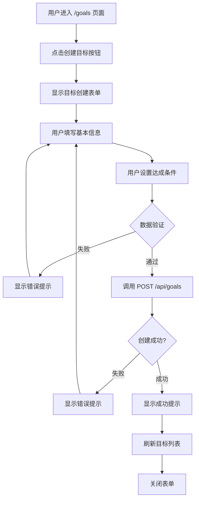
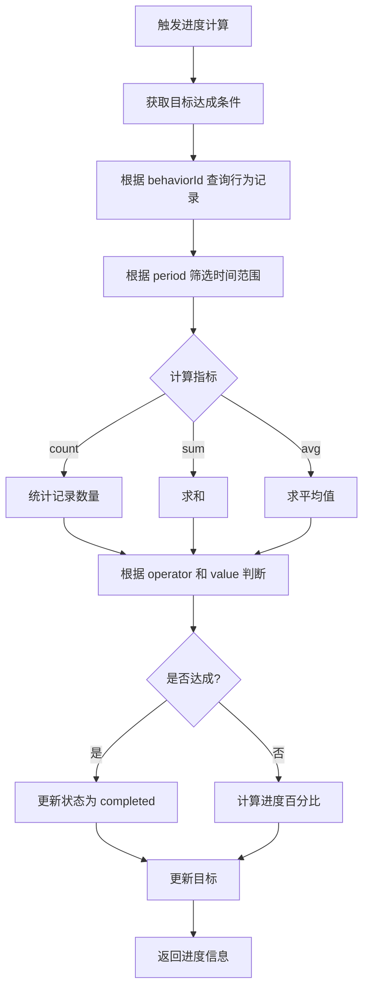
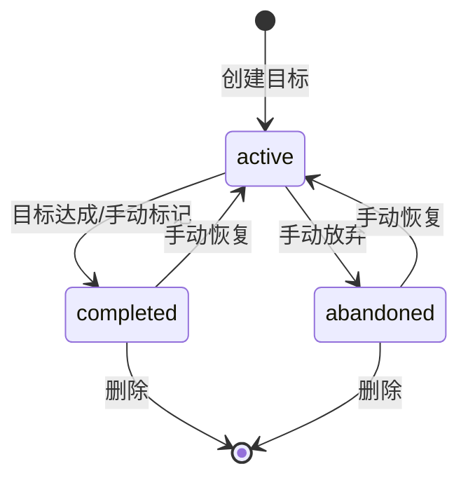
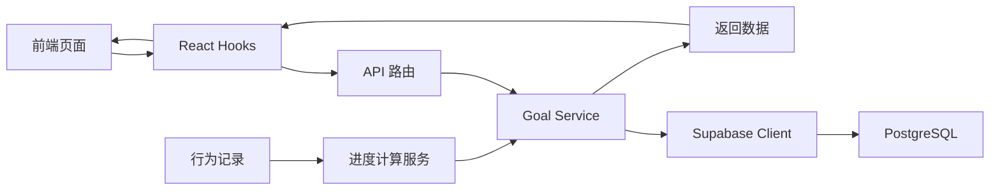

# 功能流程图：目标管理

## 1. 目标创建流程



## 2. 目标查看流程

```mermaid
flowchart TD
    A[用户进入 /goals 页面] --> B[调用 GET /api/goals]
    B --> C{加载成功?}
    C -->|失败| D[显示错误提示]
    C -->|成功| E[显示目标列表]
    E --> F[用户点击目标卡片]
    F --> G[导航到 /goals/[id]]
    G --> H[调用 GET /api/goals/[id]]
    H --> I{加载成功?}
    I -->|失败| J[显示错误提示]
    I -->|成功| K[显示目标详情]
    K --> L[计算并显示进度]
```

## 3. 目标编辑流程

```mermaid
flowchart TD
    A[用户在目标详情页面] --> B[点击编辑按钮]
    B --> C[显示编辑表单]
    C --> D[预填充现有数据]
    D --> E[用户修改信息]
    E --> F{数据验证}
    F -->|失败| G[显示错误提示]
    G --> E
    F -->|通过| H[调用 PATCH /api/goals/[id]]
    H --> I{更新成功?}
    I -->|失败| J[显示错误提示]
    J --> E
    I -->|成功| K[显示成功提示]
    K --> L[刷新目标详情]
    L --> M[重新计算进度]
```

## 4. 目标删除流程

```mermaid
flowchart TD
    A[用户在目标详情页面] --> B[点击删除按钮]
    B --> C[显示确认对话框]
    C --> D{用户确认?}
    D -->|取消| E[关闭对话框]
    D -->|确认| F[调用 DELETE /api/goals/[id]]
    F --> G{删除成功?}
    G -->|失败| H[显示错误提示]
    G -->|成功| I[显示成功提示]
    I --> J[导航到 /goals]
    J --> K[刷新目标列表]
```

## 5. 目标进度计算流程



## 6. 目标状态流转



## 7. 数据流图



