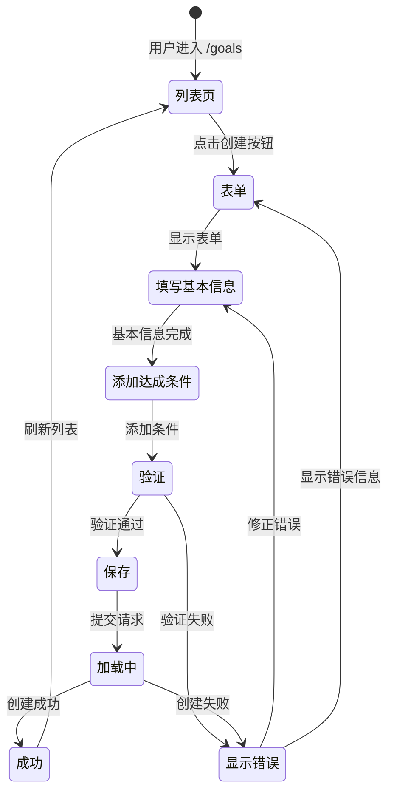
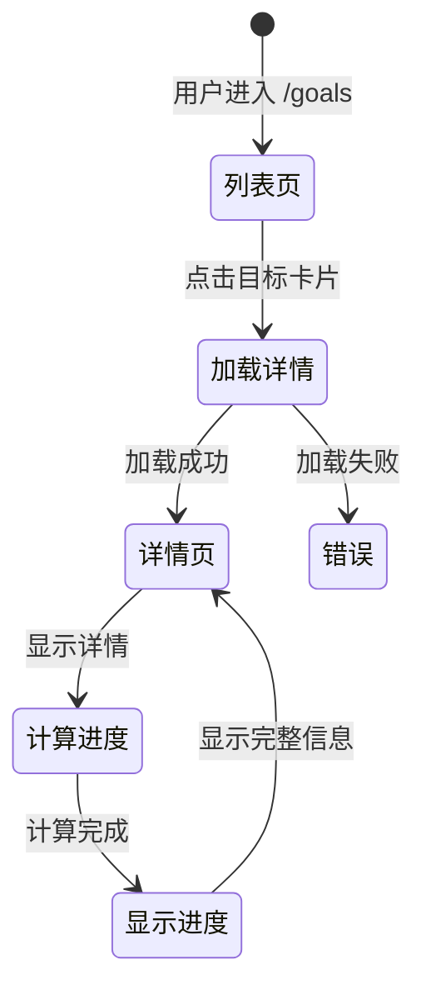
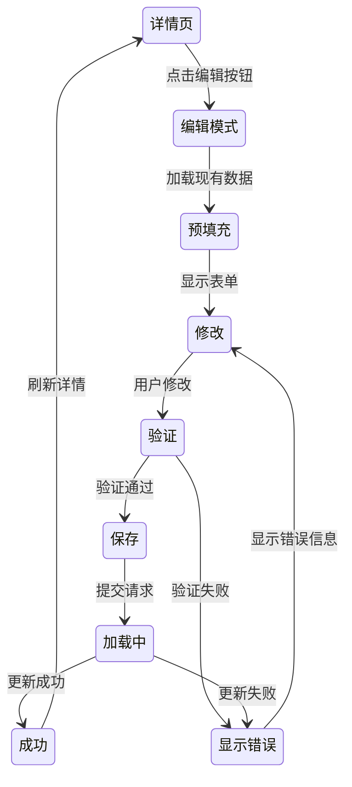

# UI 设计文档：目标管理模块

## 1. 设计变量

### 颜色
- **主强调色**: `brand.matrix` (#00FF41) - 用于主要操作按钮、进度环、链接
- **次强调色**: `brand.alert` (#FF6B35) - 用于警告、重要操作
- **背景色**: 
  - `bg.void` (#0A0A0A) - 主背景
  - `bg.carbon` (#1A1A1A) - 卡片/容器背景
  - `bg.dark` (#2A2A2A) - 悬停、次级容器
- **文字色**:
  - `text.neon` (#E0E0E0) - 主文字
  - `text.mist` (#888888) - 次要文字
  - `text.dim` (#555555) - 禁用状态
- **边框色**: `border.subtle` (rgba(0, 255, 65, 0.3))

### 字体
- **品牌/标题**: `Press Start 2P` / `Zpix`
- **正文**: `VT323` / `IBM Plex Mono` / `思源黑体`
- **数据/代码**: `JetBrains Mono`

### 间距
- 基础单位: 4px
- 常用: 4 / 8 / 12 / 16 / 24 / 32px

### 圆角
- 默认: 4px
- 卡片: 4px
- 按钮: 4px

## 2. 组件复用分析

### 可直接复用
- `Button` - Chakra UI 基础按钮组件
- `Input` - Chakra UI 输入框组件
- `Select` - Chakra UI 选择器组件
- `Textarea` - Chakra UI 文本域组件
- `Field.Root`, `Field.Label` - Chakra UI 表单字段组件
- `VStack`, `HStack`, `Box`, `Text` - Chakra UI 布局组件
- `Skeleton` - Chakra UI 加载骨架屏
- `GoalProgressRing` - 现有的目标进度环组件（需增强）

### 需扩展
- `GoalProgressRing` - 需要支持更多尺寸和状态变体

### 需新建
- `GoalList` - 目标列表组件
- `GoalCard` - 目标卡片组件
- `GoalForm` - 目标表单组件
- `GoalCriteriaForm` - 达成条件表单组件
- `GoalStatusBadge` - 目标状态徽章组件
- `GoalProgressChart` - 目标进度趋势图组件

## 3. 页面设计

### 3.1 /goals - 目标列表页面

**关联用户故事**: US-002, US-009

**桌面端布局**:
```
┌─────────────────────────────────────────────────────────┐
│ TopNavbar (64px)                                         │
├─────────────────────────────────────────────────────────┤
│ ┌─────────────────────────────────────────────────────┐ │
│ │ 目标管理                              [+ 创建目标]  │ │
│ ├─────────────────────────────────────────────────────┤ │
│ │ [筛选: 全部 ▼] [排序: 创建时间 ▼] [搜索框...]      │ │
│ ├─────────────────────────────────────────────────────┤ │
│ │ ┌──────────┐ ┌──────────┐ ┌──────────┐            │ │
│ │ │ GoalCard │ │ GoalCard │ │ GoalCard │            │ │
│ │ └──────────┘ └──────────┘ └──────────┘            │ │
│ │ ┌──────────┐ ┌──────────┐                          │ │
│ │ │ GoalCard │ │ GoalCard │                          │ │
│ │ └──────────┘ └──────────┘                          │ │
│ └─────────────────────────────────────────────────────┘ │
└─────────────────────────────────────────────────────────┘
```

**移动端布局**:
```
┌─────────────────────┐
│ TopNavbar (56px)    │
├─────────────────────┤
│ 目标管理            │
│ [+ 创建目标]        │
├─────────────────────┤
│ [筛选] [排序]       │
│ [搜索框...]         │
├─────────────────────┤
│ ┌─────────────────┐ │
│ │   GoalCard      │ │
│ └─────────────────┘ │
│ ┌─────────────────┐ │
│ │   GoalCard      │ │
│ └─────────────────┘ │
└─────────────────────┘
```

**功能区域**:
1. **页面标题**: "目标管理" + "创建目标"按钮（Primary，矩阵绿）
2. **筛选和排序**: 
   - 状态筛选（全部/进行中/已完成/已放弃）
   - 分类筛选（健康/财务/习惯/学习/其他）
   - 排序（创建时间/进度/名称）
   - 搜索框（搜索目标名称）
3. **目标列表**: 网格布局（桌面端 2-3 列，移动端 1 列）

### 3.2 /goals/[id] - 目标详情页面

**关联用户故事**: US-003, US-004, US-005, US-007, US-008

**桌面端布局**:
```
┌─────────────────────────────────────────────────────────┐
│ TopNavbar (64px)                                         │
├─────────────────────────────────────────────────────────┤
│ [← 返回] 目标详情                    [编辑] [删除]       │
├─────────────────────────────────────────────────────────┤
│ ┌─────────────────────────────────────────────────────┐ │
│ │ 目标名称                                    [状态]  │ │
│ │ 描述文本...                                         │ │
│ │ 分类: 健康 | 开始: 2026-01-01 | 结束: 2026-12-31   │ │
│ ├─────────────────────────────────────────────────────┤ │
│ │ 进度: [进度环 75%]                                   │ │
│ │ 当前: 75 / 目标: 100                                │ │
│ ├─────────────────────────────────────────────────────┤ │
│ │ [进度趋势图]                                         │ │
│ ├─────────────────────────────────────────────────────┤ │
│ │ 达成条件:                                            │ │
│ │ • 行为: 运动 | 指标: count | 目标: 100 | 周期: 月   │ │
│ ├─────────────────────────────────────────────────────┤ │
│ │ 关联行为记录:                                        │ │
│ │ • 2026-01-15 运动 30分钟                            │ │
│ │ • 2026-01-14 运动 45分钟                            │ │
│ └─────────────────────────────────────────────────────┘ │
└─────────────────────────────────────────────────────────┘
```

**移动端布局**:
```
┌─────────────────────┐
│ TopNavbar (56px)    │
├─────────────────────┤
│ [←] 目标详情        │
│        [编辑] [删除]│
├─────────────────────┤
│ 目标名称            │
│ [状态]              │
│ 描述...             │
│ 分类 | 日期         │
├─────────────────────┤
│ [进度环]            │
│ 75 / 100            │
├─────────────────────┤
│ [进度趋势图]        │
├─────────────────────┤
│ 达成条件            │
│ • ...               │
└─────────────────────┘
```

**功能区域**:
1. **页面头部**: 返回按钮 + 标题 + 操作按钮（编辑/删除）
2. **目标信息**: 名称、描述、分类、日期范围
3. **进度展示**: 进度环 + 当前值/目标值 + 进度趋势图
4. **达成条件**: 列表展示所有达成条件
5. **关联记录**: 显示相关的行为记录列表

## 4. 组件规格

### 4.1 GoalCard - 目标卡片组件

**用途**: 在目标列表中展示单个目标的摘要信息

**Props**:
```typescript
interface GoalCardProps {
  goal: Goal;
  onClick?: (goalId: string) => void;
}
```

**结构**:
```
┌─────────────────────┐
│ 目标名称      [状态]│
│ 描述文本...         │
│ 分类: 健康          │
│ [进度环 75%]        │
│ 75 / 100            │
│ 剩余: 30天          │
└─────────────────────┘
```

**状态变体**:
- **active**: 边框颜色 `brand.matrix`，进度环绿色
- **completed**: 边框颜色 `brand.matrix`（较暗），进度环绿色（100%），显示完成图标
- **abandoned**: 边框颜色 `text.dim`，进度环灰色，显示放弃图标

**交互**:
- 悬停: 边框亮度增加，轻微发光效果
- 点击: 导航到 `/goals/[id]`

### 4.2 GoalForm - 目标表单组件

**用途**: 创建或编辑目标

**Props**:
```typescript
interface GoalFormProps {
  goal?: Goal; // 编辑时传入
  onSubmit: (goal: GoalCreateRequest) => void;
  onCancel: () => void;
  isLoading?: boolean;
}
```

**结构**:
```
┌─────────────────────────────────┐
│ 创建目标 / 编辑目标              │
├─────────────────────────────────┤
│ 目标名称 *                       │
│ [输入框]                         │
│ 描述                             │
│ [文本域]                         │
│ 分类 *                           │
│ [下拉选择]                       │
│ 开始日期 *                       │
│ [日期选择器]                     │
│ 结束日期                         │
│ [日期选择器]                     │
├─────────────────────────────────┤
│ 达成条件 *                       │
│ [+ 添加条件]                     │
│ ┌─────────────────────────────┐ │
│ │ 关联行为: [选择...]          │ │
│ │ 指标: [count/sum/avg]       │ │
│ │ 运算符: [>/>=/</<=/==]      │ │
│ │ 目标值: [输入]               │ │
│ │ 周期: [daily/weekly/monthly]│ │
│ │ [删除]                       │ │
│ └─────────────────────────────┘ │
├─────────────────────────────────┤
│ [取消] [保存]                    │
└─────────────────────────────────┘
```

**验证**:
- 目标名称: 必填，最大 100 字符
- 开始日期: 必填
- 结束日期: 不能早于开始日期
- 达成条件: 至少一个

### 4.3 GoalCriteriaForm - 达成条件表单组件

**用途**: 在 GoalForm 中用于添加/编辑达成条件

**Props**:
```typescript
interface GoalCriteriaFormProps {
  criteria: GoalCriteria;
  behaviorDefinitions: BehaviorDefinition[];
  onChange: (criteria: GoalCriteria) => void;
  onDelete?: () => void;
}
```

**字段**:
- 关联行为: Select（从行为定义列表选择）
- 指标: Select（count/sum/avg）
- 运算符: Select（>/>=/</<=/==）
- 目标值: Input（数字，必填，> 0）
- 周期: Select（daily/weekly/monthly）

### 4.4 GoalStatusBadge - 目标状态徽章组件

**用途**: 显示目标状态

**Props**:
```typescript
interface GoalStatusBadgeProps {
  status: 'active' | 'completed' | 'abandoned';
}
```

**样式**:
- **active**: 背景 `rgba(0, 255, 65, 0.2)`，文字 `brand.matrix`，边框 `brand.matrix`
- **completed**: 背景 `rgba(0, 255, 65, 0.3)`，文字 `brand.matrix`，边框 `brand.matrix`
- **abandoned**: 背景 `rgba(136, 136, 136, 0.2)`，文字 `text.mist`，边框 `text.mist`

### 4.5 GoalProgressChart - 目标进度趋势图组件

**用途**: 显示目标进度随时间的变化趋势

**Props**:
```typescript
interface GoalProgressChartProps {
  goalId: string;
  startDate: string;
  endDate?: string;
  period: 'daily' | 'weekly' | 'monthly';
}
```

**图表类型**: 折线图（使用现有 trend-line-chart 组件或类似）

**数据点**: 每个周期一个数据点，显示当前值/目标值

## 5. 交互流程

### 5.1 创建目标流程



### 5.2 查看目标详情流程



### 5.3 编辑目标流程



## 6. 响应式设计

### 断点
- **Mobile**: < 640px - 单列布局，底部操作按钮
- **Tablet**: 640-1024px - 双列布局
- **Desktop**: > 1024px - 多列网格布局

### 适配策略
- 目标列表: Mobile 1列，Tablet 2列，Desktop 3列
- 表单: Mobile 全屏，Desktop 侧边栏或模态框
- 详情页: Mobile 垂直堆叠，Desktop 左右分栏

