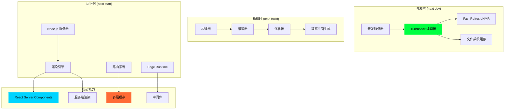
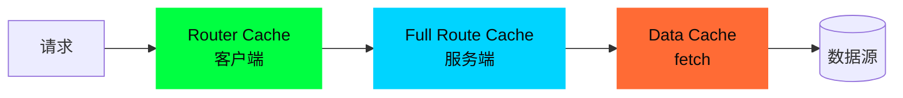
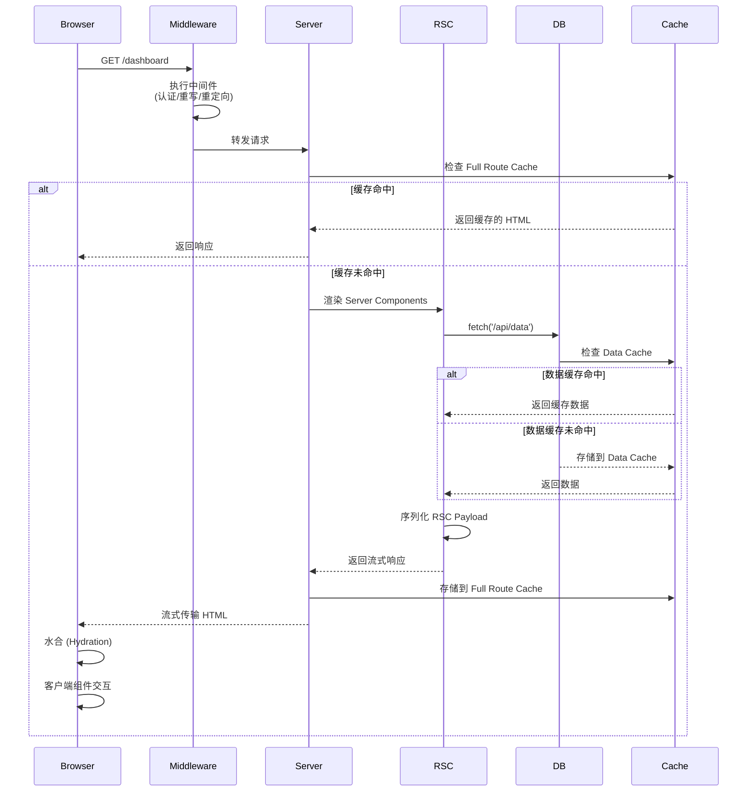
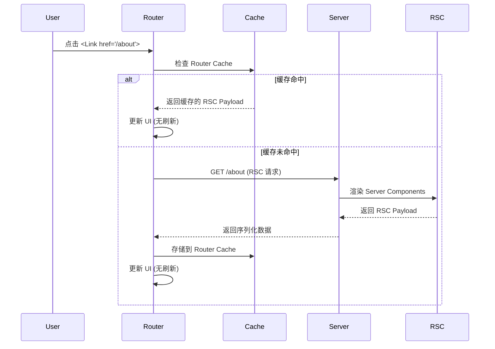

# 00 - Next.js 16.1 总览与架构

> 🟢 基础 | 理解 Next.js 的整体架构、核心模块和设计理念

## 目录

- [整体架构](#整体架构)
- [核心模块](#核心模块)
- [请求生命周期](#请求生命周期)
- [设计理念](#设计理念)
- [版本演进](#版本演进)

## 整体架构

Next.js 16.1 采用**多层架构**，将编译、渲染、路由、缓存等能力模块化：



## 核心模块

### 1. 编译层 (Turbopack)

**位置**: `packages/next-swc/crates/` (Rust) + `packages/next/src/build/`

```typescript
// 核心编译流程
interface TurbopackCompiler {
  // 增量编译
  compile(entry: string): Promise<CompilationResult>

  // 文件系统缓存 (16.1 稳定特性)
  cache: FileSystemCache

  // 模块图
  moduleGraph: ModuleGraph

  // HMR 更新
  hmrUpdate(changedFiles: Set<string>): HMRUpdate
}
```

**关键特性**:
- ✅ **增量编译**: 只重新编译变更的模块
- ✅ **文件系统缓存**: 持久化编译产物，重启快 80%
- ✅ **并行构建**: Rust 多线程并行处理
- ✅ **Tree Shaking**: 死代码消除

### 2. 渲染层 (React Server Components)

**位置**: `packages/next/src/server/app-render/`

```typescript
// RSC 渲染核心
interface AppRender {
  // 渲染服务端组件树
  renderToReadableStream(
    element: ReactElement,
    options: RenderOptions
  ): ReadableStream

  // 客户端引用序列化
  serializeClientReferences(
    references: ClientReferenceMap
  ): Uint8Array

  // 流式传输
  streamResponse(
    stream: ReadableStream,
    metadata: FlightData
  ): Response
}
```

**渲染模式**:
- **SSR (Server-Side Rendering)**: 服务端生成 HTML
- **SSG (Static Site Generation)**: 构建时预渲染
- **ISR (Incremental Static Regeneration)**: 增量静态再生成
- **Streaming SSR**: 流式服务端渲染
- **PPR (Partial Prerendering)**: 部分预渲染 (实验性)

### 3. 路由层 (App Router)

**位置**: `packages/next/src/client/components/app-router.tsx`

```typescript
// App Router 核心
interface AppRouter {
  // 导航
  push(href: string, options?: NavigateOptions): void
  replace(href: string, options?: NavigateOptions): void
  prefetch(href: string): Promise<void>

  // 状态管理
  state: {
    tree: FlightRouterState    // 路由树
    cache: CacheNode           // 路由缓存
    prefetchCache: PrefetchCache
  }
}
```

**文件系统约定**:
```
app/
├── layout.tsx        # 布局组件 (共享 UI)
├── page.tsx          # 页面组件
├── loading.tsx       # 加载 UI
├── error.tsx         # 错误边界
├── not-found.tsx     # 404 页面
├── route.ts          # API 路由
└── template.tsx      # 模板 (每次重新挂载)
```

### 4. 缓存层 (Multi-tier Cache)

**位置**: `packages/next/src/server/lib/incremental-cache/`



**四层缓存**:
1. **Request Memoization**: 请求去重
2. **Data Cache**: `fetch()` 结果缓存
3. **Full Route Cache**: 完整路由缓存
4. **Router Cache**: 客户端导航缓存

### 5. 中间件层 (Edge Runtime)

**位置**: `packages/next/src/server/web/`

```typescript
// 中间件执行环境
interface EdgeRuntime {
  // 轻量级 V8 隔离环境
  isolate: V8Isolate

  // Web 标准 API
  fetch: typeof fetch
  Request: typeof Request
  Response: typeof Response

  // 执行中间件
  run(middleware: MiddlewareFunction): Promise<Response>
}
```

## 请求生命周期

### SSR 请求完整流程



### 客户端导航流程



## 设计理念

### 1. 约定优于配置 (Convention over Configuration)

Next.js 通过文件系统约定减少配置：

```
app/
├── (auth)/          # 路由组 (不影响 URL)
│   ├── login/
│   └── register/
├── dashboard/
│   ├── @analytics/  # 并行路由
│   ├── @team/
│   └── layout.tsx   # 插槽布局
└── api/
    └── [...slug]/   # 捕获所有路由
        └── route.ts
```

### 2. 渐进式增强 (Progressive Enhancement)

从静态到动态，逐步增强：

```typescript
// 静态生成 (默认)
export default async function Page() {
  return <div>Static Content</div>
}

// 动态渲染 (使用 cookies/headers)
export default async function Page() {
  const cookieStore = cookies()  // 触发动态渲染
  return <div>Dynamic Content</div>
}

// 流式渲染 (Suspense)
export default async function Page() {
  return (
    <Suspense fallback={<Loading />}>
      <AsyncComponent />
    </Suspense>
  )
}
```

### 3. 服务端优先 (Server-First)

默认在服务端执行，减少客户端 JS：

```typescript
// Server Component (默认)
async function ServerComponent() {
  const data = await db.query() // 直接访问数据库
  return <UI data={data} />
}

// Client Component (显式标记)
'use client'
function ClientComponent() {
  const [state, setState] = useState()
  return <Interactive />
}
```

### 4. 零配置优化 (Zero-Config Optimization)

自动优化，无需手动配置：

- ✅ **自动代码分割**: 每个路由自动分割
- ✅ **图片优化**: `<Image>` 自动响应式优化
- ✅ **字体优化**: 自动内联字体 CSS
- ✅ **脚本优化**: `<Script strategy="lazyOnload">`
- ✅ **预取**: `<Link>` 自动预取可见链接

## 版本演进

### Next.js 13 → 16 关键变化

| 版本 | 关键特性 | 稳定性 |
|------|---------|--------|
| **13.0** | 引入 App Router, RSC | Beta |
| **13.4** | App Router 稳定 | Stable |
| **14.0** | Turbopack Dev (Beta), Partial Prerendering | Beta |
| **15.0** | React 19, Turbopack 改进 | Stable |
| **16.0** | Turbopack 构建, 性能优化 | Stable |
| **16.1** | Turbopack 文件系统缓存, Bundle Analyzer | Stable |

### 16.1 主要改进

```typescript
// 1. Turbopack 文件系统缓存 (稳定)
// 开发服务器重启速度提升 ~80%
next dev  // 自动启用缓存

// 2. Bundle Analyzer (实验性)
next build --experimental-bundle-analyzer

// 3. 调试支持
next dev --inspect  // Chrome DevTools 调试

// 4. serverExternalPackages 改进
// next.config.ts
export default {
  experimental: {
    serverExternalPackages: ['@prisma/client']  // 自动处理传递依赖
  }
}

// 5. 更小的安装包
npm install next  // 减少 20MB
```

## 核心数据结构

### FlightData (RSC Payload)

```typescript
// RSC 序列化格式
type FlightData = Array<{
  // 路由段
  segment: string

  // 树结构
  tree: FlightRouterState

  // 子树数据
  subTreeData: React.ReactNode | null

  // 头部信息
  head: React.ReactNode | null
}>

// 示例 Payload
[
  [
    'dashboard',                    // segment
    { children: ['analytics', {}] }, // tree
    <ServerComponent />,            // subTreeData
    <Head />                        // head
  ]
]
```

### CacheNode (Router Cache)

```typescript
interface CacheNode {
  // 状态
  status: 'lazy' | 'loading' | 'ready'

  // 数据
  data: FlightData | null

  // 子缓存
  subTreeData: React.ReactNode | null
  parallelRoutes: Map<string, CacheNode>

  // 过期时间
  expiresAt: number | null
}
```

## 关键源码路径

```
packages/next/
├── src/
│   ├── build/                    # 构建系统
│   │   ├── webpack/              # Webpack 配置 (legacy)
│   │   └── webpack-config.ts
│   ├── client/                   # 客户端运行时
│   │   ├── components/
│   │   │   ├── app-router.tsx    # App Router 核心
│   │   │   ├── layout-router.tsx # 布局路由
│   │   │   └── navigation.ts     # useRouter/usePathname
│   │   └── index.tsx             # 客户端入口
│   ├── server/                   # 服务端运行时
│   │   ├── app-render/           # App Router 渲染
│   │   │   ├── action-handler.ts # Server Actions
│   │   │   └── create-component-tree.tsx
│   │   ├── base-server.ts        # HTTP 服务器基类
│   │   ├── next-server.ts        # Next.js 服务器
│   │   └── web/                  # Edge Runtime
│   ├── shared/                   # 共享代码
│   │   └── lib/
│   │       ├── router/           # 路由共享逻辑
│   │       └── lazy-dynamic/     # 动态导入
│   └── telemetry/                # 遥测数据
└── next.config.ts                # 配置文件
```

## 调试技巧

### 1. 开启详细日志

```bash
# 开启详细日志
DEBUG=next:* next dev

# Turbopack 日志
TURBOPACK_LOG=1 next dev

# 源码 map
next dev --experimental-debug
```

### 2. 检查缓存

```typescript
// app/page.tsx
export const revalidate = 0  // 禁用缓存，方便调试
export const dynamic = 'force-dynamic'  // 强制动态渲染
```

### 3. 查看 RSC Payload

```bash
# 客户端导航请求
curl http://localhost:3000/about \
  -H "RSC: 1" \
  -H "Next-Router-Prefetch: 1"
```

## 性能指标

| 指标 | 目标 | 说明 |
|------|------|------|
| **首屏时间 (FCP)** | < 1.8s | First Contentful Paint |
| **可交互时间 (TTI)** | < 3.8s | Time to Interactive |
| **布局稳定性 (CLS)** | < 0.1 | Cumulative Layout Shift |
| **首字节时间 (TTFB)** | < 600ms | Time to First Byte |

## 下一步

- [01 - App Router](./01-app-router.md) - 深入文件系统路由实现
- [02 - Turbopack](./02-turbopack.md) - 理解新一代编译器
- [10 - React Server Components](./10-server-components.md) - RSC 架构详解

---

**Sources:**
- [Next.js 16.1 Release](https://nextjs.org/blog/next-16-1)
- [Next.js Documentation](https://nextjs.org/docs)
