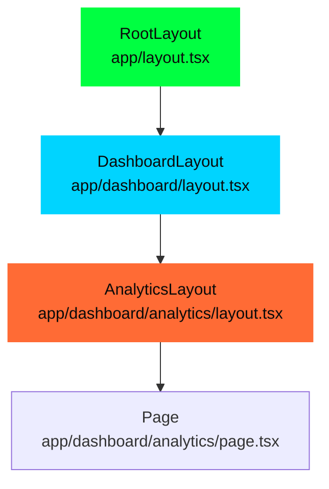

# 01 - App Router 核心机制

> 🟡 中级 | 深入 App Router 的文件系统路由、布局系统和导航实现

## 目录

- [文件系统路由](#文件系统路由)
- [路由匹配算法](#路由匹配算法)
- [布局系统](#布局系统)
- [导航机制](#导航机制)
- [并行路由与拦截](#并行路由与拦截)
- [源码实现](#源码实现)

## 文件系统路由

### 路由约定

```
app/
├── page.tsx                    # /
├── about/
│   └── page.tsx               # /about
├── blog/
│   ├── [slug]/                # /blog/:slug (动态段)
│   │   └── page.tsx
│   └── [...slug]/             # /blog/* (捕获所有)
│       └── page.tsx
├── (marketing)/               # 路由组 (不影响 URL)
│   ├── about/
│   └── contact/
├── dashboard/
│   ├── @analytics/            # 并行路由 (插槽)
│   │   └── page.tsx
│   ├── @team/
│   │   └── page.tsx
│   └── layout.tsx             # 接收 analytics 和 team props
└── photos/
    ├── [id]/
    │   └── page.tsx
    └── (..)photos/[id]/       # 拦截路由 (模态框)
        └── page.tsx
```

### 特殊文件

| 文件 | 用途 | 导出 |
|------|------|------|
| `layout.tsx` | 共享 UI，不重新挂载 | `default export` |
| `page.tsx` | 唯一页面内容 | `default export` |
| `loading.tsx` | 加载 UI (Suspense 边界) | `default export` |
| `error.tsx` | 错误边界 | `default export` |
| `not-found.tsx` | 404 页面 | `default export` |
| `template.tsx` | 每次导航重新挂载 | `default export` |
| `route.ts` | API 端点 | HTTP 方法 |
| `default.tsx` | 并行路由回退 | `default export` |

## 路由匹配算法

### 1. 文件系统扫描

**源码位置**: `packages/next/src/lib/metadata/resolve-metadata.ts`

```typescript
// 简化的路由树构建
interface RouteNode {
  segment: string              // 路由段 (如 'blog', '[slug]')
  type: 'static' | 'dynamic' | 'catch-all'
  children: Map<string, RouteNode>
  page?: PageModule            // page.tsx 模块
  layout?: LayoutModule        // layout.tsx 模块
  loading?: LoadingModule      // loading.tsx 模块
  error?: ErrorModule          // error.tsx 模块
}

// 构建路由树
function buildRouteTree(appDir: string): RouteNode {
  const root: RouteNode = {
    segment: '',
    type: 'static',
    children: new Map()
  }

  // 递归扫描 app 目录
  function scanDirectory(dir: string, node: RouteNode) {
    const entries = fs.readdirSync(dir, { withFileTypes: true })

    for (const entry of entries) {
      if (entry.isDirectory()) {
        const segment = entry.name

        // 跳过路由组 (marketing)
        if (segment.startsWith('(') && segment.endsWith(')')) {
          scanDirectory(path.join(dir, segment), node)
          continue
        }

        // 创建子节点
        const childNode: RouteNode = {
          segment: normalizeSegment(segment),
          type: getSegmentType(segment),
          children: new Map()
        }

        node.children.set(segment, childNode)
        scanDirectory(path.join(dir, segment), childNode)
      } else if (entry.isFile()) {
        // 加载特殊文件
        const fileName = entry.name
        if (fileName === 'page.tsx' || fileName === 'page.js') {
          node.page = require(path.join(dir, fileName))
        } else if (fileName === 'layout.tsx' || fileName === 'layout.js') {
          node.layout = require(path.join(dir, fileName))
        }
        // ... loading, error, etc.
      }
    }
  }

  scanDirectory(appDir, root)
  return root
}

// 段类型判断
function getSegmentType(segment: string): RouteNode['type'] {
  if (segment.startsWith('[...')) return 'catch-all'
  if (segment.startsWith('[')) return 'dynamic'
  return 'static'
}

// 规范化段名称 ([slug] -> :slug)
function normalizeSegment(segment: string): string {
  if (segment.startsWith('[') && segment.endsWith(']')) {
    return `:${segment.slice(1, -1)}`
  }
  return segment
}
```

### 2. 路径匹配

```mermaid
graph TD
    Start[请求路径: /blog/hello-world] --> Split[分割路径段]
    Split --> Segments["['blog', 'hello-world']"]

    Segments --> Match1{匹配 'blog'}
    Match1 -->|静态匹配| BlogNode[RouteNode: blog]

    BlogNode --> Match2{匹配 'hello-world'}
    Match2 -->|动态匹配 [slug]| SlugNode[RouteNode: [slug]]

    SlugNode --> Check{存在 page.tsx?}
    Check -->|是| Collect[收集所有布局]
    Check -->|否| NotFound[404]

    Collect --> Chain[构建组件链]
    Chain --> Render[渲染]

    style Match1 fill:#00FF41,stroke:#00FF41,color:#0A0A0A
    style Match2 fill:#00D4FF,stroke:#00D4FF,color:#0A0A0A
    style Collect fill:#FF6B35,stroke:#FF6B35,color:#0A0A0A
```

**源码实现**:

```typescript
// 简化的路径匹配器
function matchRoute(pathname: string, tree: RouteNode): MatchResult | null {
  const segments = pathname.split('/').filter(Boolean)
  const params: Record<string, string> = {}
  let currentNode = tree

  for (let i = 0; i < segments.length; i++) {
    const segment = segments[i]
    let matched = false

    // 1. 优先静态匹配
    if (currentNode.children.has(segment)) {
      currentNode = currentNode.children.get(segment)!
      matched = true
    } else {
      // 2. 动态段匹配
      for (const [key, node] of currentNode.children) {
        if (node.type === 'dynamic') {
          // [slug] 匹配
          const paramName = key.slice(1, -1)
          params[paramName] = segment
          currentNode = node
          matched = true
          break
        } else if (node.type === 'catch-all') {
          // [...slug] 匹配剩余所有段
          const paramName = key.slice(4, -1) // 去掉 '[...' 和 ']'
          params[paramName] = segments.slice(i).join('/')
          currentNode = node
          matched = true
          break
        }
      }
    }

    if (!matched) {
      return null // 未找到匹配
    }
  }

  // 检查是否有 page.tsx
  if (!currentNode.page) {
    return null
  }

  return {
    params,
    node: currentNode
  }
}

interface MatchResult {
  params: Record<string, string>
  node: RouteNode
}
```

### 3. 优先级规则

匹配优先级（从高到低）：

```
1. 静态段         /blog/hello
2. 动态段         /blog/[slug]
3. 捕获所有段     /blog/[...slug]
```

示例：

```
app/
├── blog/
│   ├── [slug]/page.tsx       # 优先级 2
│   ├── hello/page.tsx        # 优先级 1 (优先匹配)
│   └── [...slug]/page.tsx    # 优先级 3

/blog/hello        → app/blog/hello/page.tsx
/blog/world        → app/blog/[slug]/page.tsx (params: { slug: 'world' })
/blog/a/b/c        → app/blog/[...slug]/page.tsx (params: { slug: ['a','b','c'] })
```

## 布局系统

### 嵌套布局



**组件树构建**:

```typescript
// packages/next/src/server/app-render/create-component-tree.tsx

async function createComponentTree(
  matchedRoute: MatchResult
): Promise<React.ReactElement> {
  const { node, params } = matchedRoute
  const layouts: LayoutModule[] = []
  const loadings: LoadingModule[] = []
  const errors: ErrorModule[] = []

  // 从根到叶子收集所有布局
  let current = node
  const path: RouteNode[] = []

  while (current) {
    path.unshift(current)
    current = current.parent // 假设有父节点引用
  }

  for (const node of path) {
    if (node.layout) layouts.push(node.layout)
    if (node.loading) loadings.push(node.loading)
    if (node.error) errors.push(node.error)
  }

  // 从外到内嵌套组件
  let tree = <Page {...params} />

  // 包裹 loading (Suspense 边界)
  for (let i = loadings.length - 1; i >= 0; i--) {
    const Loading = loadings[i].default
    tree = (
      <Suspense fallback={<Loading />}>
        {tree}
      </Suspense>
    )
  }

  // 包裹 error (错误边界)
  for (let i = errors.length - 1; i >= 0; i--) {
    const Error = errors[i].default
    tree = (
      <ErrorBoundary fallback={<Error />}>
        {tree}
      </ErrorBoundary>
    )
  }

  // 包裹 layout
  for (let i = layouts.length - 1; i >= 0; i--) {
    const Layout = layouts[i].default
    tree = <Layout>{tree}</Layout>
  }

  return tree
}
```

**渲染结果**:

```tsx
<RootLayout>
  <ErrorBoundary fallback={<RootError />}>
    <Suspense fallback={<RootLoading />}>
      <DashboardLayout>
        <ErrorBoundary fallback={<DashboardError />}>
          <Suspense fallback={<DashboardLoading />}>
            <AnalyticsLayout>
              <ErrorBoundary fallback={<AnalyticsError />}>
                <Suspense fallback={<AnalyticsLoading />}>
                  <Page params={{ ... }} />
                </Suspense>
              </ErrorBoundary>
            </AnalyticsLayout>
          </Suspense>
        </ErrorBoundary>
      </DashboardLayout>
    </Suspense>
  </ErrorBoundary>
</RootLayout>
```

### Layout vs Template

| 特性 | Layout | Template |
|------|--------|----------|
| **重新挂载** | ❌ 导航时保持状态 | ✅ 每次导航重新挂载 |
| **用途** | 共享 UI (导航栏、侧边栏) | 需要重置状态的 UI |
| **性能** | 更好 (复用 DOM) | 较差 (重新创建) |

```tsx
// app/layout.tsx - 不重新挂载
export default function Layout({ children }) {
  const [count, setCount] = useState(0) // 导航时保持状态
  return (
    <div>
      <Nav count={count} onClick={() => setCount(c => c + 1)} />
      {children}
    </div>
  )
}

// app/template.tsx - 每次重新挂载
export default function Template({ children }) {
  const [count, setCount] = useState(0) // 导航时重置为 0
  return (
    <div>
      <Counter count={count} onClick={() => setCount(c => c + 1)} />
      {children}
    </div>
  )
}
```

## 导航机制

### 客户端路由

**源码位置**: `packages/next/src/client/components/app-router.tsx`

```mermaid
sequenceDiagram
    participant User
    participant Link
    participant Router
    participant Cache
    participant Server

    User->>Link: 点击 <Link href="/about">
    Link->>Link: event.preventDefault()
    Link->>Router: router.push('/about')

    Router->>Cache: 检查 Router Cache
    alt 缓存命中
        Cache-->>Router: 返回 CacheNode
        Router->>Router: reducer(state, action)
        Router->>Router: React.startTransition()
        Router-->>User: 更新 UI (无刷新)
    else 缓存未命中
        Router->>Server: fetch RSC Payload
        Server-->>Router: FlightData
        Router->>Cache: 更新缓存
        Router->>Router: reducer(state, action)
        Router-->>User: 更新 UI (无刷新)
    end
```

**核心实现**:

```typescript
// packages/next/src/client/components/app-router.tsx

interface AppRouterState {
  tree: FlightRouterState       // 路由树状态
  cache: CacheNode              // 缓存节点
  prefetchCache: PrefetchCache  // 预取缓存
  pushRef: PushRef              // 导航引用
  focusAndScrollRef: FocusAndScrollRef
  canonicalUrl: string          // 当前 URL
}

function appReducer(
  state: AppRouterState,
  action: AppRouterAction
): AppRouterState {
  switch (action.type) {
    case 'navigate': {
      const { url, cacheType } = action
      const href = new URL(url, location.href)

      // 检查缓存
      const cached = findCacheNode(state.cache, href.pathname)
      if (cached && cached.status === 'ready') {
        return {
          ...state,
          canonicalUrl: href.toString(),
          pushRef: { pendingPush: true, mpaNavigation: false }
        }
      }

      // 触发 RSC 请求
      return {
        ...state,
        canonicalUrl: href.toString(),
        pushRef: { pendingPush: true, mpaNavigation: false },
        cache: createLazyCacheNode(href.pathname) // 创建 lazy 缓存节点
      }
    }

    case 'prefetch': {
      const { url } = action
      // 预取 RSC Payload
      prefetchRSC(url)
      return state
    }

    case 'server-patch': {
      const { flightData } = action
      // 更新缓存
      const newCache = applyFlightData(state.cache, flightData)
      return {
        ...state,
        cache: newCache
      }
    }

    default:
      return state
  }
}

// App Router 组件
function AppRouter({ initialTree, initialCanonicalUrl }: AppRouterProps) {
  const [state, dispatch] = useReducer(appReducer, {
    tree: initialTree,
    cache: createCacheNode(),
    prefetchCache: new Map(),
    pushRef: { pendingPush: false, mpaNavigation: false },
    focusAndScrollRef: { apply: false },
    canonicalUrl: initialCanonicalUrl
  })

  useEffect(() => {
    // 监听 popstate (浏览器前进/后退)
    function onPopState(event: PopStateEvent) {
      const url = new URL(window.location.href)
      dispatch({ type: 'navigate', url: url.toString(), cacheType: 'soft' })
    }

    window.addEventListener('popstate', onPopState)
    return () => window.removeEventListener('popstate', onPopState)
  }, [])

  // 渲染缓存节点
  return <CacheNodeRenderer node={state.cache} />
}
```

### Link 组件

```typescript
// packages/next/src/client/components/link.tsx

function Link({
  href,
  prefetch = true,
  children,
  ...props
}: LinkProps) {
  const router = useRouter()

  // 预取逻辑
  useEffect(() => {
    if (prefetch && isInViewport(linkRef.current)) {
      router.prefetch(href)
    }
  }, [href, prefetch])

  function handleClick(e: React.MouseEvent) {
    e.preventDefault()

    // 客户端导航
    router.push(href)
  }

  return (
    <a href={href} onClick={handleClick} {...props}>
      {children}
    </a>
  )
}
```

### useRouter Hook

```typescript
// packages/next/src/client/components/navigation.ts

export function useRouter(): AppRouterInstance {
  const router = useContext(AppRouterContext)

  if (!router) {
    throw new Error('useRouter must be used within AppRouter')
  }

  return useMemo(() => ({
    push: (href: string, options?: NavigateOptions) => {
      router.dispatch({
        type: 'navigate',
        url: href,
        cacheType: options?.scroll === false ? 'soft' : 'hard'
      })
    },

    replace: (href: string, options?: NavigateOptions) => {
      router.dispatch({
        type: 'navigate',
        url: href,
        cacheType: 'hard',
        replace: true
      })
    },

    prefetch: (href: string) => {
      router.dispatch({
        type: 'prefetch',
        url: href
      })
    },

    back: () => {
      window.history.back()
    },

    forward: () => {
      window.history.forward()
    },

    refresh: () => {
      router.dispatch({
        type: 'refresh'
      })
    }
  }), [router])
}
```

## 并行路由与拦截

### 并行路由 (@slots)

**用途**: 同时渲染多个页面到不同插槽

```
app/dashboard/
├── @analytics/
│   └── page.tsx
├── @team/
│   └── page.tsx
├── layout.tsx
└── page.tsx
```

**Layout 实现**:

```tsx
// app/dashboard/layout.tsx
export default function DashboardLayout({
  children,    // 默认插槽 (page.tsx)
  analytics,   // @analytics 插槽
  team         // @team 插槽
}: {
  children: React.ReactNode
  analytics: React.ReactNode
  team: React.ReactNode
}) {
  return (
    <div className="dashboard">
      <div className="main">{children}</div>
      <div className="sidebar">
        <div className="analytics">{analytics}</div>
        <div className="team">{team}</div>
      </div>
    </div>
  )
}
```

**渲染流程**:

```mermaid
graph LR
    Request[/dashboard] --> Render[渲染 Layout]
    Render --> Slot1[children<br/>page.tsx]
    Render --> Slot2[analytics<br/>@analytics/page.tsx]
    Render --> Slot3[team<br/>@team/page.tsx]

    Slot1 --> Combine[组合]
    Slot2 --> Combine
    Slot3 --> Combine

    style Render fill:#00FF41,stroke:#00FF41,color:#0A0A0A
    style Combine fill:#FF6B35,stroke:#FF6B35,color:#0A0A0A
```

### 拦截路由 ((..)segment)

**用途**: 拦截导航显示模态框，保持 URL 更新

```
app/
├── photos/
│   ├── [id]/
│   │   └── page.tsx         # 直接访问: 完整页面
│   └── (..)photos/[id]/
│       └── page.tsx          # 拦截导航: 模态框
└── layout.tsx
```

**拦截语法**:

| 语法 | 匹配 | 示例 |
|------|------|------|
| `(.)segment` | 同级目录 | `(.)settings` |
| `(..)segment` | 上一级目录 | `(..)photos` |
| `(..)(..)segment` | 上两级目录 | `(..)(..)posts` |
| `(...)segment` | 根目录 | `(...)app` |

**实现示例**:

```tsx
// app/photos/(..)photos/[id]/page.tsx (模态框)
export default function PhotoModal({ params }: { params: { id: string } }) {
  const router = useRouter()

  return (
    <Modal onClose={() => router.back()}>
      <Image src={`/photos/${params.id}.jpg`} />
    </Modal>
  )
}

// app/photos/[id]/page.tsx (完整页面)
export default function PhotoPage({ params }: { params: { id: string } }) {
  return (
    <div className="photo-page">
      <Image src={`/photos/${params.id}.jpg`} />
      <Comments photoId={params.id} />
    </div>
  )
}
```

**路由行为**:

```
点击链接导航: /photos/1
→ 渲染 app/photos/(..)photos/[id]/page.tsx (模态框)

直接访问 URL: /photos/1
→ 渲染 app/photos/[id]/page.tsx (完整页面)

刷新页面: /photos/1
→ 渲染 app/photos/[id]/page.tsx (完整页面)
```

## 源码实现

### FlightRouterState 数据结构

```typescript
// packages/next/src/client/components/router-reducer/router-reducer-types.ts

type FlightRouterState = [
  segment: string,                    // 当前段 ('dashboard')
  parallelRoutes: {                   // 并行路由
    [key: string]: FlightRouterState  // 子树
  },
  url?: string | null,                // 完整 URL
  refresh?: 'refetch',                // 刷新标记
  isRootLayout?: boolean              // 是否根布局
]

// 示例
const routerState: FlightRouterState = [
  'dashboard',                         // 段
  {
    children: [                        // 默认插槽
      'analytics',
      {
        children: ['__PAGE__', {}]
      }
    ],
    '@sidebar': [                      // @sidebar 插槽
      'team',
      {
        children: ['__PAGE__', {}]
      }
    ]
  },
  '/dashboard/analytics',              // URL
  undefined,
  true                                 // 根布局
]
```

### CacheNode 实现

```typescript
// packages/next/src/client/components/router-reducer/router-reducer-types.ts

interface CacheNode {
  // 状态
  status: 'lazy' | 'loading' | 'ready'

  // 数据
  data: React.ReactNode | null        // 渲染内容
  subTreeData: React.ReactNode | null // 子树数据
  parallelRoutes: Map<string, CacheNode> // 并行路由缓存

  // 过期
  lazyData: Promise<React.ReactNode> | null
  rsc?: React.ReactNode               // RSC Payload
  prefetchRsc?: React.ReactNode       // 预取的 RSC

  // 元数据
  loading?: React.ReactNode
  head?: React.ReactNode
}

// 创建缓存节点
function createCacheNode(): CacheNode {
  return {
    status: 'lazy',
    data: null,
    subTreeData: null,
    parallelRoutes: new Map(),
    lazyData: null
  }
}
```

### 路由状态更新

```typescript
// packages/next/src/client/components/router-reducer/reducers/navigate-reducer.ts

function navigateReducer(
  state: AppRouterState,
  action: NavigateAction
): AppRouterState {
  const { url, cacheType } = action
  const { pathname } = new URL(url, location.href)

  // 1. 检查缓存
  const cacheNode = findCacheNode(state.cache, pathname)

  if (cacheNode?.status === 'ready') {
    // 缓存命中，直接返回
    return {
      ...state,
      canonicalUrl: url,
      pushRef: {
        pendingPush: true,
        mpaNavigation: false
      }
    }
  }

  // 2. 缓存未命中，创建 lazy 节点
  const newCache = insertCacheNode(state.cache, pathname, {
    status: 'loading',
    data: null,
    subTreeData: null,
    parallelRoutes: new Map(),
    lazyData: fetchRSC(url) // 异步获取
  })

  // 3. 触发导航
  return {
    ...state,
    cache: newCache,
    canonicalUrl: url,
    pushRef: {
      pendingPush: true,
      mpaNavigation: false
    }
  }
}

// 获取 RSC Payload
async function fetchRSC(url: string): Promise<FlightData> {
  const res = await fetch(url, {
    headers: {
      'RSC': '1',
      'Next-Router-Prefetch': '1'
    }
  })

  return parseFlightData(await res.text())
}
```

## 性能优化

### 1. 自动预取

```tsx
// Link 组件自动预取可见链接
<Link href="/about" prefetch={true}>  {/* 默认 true */}
  About
</Link>

// 预取策略
// - 静态路由: 预取完整 RSC Payload
// - 动态路由: 预取部分数据 (共享布局)
```

### 2. Soft vs Hard Navigation

```typescript
// Soft Navigation (软导航)
// - 复用共享布局
// - 使用 Router Cache
router.push('/dashboard/analytics') // 从 /dashboard/settings

// Hard Navigation (硬导航)
// - 丢弃 Router Cache
// - 完全重新渲染
router.refresh()
```

### 3. Loading UI

```tsx
// app/dashboard/loading.tsx
export default function Loading() {
  return <Spinner />
}

// 自动包裹为 Suspense
<Suspense fallback={<Loading />}>
  <Page />
</Suspense>
```

## 调试技巧

### 1. 查看路由状态

```typescript
// 安装 React DevTools
// 找到 AppRouter 组件，查看 state
{
  tree: [...],
  cache: { ... },
  canonicalUrl: '/dashboard/analytics'
}
```

### 2. 查看 RSC Payload

```bash
# 客户端导航请求
curl http://localhost:3000/about \
  -H "RSC: 1" \
  -H "Next-Router-Prefetch: 1"

# 响应示例
1:["$","div",null,{"children":["$","h1",null,{"children":"About"}]}]
```

### 3. 禁用缓存

```tsx
// app/page.tsx
export const dynamic = 'force-dynamic'  // 禁用 Full Route Cache
export const revalidate = 0             // 禁用 Data Cache

// 客户端禁用 Router Cache
router.push(href, { scroll: false }) // Soft navigation (使用缓存)
router.refresh()                     // Hard navigation (清除缓存)
```

## 下一步

- [04 - 路由系统](./04-routing.md) - 深入客户端路由实现
- [06 - 缓存系统](./06-caching.md) - Router Cache 详解
- [10 - React Server Components](./10-server-components.md) - RSC Payload 序列化

---

**Sources:**
- [Next.js App Router Documentation](https://nextjs.org/docs/app)
- [Next.js Source Code](https://github.com/vercel/next.js/tree/canary/packages/next/src/client/components)
