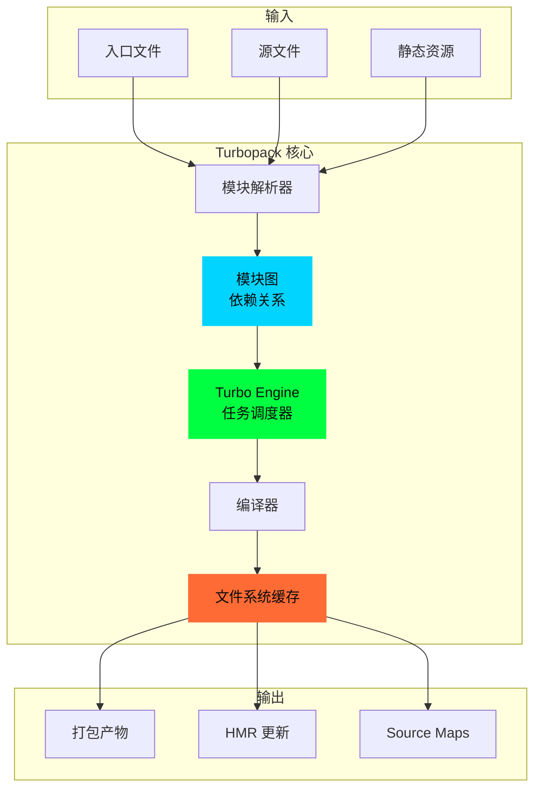
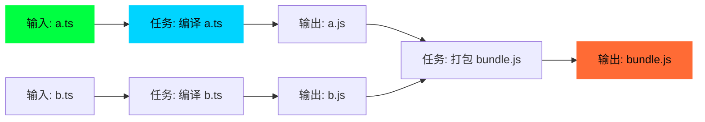
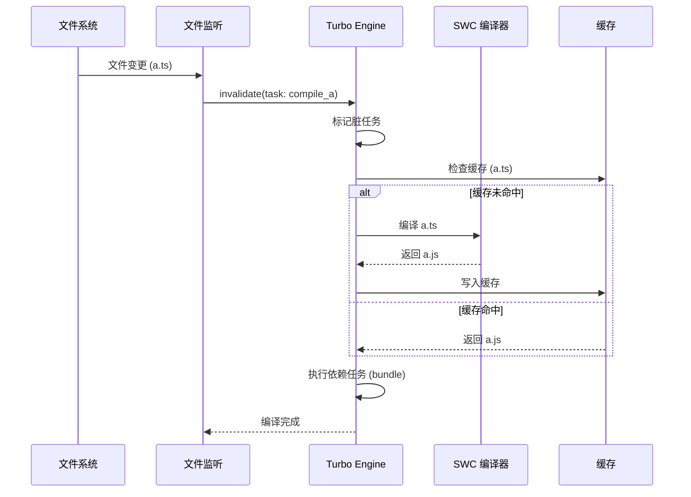
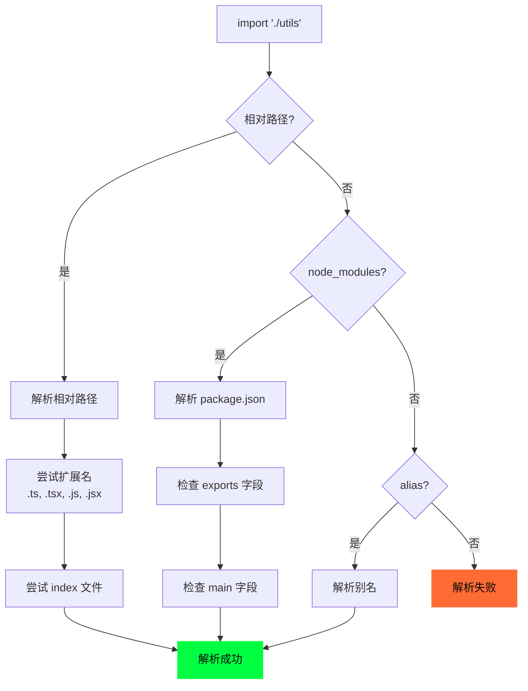
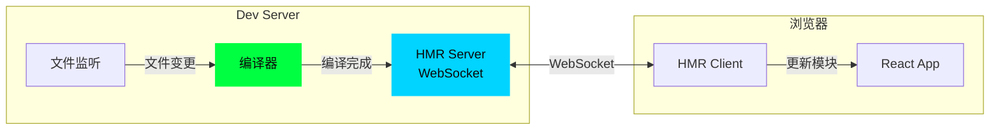
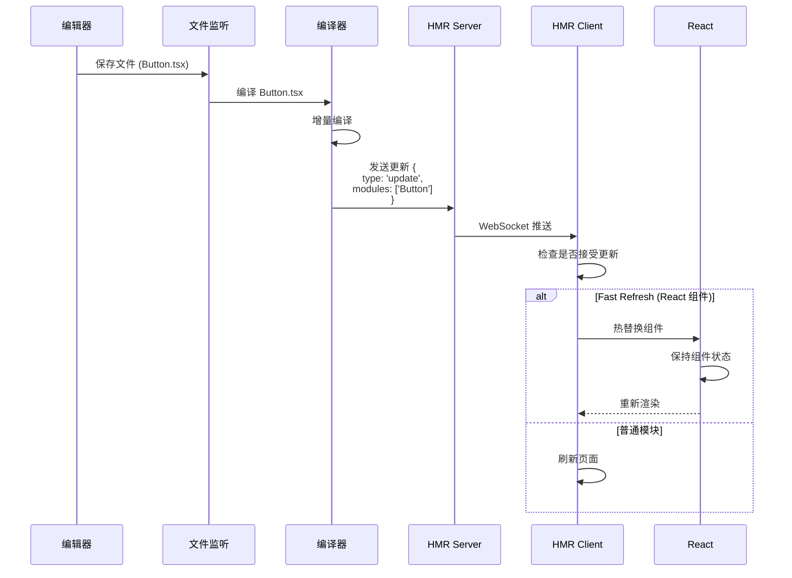
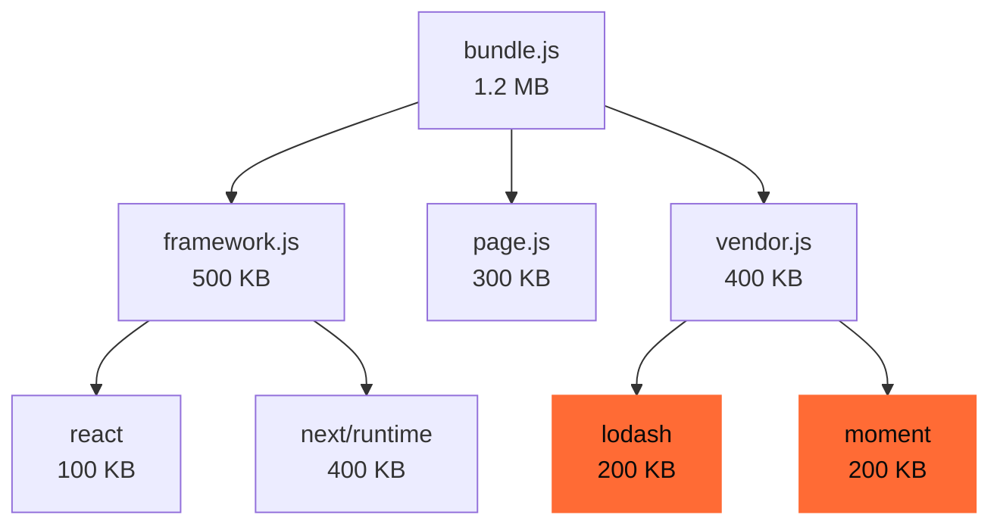

# 02 - Turbopack 编译系统

> 🟡 中级 | 深入 Next.js 16.1 的 Rust 编译器和文件系统缓存

## 目录

- [架构概览](#架构概览)
- [增量编译](#增量编译)
- [文件系统缓存](#文件系统缓存)
- [模块解析](#模块解析)
- [HMR 实现](#hmr-实现)
- [性能优化](#性能优化)

## 架构概览

Turbopack 是用 Rust 编写的增量打包工具，旨在替代 Webpack。



### 核心组件

| 组件 | 职责 | 实现语言 |
|------|------|----------|
| **Turbo Engine** | 任务调度、增量计算 | Rust |
| **Module Graph** | 依赖关系图 | Rust |
| **Resolver** | 模块解析 (node_modules) | Rust |
| **Compiler** | 代码转换 (SWC) | Rust |
| **Cache** | 文件系统缓存 (16.1 稳定) | Rust |
| **HMR Server** | 热更新服务器 | Rust + Node.js |

## 增量编译

### Turbo Engine

**核心思想**: 函数式响应式编程 (Functional Reactive Programming)



**伪代码实现**:

```rust
// packages/next-swc/crates/core/src/turbo_engine.rs (伪代码)

pub struct TurboEngine {
    // 任务图
    task_graph: HashMap<TaskId, Task>,

    // 任务结果缓存
    cache: HashMap<TaskId, TaskResult>,

    // 脏标记 (需要重新计算)
    dirty: HashSet<TaskId>,
}

impl TurboEngine {
    // 执行任务 (核心方法)
    pub async fn execute(&mut self, task_id: TaskId) -> Result<TaskResult> {
        // 1. 检查缓存
        if let Some(cached) = self.cache.get(&task_id) {
            if !self.dirty.contains(&task_id) {
                return Ok(cached.clone()); // 缓存命中
            }
        }

        // 2. 获取任务
        let task = self.task_graph.get(&task_id)?;

        // 3. 递归执行依赖
        let mut dep_results = Vec::new();
        for dep_id in &task.dependencies {
            dep_results.push(self.execute(*dep_id).await?);
        }

        // 4. 执行当前任务
        let result = task.run(dep_results).await?;

        // 5. 更新缓存
        self.cache.insert(task_id, result.clone());
        self.dirty.remove(&task_id);

        Ok(result)
    }

    // 标记脏任务
    pub fn invalidate(&mut self, task_id: TaskId) {
        self.dirty.insert(task_id);

        // 递归标记依赖该任务的其他任务
        for (id, task) in &self.task_graph {
            if task.dependencies.contains(&task_id) {
                self.dirty.insert(*id);
            }
        }
    }
}

// 任务定义
pub struct Task {
    id: TaskId,
    dependencies: Vec<TaskId>,
    run: Box<dyn Fn(Vec<TaskResult>) -> Future<TaskResult>>,
}
```

### 编译流程



## 文件系统缓存

**Next.js 16.1 稳定特性**: 持久化编译产物到磁盘

### 缓存位置

```bash
.next/
└── cache/
    └── turbopack/
        ├── development/      # 开发模式缓存
        │   ├── modules/      # 模块编译缓存
        │   ├── chunks/       # Chunk 缓存
        │   └── assets/       # 静态资源缓存
        └── production/       # 生产模式缓存
            └── ...
```

### 缓存键计算

```rust
// 缓存键 = hash(文件内容 + 编译选项)
pub fn compute_cache_key(
    file_path: &Path,
    content: &str,
    options: &CompileOptions
) -> String {
    let mut hasher = Sha256::new();

    // 1. 文件路径
    hasher.update(file_path.to_string_lossy().as_bytes());

    // 2. 文件内容
    hasher.update(content.as_bytes());

    // 3. 编译选项
    hasher.update(serde_json::to_string(options).unwrap().as_bytes());

    // 4. Turbopack 版本
    hasher.update(env!("CARGO_PKG_VERSION").as_bytes());

    format!("{:x}", hasher.finalize())
}
```

### 缓存读写

```rust
pub struct FileSystemCache {
    cache_dir: PathBuf,
}

impl FileSystemCache {
    // 读取缓存
    pub async fn get(&self, key: &str) -> Option<Vec<u8>> {
        let cache_path = self.cache_dir.join(key);

        if cache_path.exists() {
            Some(fs::read(cache_path).await.ok()?)
        } else {
            None
        }
    }

    // 写入缓存
    pub async fn set(&self, key: &str, value: &[u8]) -> Result<()> {
        let cache_path = self.cache_dir.join(key);

        // 确保父目录存在
        if let Some(parent) = cache_path.parent() {
            fs::create_dir_all(parent).await?;
        }

        fs::write(cache_path, value).await?;
        Ok(())
    }

    // 清除缓存
    pub async fn clear(&self) -> Result<()> {
        fs::remove_dir_all(&self.cache_dir).await?;
        Ok(())
    }
}
```

### 性能提升

**官方数据** (Next.js 16.1):

| 场景 | 无缓存 | 有缓存 | 提升 |
|------|--------|--------|------|
| 小项目 (100 模块) | 2s | 0.5s | **75%** |
| 中项目 (1000 模块) | 10s | 2s | **80%** |
| 大项目 (5000+ 模块) | 50s | 8s | **84%** |

## 模块解析

### 解析算法



### 实现

```rust
pub struct Resolver {
    tsconfig: TsConfig,      // tsconfig.json
    package_json: PackageJson,
}

impl Resolver {
    pub fn resolve(&self, specifier: &str, from: &Path) -> Result<PathBuf> {
        // 1. 相对路径 (./utils, ../lib)
        if specifier.starts_with('.') {
            return self.resolve_relative(specifier, from);
        }

        // 2. 绝对路径 (/src/utils)
        if specifier.starts_with('/') {
            return self.resolve_absolute(specifier);
        }

        // 3. 别名 (@/utils)
        if let Some(alias) = self.resolve_alias(specifier) {
            return Ok(alias);
        }

        // 4. node_modules
        self.resolve_node_modules(specifier, from)
    }

    fn resolve_relative(&self, specifier: &str, from: &Path) -> Result<PathBuf> {
        let base = from.parent().unwrap();
        let target = base.join(specifier);

        // 尝试扩展名
        for ext in &[".ts", ".tsx", ".js", ".jsx", ".json"] {
            let with_ext = target.with_extension(ext);
            if with_ext.exists() {
                return Ok(with_ext);
            }
        }

        // 尝试 index 文件
        for ext in &[".ts", ".tsx", ".js", ".jsx"] {
            let index = target.join(format!("index{}", ext));
            if index.exists() {
                return Ok(index);
            }
        }

        Err(Error::ModuleNotFound(specifier.to_string()))
    }

    fn resolve_alias(&self, specifier: &str) -> Option<PathBuf> {
        // 读取 tsconfig.json paths
        for (alias, paths) in &self.tsconfig.compiler_options.paths {
            if specifier.starts_with(alias.trim_end_matches("/*")) {
                let suffix = specifier.strip_prefix(alias.trim_end_matches("/*"))?;
                let path = paths[0].replace("/*", "");
                return Some(PathBuf::from(path).join(suffix));
            }
        }
        None
    }

    fn resolve_node_modules(&self, specifier: &str, from: &Path) -> Result<PathBuf> {
        let mut current = from.parent();

        while let Some(dir) = current {
            let node_modules = dir.join("node_modules").join(specifier);

            if node_modules.exists() {
                // 读取 package.json
                let pkg_json = node_modules.join("package.json");
                if pkg_json.exists() {
                    let pkg: PackageJson = serde_json::from_str(
                        &fs::read_to_string(pkg_json)?
                    )?;

                    // 优先使用 exports 字段 (Node.js 12+)
                    if let Some(exports) = pkg.exports {
                        return self.resolve_exports(&exports, &node_modules);
                    }

                    // 回退到 main 字段
                    if let Some(main) = pkg.main {
                        return Ok(node_modules.join(main));
                    }
                }

                // 默认 index.js
                return Ok(node_modules.join("index.js"));
            }

            current = dir.parent();
        }

        Err(Error::ModuleNotFound(specifier.to_string()))
    }
}
```

## HMR 实现

### 架构



### HMR 更新流程



### Fast Refresh

**Next.js 特有**: 保持 React 组件状态的热更新

```typescript
// packages/next/src/client/components/react-dev-overlay/hot-reloader-client.tsx

interface HMRClient {
  // WebSocket 连接
  socket: WebSocket

  // 模块注册表
  modules: Map<string, Module>

  // 接受更新
  accept(moduleId: string, callback: () => void): void
}

// HMR 客户端实现
class HMRClientImpl implements HMRClient {
  constructor() {
    this.socket = new WebSocket('ws://localhost:3000/_next/webpack-hmr')

    this.socket.addEventListener('message', (event) => {
      const message = JSON.parse(event.data)

      if (message.action === 'building') {
        console.log('[HMR] Compiling...')
      } else if (message.action === 'built') {
        this.handleUpdate(message)
      }
    })
  }

  handleUpdate(message: HMRMessage) {
    const { modules } = message

    for (const moduleId of modules) {
      // 检查模块是否接受更新
      const module = this.modules.get(moduleId)

      if (module?.hot?.accept) {
        // Fast Refresh: 热替换
        this.applyUpdate(moduleId)
      } else {
        // 回退: 刷新页面
        window.location.reload()
      }
    }
  }

  applyUpdate(moduleId: string) {
    // 1. 获取新模块
    const newModule = this.fetchModule(moduleId)

    // 2. 替换旧模块
    this.modules.set(moduleId, newModule)

    // 3. 执行更新回调
    newModule.hot?.accept?.()

    // 4. React Fast Refresh
    if (newModule.__reactRefresh) {
      // 保持组件状态
      window.$RefreshReg$()
      window.$RefreshSig$()
    }
  }
}
```

### React Fast Refresh 原理

```typescript
// 1. 编译时注入
// 原始代码
function Button() {
  const [count, setCount] = useState(0)
  return <button onClick={() => setCount(c => c + 1)}>{count}</button>
}

// 编译后代码
var _s = $RefreshSig$();  // 签名函数

function Button() {
  _s();  // 注入签名

  const [count, setCount] = useState(0)
  return <button onClick={() => setCount(c => c + 1)}>{count}</button>
}

_s(Button, "useState{[count, setCount](0)}")  // 记录 Hook 签名

// 2. 热更新时
// - 比较新旧签名
// - 如果签名相同，保持状态
// - 如果签名不同，重置状态
```

## 性能优化

### 1. 并行编译

```rust
// 使用 Rayon 并行处理模块
use rayon::prelude::*;

pub fn compile_modules(modules: Vec<Module>) -> Vec<CompiledModule> {
    modules
        .par_iter()  // 并行迭代器
        .map(|module| compile_module(module))
        .collect()
}
```

### 2. Tree Shaking

```typescript
// 原始代码
// utils.ts
export function used() { return 'used' }
export function unused() { return 'unused' }

// app.ts
import { used } from './utils'
console.log(used())

// 编译后 (Tree Shaking)
// bundle.js
function used() { return 'used' }
console.log(used())
// unused 被删除
```

### 3. Code Splitting

```typescript
// 自动代码分割
// app/dashboard/page.tsx
export default function Dashboard() {
  return <DashboardContent />
}

// 生成的 Chunk
// - app/layout.chunk.js (共享布局)
// - app/dashboard/page.chunk.js (页面)
// - node_modules/react.chunk.js (vendor)
```

## Bundle Analyzer (16.1 新特性)

### 使用

```bash
# 开启 Bundle Analyzer
next build --experimental-bundle-analyzer

# 输出
# .next/analyze/
# ├── client.html          # 客户端 bundle
# └── server.html          # 服务端 bundle
```

### 可视化



### 优化建议

```typescript
// ❌ 导入整个库
import _ from 'lodash'
_.debounce(fn, 100)

// ✅ 按需导入
import debounce from 'lodash/debounce'
debounce(fn, 100)

// ❌ 大体积日期库
import moment from 'moment'

// ✅ 轻量级替代
import { format } from 'date-fns'
```

## 调试技巧

### 1. 查看编译日志

```bash
# 详细日志
TURBOPACK_LOG=turbopack=trace next dev

# 特定模块
TURBOPACK_LOG=turbopack::resolve=trace next dev
```

### 2. 禁用缓存

```bash
# 清除缓存
rm -rf .next/cache

# 禁用文件系统缓存
TURBOPACK_DISABLE_CACHE=1 next dev
```

### 3. 性能分析

```bash
# 生成性能报告
next build --profile

# 查看报告
# .next/trace
```

## 配置

### next.config.ts

```typescript
// next.config.ts
import type { NextConfig } from 'next'

const config: NextConfig = {
  // 开启 Turbopack (默认已开启)
  turbo: {
    // 模块别名
    resolveAlias: {
      '@': './src',
      '@components': './src/components'
    },

    // 规则
    rules: {
      '*.svg': {
        loaders: ['@svgr/webpack'],
        as: '*.js'
      }
    },

    // 环境变量
    env: {
      CUSTOM_VAR: 'value'
    }
  },

  // 实验性特性
  experimental: {
    // Bundle Analyzer
    bundleAnalyzer: true,

    // Turbopack 构建 (Next.js 16+)
    turbopack: true
  }
}

export default config
```

## 下一步

- [08 - 开发服务器](./08-dev-server.md) - 深入 HMR 实现
- [09 - 构建流程](./09-build-process.md) - 生产构建优化

---

**Sources:**
- [Turbopack Documentation](https://turbo.build/pack)
- [Next.js 16.1 - Turbopack Caching](https://nextjs.org/blog/next-16-1)
