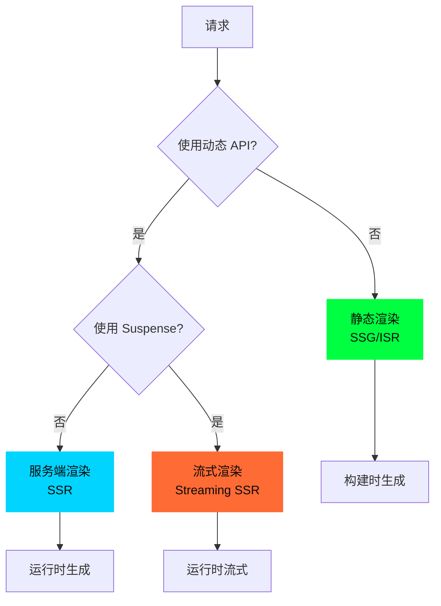
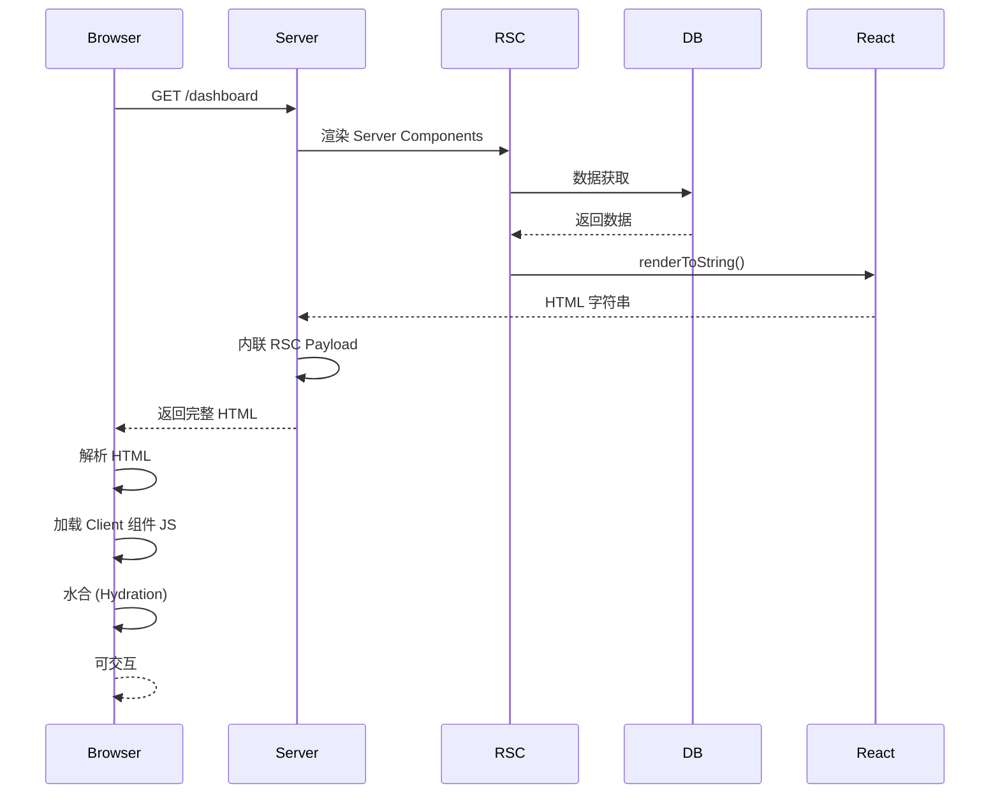
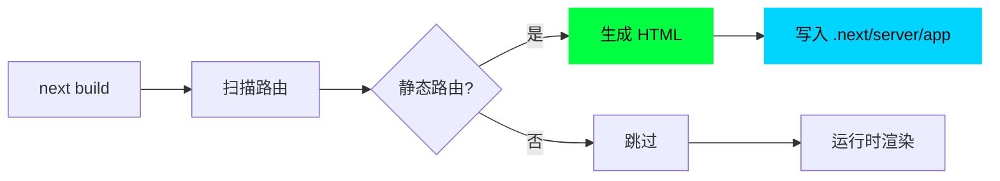
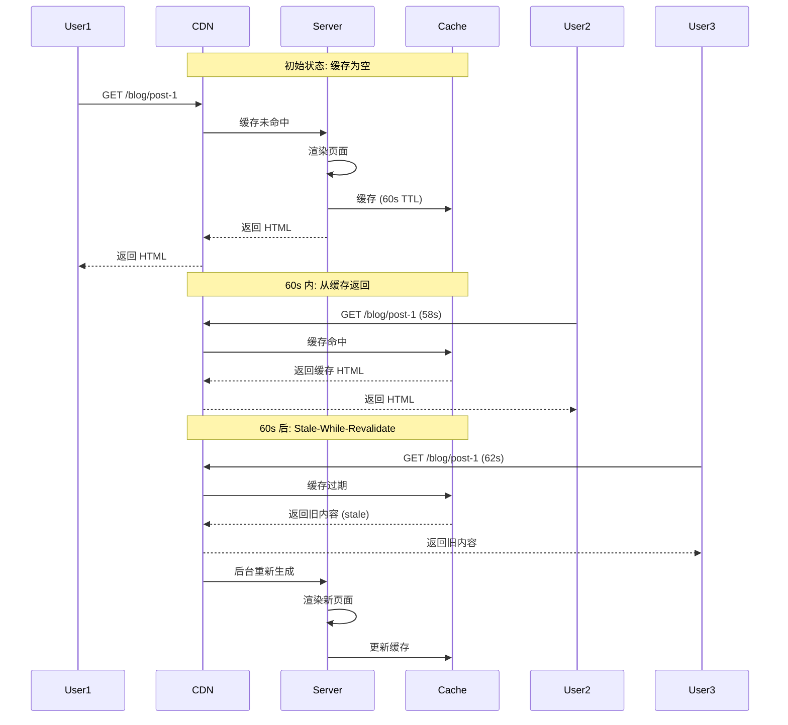
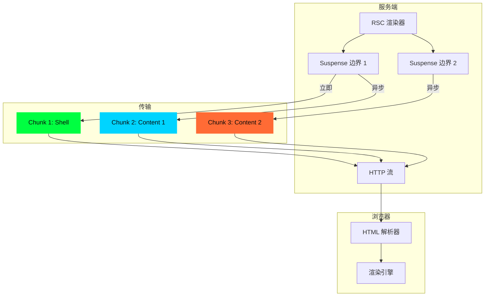
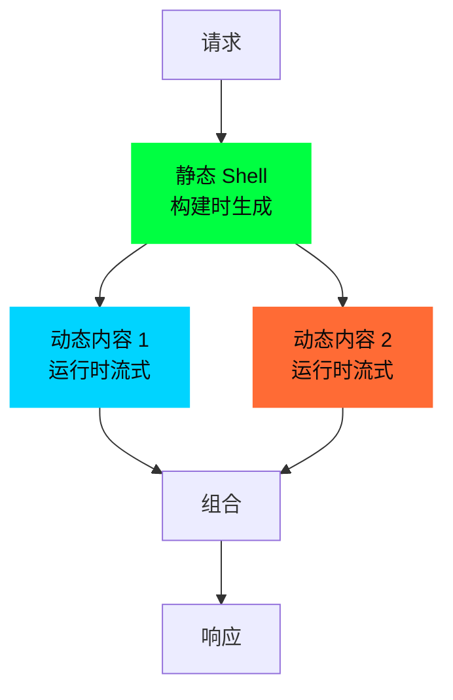
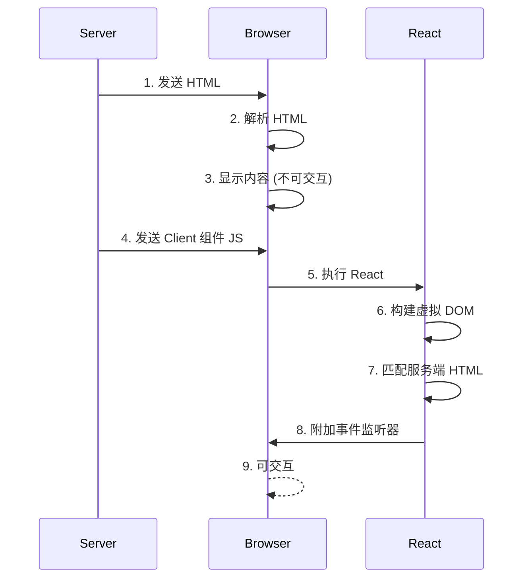

# 03 - 渲染机制

> 🟡 中级 | 深入 SSR/SSG/ISR/Streaming 和 Partial Prerendering

## 目录

- [渲染策略](#渲染策略)
- [服务端渲染 (SSR)](#服务端渲染-ssr)
- [静态生成 (SSG)](#静态生成-ssg)
- [增量静态再生成 (ISR)](#增量静态再生成-isr)
- [流式渲染 (Streaming)](#流式渲染-streaming)
- [部分预渲染 (PPR)](#部分预渲染-ppr)
- [水合机制 (Hydration)](#水合机制-hydration)

## 渲染策略

Next.js 16.1 支持多种渲染策略,自动选择最优方案:



### 策略决策树

| 条件 | 渲染策略 |
|------|---------|
| 无动态 API + 构建时生成 | **SSG** |
| 无动态 API + `revalidate` | **ISR** |
| 使用 `cookies()`/`headers()`/`searchParams` | **SSR** |
| 使用 `<Suspense>` | **Streaming SSR** |
| 静态 + 动态混合 (实验性) | **PPR** |

### 动态 API 检测

```typescript
// 以下 API 会触发动态渲染

// 1. cookies()
import { cookies } from 'next/headers'
const token = cookies().get('token')  // 🔴 动态渲染

// 2. headers()
import { headers } from 'next/headers'
const ua = headers().get('user-agent')  // 🔴 动态渲染

// 3. searchParams (Server Component)
export default function Page({ searchParams }: {
  searchParams: { q: string }
}) {
  return <div>{searchParams.q}</div>  // 🔴 动态渲染
}

// 4. 动态段 + generateStaticParams 未覆盖
export default function Page({ params }: { params: { id: string } }) {
  return <div>{params.id}</div>
}
// 如果 generateStaticParams 未返回该 id,则动态渲染

// 5. 显式标记
export const dynamic = 'force-dynamic'  // 🔴 强制动态渲染
export const revalidate = 0  // 🔴 禁用缓存
```

## 服务端渲染 (SSR)

### 执行流程



### 源码实现

**位置**: `packages/next/src/server/app-render/app-render.tsx`

```typescript
// 简化的 SSR 实现
export async function renderToHTML(
  req: Request,
  res: Response,
  pathname: string,
  query: ParsedUrlQuery
): Promise<string> {
  // 1. 匹配路由
  const matchedRoute = matchRoute(pathname, routeTree)

  // 2. 构建组件树
  const componentTree = await createComponentTree(matchedRoute)

  // 3. 渲染 Server Components
  const rscStream = renderToReadableStream(componentTree, {
    onError(error) {
      console.error('RSC Error:', error)
    }
  })

  // 4. 转换为 React 元素
  const rscPayload = await streamToString(rscStream)
  const reactElement = parseRSCPayload(rscPayload)

  // 5. 渲染为 HTML
  const htmlStream = renderToString(reactElement)
  const html = await streamToString(htmlStream)

  // 6. 内联 RSC Payload (用于水合)
  const htmlWithPayload = injectRSCPayload(html, rscPayload)

  // 7. 包装为完整 HTML
  return wrapHTML(htmlWithPayload, {
    scripts: getClientScripts(),
    styles: getStyles()
  })
}
```

### HTML 结构

```html
<!DOCTYPE html>
<html>
<head>
  <meta charset="utf-8">
  <link rel="stylesheet" href="/_next/static/css/app.css">
</head>
<body>
  <!-- 服务端渲染的 HTML -->
  <div id="__next">
    <div>
      <h1>Dashboard</h1>
      <div>Loading...</div> <!-- Suspense fallback -->
    </div>
  </div>

  <!-- 内联 RSC Payload (用于水合) -->
  <script id="__NEXT_DATA__" type="application/json">
    {
      "props": {...},
      "page": "/dashboard",
      "query": {},
      "buildId": "...",
      "rsc": "1:\"$L1\"\n2:{\"id\":\"...\",\"chunks\":[...]}" // RSC Payload
    }
  </script>

  <!-- 客户端 JS -->
  <script src="/_next/static/chunks/webpack.js"></script>
  <script src="/_next/static/chunks/framework.js"></script>
  <script src="/_next/static/chunks/main.js"></script>
  <script src="/_next/static/chunks/pages/_app.js"></script>
  <script src="/_next/static/chunks/pages/dashboard.js"></script>
</body>
</html>
```

## 静态生成 (SSG)

### 构建时生成



### 静态页面示例

```typescript
// app/about/page.tsx
export default function About() {
  return <h1>About Us</h1>
}

// 构建输出
// .next/server/app/about.html
// .next/server/app/about.rsc
```

### 动态段预渲染

```typescript
// app/blog/[slug]/page.tsx

// 1. 生成静态参数
export async function generateStaticParams() {
  const posts = await db.query('SELECT slug FROM posts')

  return posts.map((post) => ({
    slug: post.slug
  }))
}

// 2. 页面组件
export default async function Post({ params }: {
  params: { slug: string }
}) {
  const post = await db.query('SELECT * FROM posts WHERE slug = ?', params.slug)

  return (
    <article>
      <h1>{post.title}</h1>
      <div>{post.content}</div>
    </article>
  )
}

// 构建时生成
// - /blog/hello-world.html
// - /blog/nextjs-guide.html
// - ...
```

### generateStaticParams 实现

```typescript
// packages/next/src/build/index.ts (简化)

async function buildStaticPages(routes: RouteNode[]) {
  for (const route of routes) {
    // 1. 检查是否有 generateStaticParams
    const staticParams = await route.page?.generateStaticParams?.()

    if (staticParams) {
      // 2. 为每个参数生成页面
      for (const params of staticParams) {
        const html = await renderToHTML(route.path, { params })
        const outputPath = getOutputPath(route.path, params)

        // 3. 写入文件
        await fs.writeFile(outputPath, html)
      }
    } else if (!route.isDynamic) {
      // 静态路由直接生成
      const html = await renderToHTML(route.path, {})
      await fs.writeFile(getOutputPath(route.path), html)
    }
  }
}
```

## 增量静态再生成 (ISR)

### 工作原理



### 配置

```typescript
// app/blog/[slug]/page.tsx

// 设置重新验证时间
export const revalidate = 60  // 60 秒后重新生成

export default async function Post({ params }: {
  params: { slug: string }
}) {
  const post = await fetch(`https://api.example.com/posts/${params.slug}`, {
    next: { revalidate: 60 }  // 也可以在 fetch 级别设置
  })

  return <article>{post.title}</article>
}
```

### 按需重新验证

```typescript
// app/api/revalidate/route.ts
import { revalidatePath, revalidateTag } from 'next/cache'

export async function POST(request: Request) {
  const { path, tag } = await request.json()

  if (path) {
    // 重新验证路径
    revalidatePath(path)
  }

  if (tag) {
    // 重新验证标签
    revalidateTag(tag)
  }

  return Response.json({ revalidated: true })
}

// 使用
fetch('/api/revalidate', {
  method: 'POST',
  body: JSON.stringify({ path: '/blog/post-1' })
})
```

### 缓存控制头

```typescript
// ISR 响应头
Cache-Control: s-maxage=60, stale-while-revalidate

// 解释:
// - s-maxage=60: 缓存 60 秒
// - stale-while-revalidate: 过期后返回旧内容,后台重新生成
```

## 流式渲染 (Streaming)

### 架构



### 使用 Suspense

```tsx
// app/dashboard/page.tsx
import { Suspense } from 'react'

export default function Dashboard() {
  return (
    <div>
      <h1>Dashboard</h1>

      {/* 立即渲染 */}
      <Suspense fallback={<AnalyticsSkeleton />}>
        <Analytics />  {/* 异步组件 */}
      </Suspense>

      <Suspense fallback={<TeamSkeleton />}>
        <Team />  {/* 另一个异步组件 */}
      </Suspense>
    </div>
  )
}

// 异步组件
async function Analytics() {
  const data = await fetchAnalytics()  // 异步数据获取
  return <AnalyticsChart data={data} />
}
```

### 流式响应

```http
HTTP/1.1 200 OK
Content-Type: text/html; charset=utf-8
Transfer-Encoding: chunked

<!-- Chunk 1: Shell (立即发送) -->
<!DOCTYPE html>
<html>
<body>
  <div id="__next">
    <h1>Dashboard</h1>

    <!-- Suspense 占位符 -->
    <div id="suspense-1">
      <div>Loading analytics...</div>
    </div>

    <div id="suspense-2">
      <div>Loading team...</div>
    </div>
  </div>

<!-- Chunk 2: Analytics 完成 (1s 后) -->
<script>
  document.getElementById('suspense-1').innerHTML = '<div>Analytics content</div>'
</script>

<!-- Chunk 3: Team 完成 (2s 后) -->
<script>
  document.getElementById('suspense-2').innerHTML = '<div>Team content</div>'
</script>
</body>
</html>
```

### 源码实现

```typescript
// packages/next/src/server/stream-utils/node-web-streams-helper.ts

export async function renderToStream(
  element: React.ReactElement
): Promise<ReadableStream> {
  const encoder = new TextEncoder()

  return new ReadableStream({
    async start(controller) {
      // 1. 渲染为流
      const rscStream = renderToReadableStream(element, {
        onError(error) {
          console.error('Stream Error:', error)
        }
      })

      const reader = rscStream.getReader()

      // 2. 逐块发送
      while (true) {
        const { done, value } = await reader.read()

        if (done) {
          controller.close()
          break
        }

        // 编码并发送
        controller.enqueue(encoder.encode(value))
      }
    }
  })
}
```

### 性能对比

| 指标 | 非流式 SSR | 流式 SSR | 改进 |
|------|-----------|---------|------|
| **TTFB** | 2000ms | 100ms | **95%** |
| **FCP** | 2000ms | 500ms | **75%** |
| **TTI** | 3000ms | 2500ms | **17%** |

## 部分预渲染 (PPR)

**实验性特性**: 静态 Shell + 动态内容

### 架构



### 使用

```typescript
// next.config.ts
export default {
  experimental: {
    ppr: true  // 开启 PPR
  }
}
```

```tsx
// app/dashboard/page.tsx
export const experimental_ppr = true  // 页面级开启

export default function Dashboard() {
  return (
    <div>
      {/* 静态部分 (构建时渲染) */}
      <nav>
        <Logo />
        <Menu />
      </nav>

      {/* 动态部分 (运行时流式) */}
      <Suspense fallback={<Skeleton />}>
        <UserInfo />  {/* 使用 cookies() */}
      </Suspense>

      <Suspense fallback={<Loading />}>
        <RealtimeData />  {/* 实时数据 */}
      </Suspense>
    </div>
  )
}
```

### 工作流程

1. **构建时**: 生成静态 Shell (不包含 Suspense 内容)
2. **运行时**: 流式渲染动态内容
3. **浏览器**: 先显示 Shell,再填充动态内容

## 水合机制 (Hydration)

### 工作原理



### 选择性水合 (Selective Hydration)

```tsx
// 使用 Suspense 实现选择性水合
export default function Page() {
  return (
    <div>
      <Header />  {/* 优先水合 */}

      <Suspense fallback={<CommentsSkeleton />}>
        <Comments />  {/* 延迟水合 */}
      </Suspense>

      <Suspense fallback={<SidebarSkeleton />}>
        <Sidebar />  {/* 延迟水合 */}
      </Suspense>
    </div>
  )
}

// 水合顺序:
// 1. Header (立即)
// 2. Comments (用户滚动到时)
// 3. Sidebar (空闲时)
```

### 水合不匹配 (Hydration Mismatch)

```tsx
// ❌ 错误: 服务端和客户端不一致
export default function Clock() {
  return <div>{new Date().toISOString()}</div>
  // 服务端: 2024-01-01T00:00:00.000Z
  // 客户端: 2024-01-01T00:00:01.234Z
  // ⚠️ Hydration Mismatch!
}

// ✅ 正确: 使用 useEffect
'use client'
import { useState, useEffect } from 'react'

export default function Clock() {
  const [time, setTime] = useState<string | null>(null)

  useEffect(() => {
    setTime(new Date().toISOString())  // 仅客户端
  }, [])

  return <div>{time ?? 'Loading...'}</div>
  // 服务端: Loading...
  // 客户端: 2024-01-01T00:00:01.234Z
  // ✅ 一致
}
```

## 性能优化

### 1. 减少 HTML 体积

```tsx
// ❌ 大量内联数据
export default async function Page() {
  const data = await fetchLargeData()  // 1MB
  return <pre>{JSON.stringify(data)}</pre>  // HTML 体积大
}

// ✅ 客户端获取
export default function Page() {
  return <DataFetcher />  // 客户端 fetch
}
```

### 2. 优先级渲染

```tsx
// 使用 Suspense 控制优先级
<Suspense fallback={<HighPrioritySkeleton />}>
  <HighPriorityContent />
</Suspense>

<Suspense fallback={<LowPrioritySkeleton />}>
  <LowPriorityContent />  {/* 延迟渲染 */}
</Suspense>
```

### 3. 预渲染关键路径

```typescript
// 预渲染首屏必需的路由
export async function generateStaticParams() {
  return [
    { slug: 'home' },
    { slug: 'pricing' },
    { slug: 'features' }
  ]
}
```

## 调试技巧

### 1. 查看渲染模式

```bash
# 构建日志显示渲染模式
next build

# 输出
Route (app)                              Size     First Load JS
┌ ○ /                                    1.2 kB         80 kB   (Static)
├ ƒ /dashboard                           500 B          85 kB   (Dynamic)
├ ○ /about                               800 B          75 kB   (Static)
└ ● /blog/[slug]                         2 kB           90 kB   (SSG)

○  (Static)  automatically rendered as static HTML
●  (SSG)     automatically generated as static HTML + JSON
ƒ  (Dynamic) server-rendered on demand
```

### 2. 强制静态渲染

```typescript
// 禁用所有动态行为
export const dynamic = 'error'  // 使用动态 API 时报错
export const dynamicParams = false  // 未知参数返回 404
```

### 3. React DevTools Profiler

```tsx
import { Profiler } from 'react'

<Profiler id="Dashboard" onRender={logRenderTime}>
  <Dashboard />
</Profiler>
```

## 下一步

- [10 - React Server Components](./10-server-components.md) - RSC 深入
- [05 - 数据获取](./05-data-fetching.md) - fetch 扩展机制
- [06 - 缓存系统](./06-caching.md) - 多层缓存详解

---

**Sources:**
- [Next.js Rendering Documentation](https://nextjs.org/docs/app/building-your-application/rendering)
- [React Streaming SSR](https://github.com/reactwg/react-18/discussions/37)
