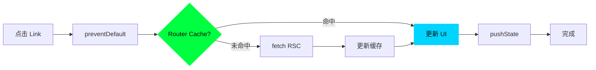

# 04 - 路由系统实现

> 🟡 中级 | 深入客户端路由、预加载和导航优化

## 目录

- [客户端路由](#客户端路由)
- [预加载策略](#预加载策略)
- [导航优化](#导航优化)
- [路由 API](#路由-api)

## 客户端路由

### 工作原理



### Link 组件

```tsx
import Link from 'next/link'

// 基本用法
<Link href="/about">About</Link>

// 禁用预取
<Link href="/about" prefetch={false}>About</Link>

// 动态路由
<Link href={`/posts/${post.id}`}>{post.title}</Link>

// 替换历史
<Link href="/login" replace>Login</Link>
```

### useRouter Hook

```typescript
'use client'

import { useRouter } from 'next/navigation'

export function Nav() {
  const router = useRouter()

  return (
    <>
      <button onClick={() => router.push('/about')}>
        Go to About
      </button>

      <button onClick={() => router.back()}>
        Go Back
      </button>

      <button onClick={() => router.refresh()}>
        Refresh
      </button>
    </>
  )
}
```

## 预加载策略

### 自动预取

```tsx
// 视口内的 Link 自动预取
<Link href="/about">  {/* 自动预取 */}
  About
</Link>

// 预取类型:
// - 静态路由: 预取完整 RSC Payload
// - 动态路由: 预取共享布局
```

### 手动预取

```typescript
const router = useRouter()

// 预取路由
router.prefetch('/about')
```

## 导航优化

### Soft vs Hard Navigation

```typescript
// Soft Navigation (使用缓存)
router.push('/about')

// Hard Navigation (清除缓存)
router.refresh()
```

### Loading UI

```tsx
// app/dashboard/loading.tsx
export default function Loading() {
  return <Spinner />
}

// 自动包裹为 Suspense
```

## 路由 API

### usePathname

```typescript
'use client'

import { usePathname } from 'next/navigation'

export function Nav() {
  const pathname = usePathname()

  return (
    <nav>
      <Link href="/" className={pathname === '/' ? 'active' : ''}>
        Home
      </Link>
    </nav>
  )
}
```

### useSearchParams

```typescript
'use client'

import { useSearchParams } from 'next/navigation'

export function Search() {
  const searchParams = useSearchParams()
  const query = searchParams.get('q')

  return <div>Search: {query}</div>
}
```

---

**Sources:**
- [Next.js Routing](https://nextjs.org/docs/app/building-your-application/routing)
