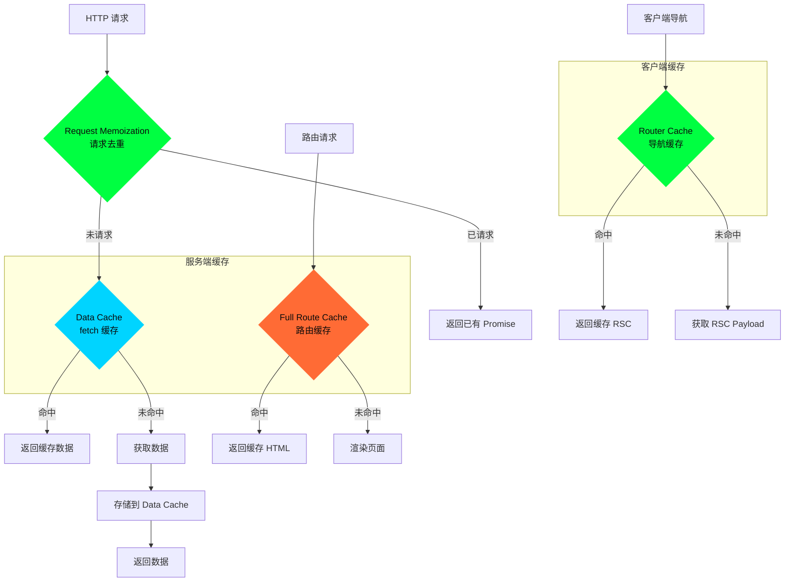
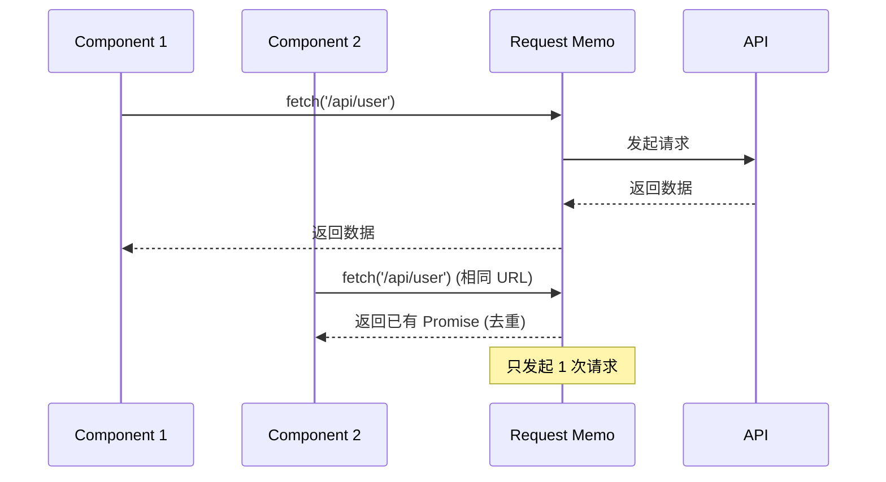
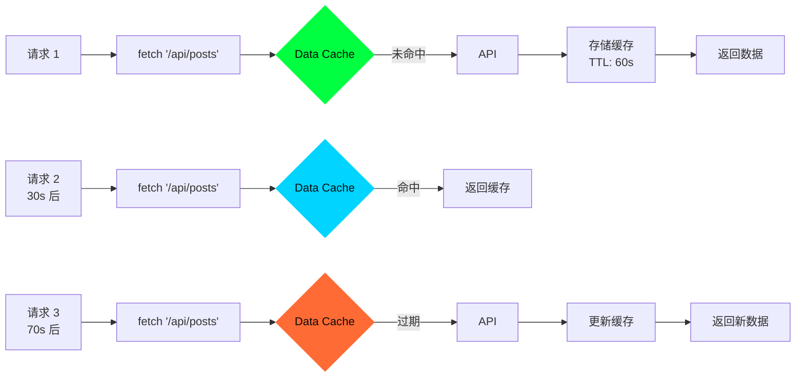
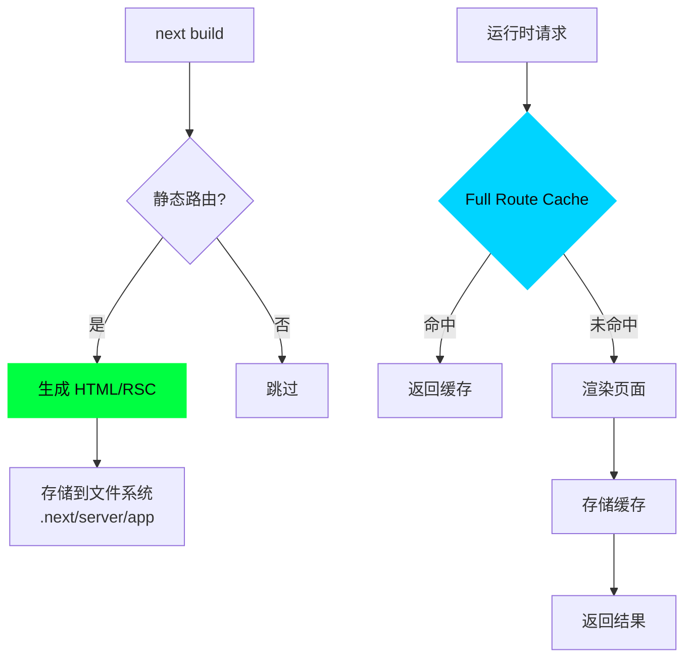
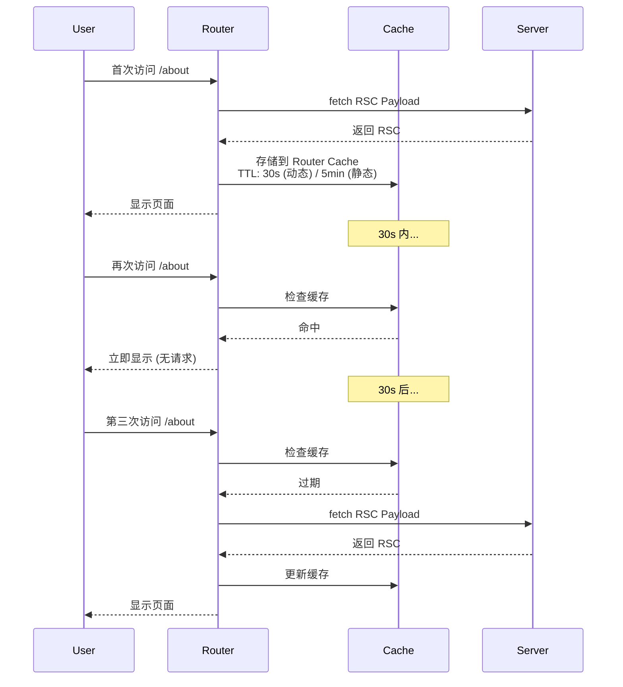

# 06 - 缓存系统

> 🟡 中级 | 深入 Next.js 多层缓存架构和缓存策略

## 目录

- [缓存架构](#缓存架构)
- [Request Memoization](#request-memoization)
- [Data Cache](#data-cache)
- [Full Route Cache](#full-route-cache)
- [Router Cache](#router-cache)
- [缓存控制](#缓存控制)

## 缓存架构

Next.js 16.1 采用**四层缓存**架构:



### 缓存层级

| 层级 | 位置 | 生命周期 | 用途 |
|------|------|---------|------|
| **1. Request Memoization** | 服务端 (内存) | 单次请求 | 去重相同 fetch |
| **2. Data Cache** | 服务端 (持久) | 跨请求 | fetch 结果缓存 |
| **3. Full Route Cache** | 服务端 (持久) | 跨请求 | 完整路由缓存 |
| **4. Router Cache** | 客户端 (内存) | 会话期间 | 导航缓存 |

## Request Memoization

### 工作原理

在**单次请求**期间,相同的 `fetch()` 调用自动去重:



### 示例

```tsx
// app/page.tsx
async function Header() {
  const user = await fetch('https://api.example.com/user')  // ✅ 请求 1
  return <nav>{user.name}</nav>
}

async function Profile() {
  const user = await fetch('https://api.example.com/user')  // ✅ 去重,不发起请求
  return <div>{user.email}</div>
}

export default function Page() {
  return (
    <div>
      <Header />   {/* 调用 1 */}
      <Profile />  {/* 调用 2,但共享结果 */}
    </div>
  )
}

// 只发起 1 次 HTTP 请求到 https://api.example.com/user
```

### 源码实现

**位置**: `packages/next/src/server/lib/patch-fetch.ts`

```typescript
// 简化的 Request Memoization
const requestMemoMap = new Map<string, Promise<any>>()

export function patchFetch() {
  const originalFetch = global.fetch

  global.fetch = function nextFetch(
    input: RequestInfo,
    init?: RequestInit
  ): Promise<Response> {
    // 1. 计算缓存键
    const cacheKey = getCacheKey(input, init)

    // 2. 检查是否已有相同请求
    if (requestMemoMap.has(cacheKey)) {
      return requestMemoMap.get(cacheKey)!  // 返回已有 Promise
    }

    // 3. 发起新请求
    const promise = originalFetch(input, init)

    // 4. 存储 Promise
    requestMemoMap.set(cacheKey, promise)

    // 5. 请求完成后清理 (防止内存泄漏)
    promise.finally(() => {
      requestMemoMap.delete(cacheKey)
    })

    return promise
  }
}

// 计算缓存键
function getCacheKey(input: RequestInfo, init?: RequestInit): string {
  const url = typeof input === 'string' ? input : input.url
  const method = init?.method || 'GET'
  const body = init?.body ? JSON.stringify(init.body) : ''

  return `${method}:${url}:${body}`
}
```

### 退出 Memoization

```typescript
// 使用不同的 cache 选项
await fetch('https://api.example.com/user', {
  cache: 'no-store'  // 每次都发起新请求
})
```

## Data Cache

### 工作原理

持久化 `fetch()` 结果,**跨请求共享**:



### 缓存配置

```typescript
// 1. 默认缓存 (永久)
await fetch('https://api.example.com/posts')

// 2. 设置重新验证时间
await fetch('https://api.example.com/posts', {
  next: { revalidate: 60 }  // 60 秒后重新验证
})

// 3. 禁用缓存
await fetch('https://api.example.com/posts', {
  cache: 'no-store'  // 每次都获取最新数据
})

// 4. 仅缓存 (不重新验证)
await fetch('https://api.example.com/posts', {
  cache: 'force-cache'
})

// 5. 使用标签
await fetch('https://api.example.com/posts', {
  next: {
    revalidate: 60,
    tags: ['posts']  // 缓存标签
  }
})
```

### 源码实现

**位置**: `packages/next/src/server/lib/incremental-cache/index.ts`

```typescript
// 简化的 Data Cache 实现
export class IncrementalCache {
  private cache: Map<string, CacheEntry> = new Map()

  async get(key: string): Promise<CacheEntry | null> {
    const entry = this.cache.get(key)

    if (!entry) {
      return null  // 缓存未命中
    }

    // 检查是否过期
    const now = Date.now()
    if (entry.expiresAt && now > entry.expiresAt) {
      this.cache.delete(key)  // 删除过期缓存
      return null
    }

    return entry
  }

  async set(
    key: string,
    data: any,
    options: CacheOptions
  ): Promise<void> {
    const expiresAt = options.revalidate
      ? Date.now() + options.revalidate * 1000
      : null

    this.cache.set(key, {
      data,
      tags: options.tags || [],
      expiresAt
    })
  }

  async revalidateTag(tag: string): Promise<void> {
    // 删除所有带该 tag 的缓存
    for (const [key, entry] of this.cache.entries()) {
      if (entry.tags.includes(tag)) {
        this.cache.delete(key)
      }
    }
  }
}

interface CacheEntry {
  data: any
  tags: string[]
  expiresAt: number | null
}

interface CacheOptions {
  revalidate?: number
  tags?: string[]
}
```

### 按需重新验证

```typescript
// app/actions.ts
'use server'

import { revalidatePath, revalidateTag } from 'next/cache'

export async function createPost(data: FormData) {
  await db.post.create(...)

  // 方法 1: 重新验证路径
  revalidatePath('/blog')

  // 方法 2: 重新验证标签
  revalidateTag('posts')
}
```

## Full Route Cache

### 工作原理

缓存**完整渲染结果** (HTML + RSC Payload):



### 缓存位置

```bash
.next/
└── server/
    └── app/
        ├── index.html        # 静态 HTML
        ├── index.rsc         # RSC Payload
        ├── about.html
        ├── about.rsc
        └── blog/
            ├── [slug].html   # 动态路由缓存
            └── [slug].rsc
```

### 路由段配置

```typescript
// app/blog/page.tsx

// 1. 静态渲染 (默认)
export default function Blog() {
  return <div>Blog</div>
}
// ✅ 构建时生成,缓存永久

// 2. 动态渲染
export const dynamic = 'force-dynamic'
export default function Blog() {
  return <div>Blog</div>
}
// ❌ 不缓存,每次请求都渲染

// 3. ISR
export const revalidate = 60
export default function Blog() {
  return <div>Blog</div>
}
// ✅ 缓存 60 秒后重新生成
```

### 重新验证

```typescript
// 方法 1: 时间重新验证
export const revalidate = 60  // 60 秒

// 方法 2: 按需重新验证
import { revalidatePath } from 'next/cache'

revalidatePath('/blog')  // 重新验证 /blog 路由

// 方法 3: 禁用缓存
export const revalidate = 0  // 禁用 Full Route Cache
```

## Router Cache

### 工作原理

**客户端导航**时缓存 RSC Payload:



### 缓存时长

| 路由类型 | 缓存时长 |
|---------|---------|
| **静态路由** | 5 分钟 |
| **动态路由** | 30 秒 |
| **Prefetch** | 30 秒 |

### 缓存结构

```typescript
// 客户端 Router Cache 结构
interface RouterCache {
  // 路由树缓存
  tree: FlightRouterState

  // 缓存节点
  cache: CacheNode

  // 预取缓存
  prefetchCache: Map<string, PrefetchEntry>
}

interface CacheNode {
  status: 'lazy' | 'loading' | 'ready'
  data: React.ReactNode | null
  subTreeData: React.ReactNode | null
  parallelRoutes: Map<string, CacheNode>

  // 过期时间
  expiresAt: number | null
}

interface PrefetchEntry {
  data: FlightData
  kind: 'auto' | 'full'
  expiresAt: number
}
```

### 源码实现

**位置**: `packages/next/src/client/components/router-reducer/reducers/navigate-reducer.ts`

```typescript
// 简化的 Router Cache
class RouterCacheImpl {
  private cache: Map<string, CacheNode> = new Map()

  get(pathname: string): CacheNode | null {
    const node = this.cache.get(pathname)

    if (!node) {
      return null
    }

    // 检查过期
    if (node.expiresAt && Date.now() > node.expiresAt) {
      this.cache.delete(pathname)
      return null
    }

    return node
  }

  set(
    pathname: string,
    data: React.ReactNode,
    isDynamic: boolean
  ): void {
    const ttl = isDynamic ? 30 * 1000 : 5 * 60 * 1000  // 30s / 5min
    const expiresAt = Date.now() + ttl

    this.cache.set(pathname, {
      status: 'ready',
      data,
      subTreeData: data,
      parallelRoutes: new Map(),
      expiresAt
    })
  }

  invalidate(pathname: string): void {
    this.cache.delete(pathname)
  }

  clear(): void {
    this.cache.clear()
  }
}
```

### 控制缓存

```typescript
// 1. 使用 router.refresh() 清除缓存
'use client'

import { useRouter } from 'next/navigation'

export function RefreshButton() {
  const router = useRouter()

  return (
    <button onClick={() => router.refresh()}>
      Refresh
    </button>
  )
}

// 2. 禁用预取
<Link href="/about" prefetch={false}>
  About
</Link>

// 3. Soft vs Hard Navigation
router.push('/about')      // Soft (使用缓存)
router.push('/about', { scroll: false })  // Soft
router.refresh()           // Hard (清除缓存)
```

## 缓存控制

### 退出缓存

```typescript
// 方法 1: 路由段配置
export const dynamic = 'force-dynamic'  // 禁用 Full Route Cache
export const revalidate = 0             // 禁用 Data Cache

// 方法 2: fetch 选项
await fetch('https://api.example.com/data', {
  cache: 'no-store'  // 禁用 Data Cache
})

// 方法 3: 使用动态 API
import { cookies } from 'next/headers'

cookies()  // 自动禁用 Full Route Cache
```

### 缓存优先级

```
1. 显式 cache: 'no-store'      → 不缓存
2. revalidate: 0                → 不缓存
3. dynamic: 'force-dynamic'     → 不缓存
4. 使用 cookies()/headers()     → 不缓存
5. revalidate: N                → 缓存 N 秒
6. 默认                         → 永久缓存
```

### 调试缓存

```typescript
// next.config.ts
export default {
  logging: {
    fetches: {
      fullUrl: true  // 显示完整 URL
    }
  }
}
```

**输出**:

```bash
GET / 200 in 45ms
  │ Cache: HIT /api/posts (60s)
  │ Cache: MISS /api/user
```

## 最佳实践

### 1. 合理设置 revalidate

```typescript
// ❌ 过短 (频繁重新生成)
export const revalidate = 1  // 每秒重新生成

// ✅ 根据数据更新频率设置
export const revalidate = 3600  // 1 小时 (博客文章)
export const revalidate = 60    // 1 分钟 (产品价格)
```

### 2. 使用缓存标签

```typescript
// 数据获取
await fetch('https://api.example.com/posts/1', {
  next: { tags: ['post-1'] }
})

await fetch('https://api.example.com/posts/2', {
  next: { tags: ['post-2'] }
})

// 精准重新验证
revalidateTag('post-1')  // 只重新验证 post-1
```

### 3. 分离静态和动态内容

```tsx
// ✅ 静态 Shell + 动态内容
export default function Page() {
  return (
    <div>
      {/* 静态部分 (缓存) */}
      <Header />
      <Hero />

      {/* 动态部分 (不缓存) */}
      <Suspense fallback={<Skeleton />}>
        <DynamicContent />
      </Suspense>
    </div>
  )
}
```

## 性能对比

| 场景 | 无缓存 | 有缓存 | 改进 |
|------|--------|--------|------|
| **首次访问** | 200ms | 200ms | 0% |
| **再次访问** | 200ms | 5ms | **97%** |
| **导航 (Router Cache)** | 100ms | 0ms | **100%** |
| **ISR 命中** | 200ms | 10ms | **95%** |

## 下一步

- [05 - 数据获取](./05-data-fetching.md) - fetch 扩展实现
- [03 - 渲染机制](./03-rendering.md) - 渲染与缓存集成
- [10 - React Server Components](./10-server-components.md) - RSC Payload 缓存

---

**Sources:**
- [Next.js Caching Documentation](https://nextjs.org/docs/app/building-your-application/caching)
- [Incremental Static Regeneration](https://nextjs.org/docs/app/building-your-application/data-fetching/incremental-static-regeneration)
