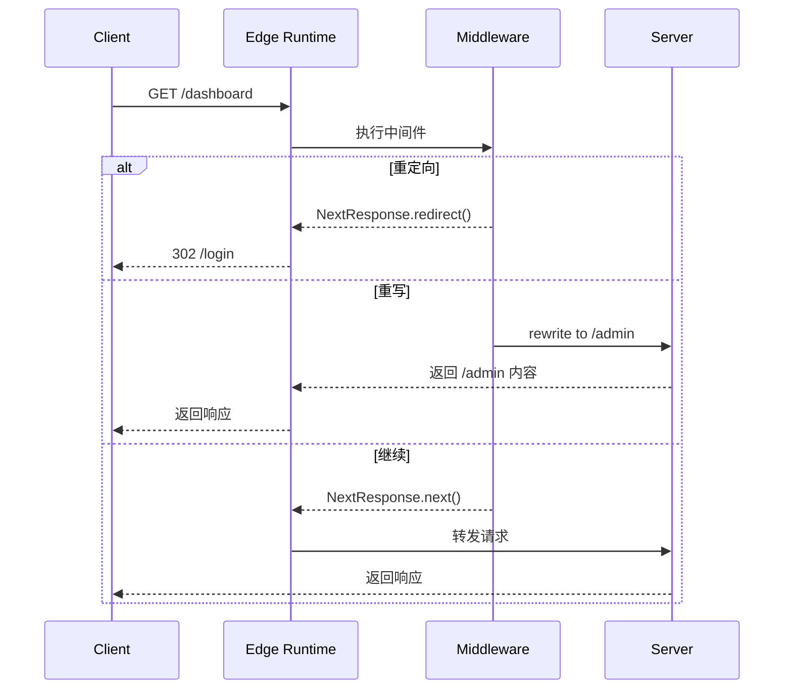

# 07 - 中间件机制

> 🟡 中级 | 深入 Edge Runtime 和中间件执行流程

## 目录

- [Edge Runtime](#edge-runtime)
- [中间件执行](#中间件执行)
- [路径匹配](#路径匹配)
- [常见用例](#常见用例)

## Edge Runtime

Next.js 中间件运行在 **Edge Runtime** (轻量级 V8 隔离环境)。

### 限制

```typescript
// ❌ 不支持
import fs from 'fs'           // Node.js API
import { PrismaClient } from '@prisma/client'  // 原生模块

// ✅ 支持
import { cookies } from 'next/headers'
fetch()  // Web API
```

## 中间件执行

### 基本使用

```typescript
// middleware.ts (根目录)
import { NextResponse } from 'next/server'
import type { NextRequest } from 'next/server'

export function middleware(request: NextRequest) {
  // 1. 读取 cookie
  const token = request.cookies.get('token')

  // 2. 认证检查
  if (!token) {
    return NextResponse.redirect(new URL('/login', request.url))
  }

  // 3. 修改请求头
  const response = NextResponse.next()
  response.headers.set('x-custom-header', 'value')

  return response
}

// 配置匹配路径
export const config = {
  matcher: ['/dashboard/:path*', '/api/:path*']
}
```

### 执行流程



## 路径匹配

### matcher 配置

```typescript
export const config = {
  matcher: [
    '/dashboard/:path*',    // /dashboard/*
    '/api/:path*',          // /api/*
    '/((?!public|static).*)' // 排除 /public 和 /static
  ]
}
```

## 常见用例

### 1. 认证

```typescript
export function middleware(request: NextRequest) {
  const token = request.cookies.get('token')

  if (!token) {
    return NextResponse.redirect(new URL('/login', request.url))
  }

  return NextResponse.next()
}
```

### 2. 国际化

```typescript
export function middleware(request: NextRequest) {
  const locale = request.cookies.get('locale') || 'en'
  const url = request.nextUrl.clone()

  if (!url.pathname.startsWith(`/${locale}`)) {
    url.pathname = `/${locale}${url.pathname}`
    return NextResponse.redirect(url)
  }

  return NextResponse.next()
}
```

### 3. A/B 测试

```typescript
export function middleware(request: NextRequest) {
  const bucket = request.cookies.get('bucket') ||
                 Math.random() > 0.5 ? 'a' : 'b'

  const response = NextResponse.next()
  response.cookies.set('bucket', bucket)

  if (bucket === 'b') {
    return NextResponse.rewrite(new URL('/variant-b', request.url))
  }

  return response
}
```

---

**Sources:**
- [Next.js Middleware](https://nextjs.org/docs/app/building-your-application/routing/middleware)
