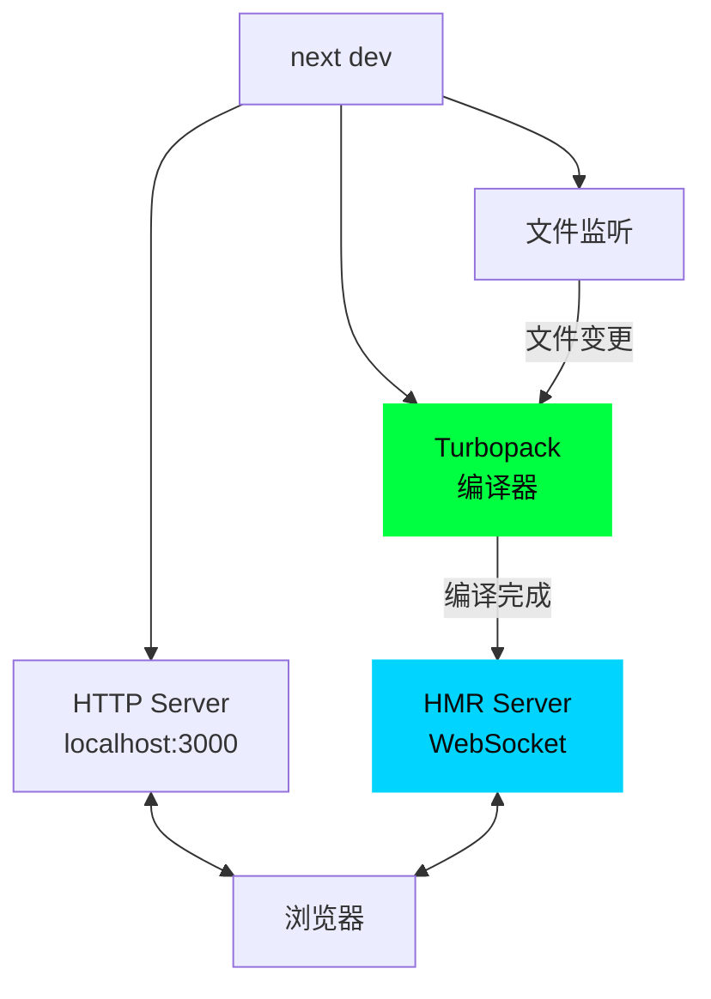
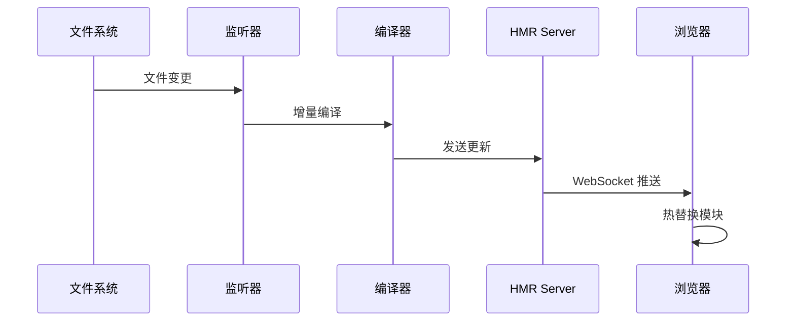

# 08 - 开发服务器

> 🟡 中级 | 深入 HMR、Fast Refresh 和开发体验优化

## 目录

- [开发服务器架构](#开发服务器架构)
- [HMR 实现](#hmr-实现)
- [Fast Refresh](#fast-refresh)
- [错误覆盖层](#错误覆盖层)

## 开发服务器架构



## HMR 实现

### WebSocket 连接

```typescript
// 客户端
const ws = new WebSocket('ws://localhost:3000/_next/webpack-hmr')

ws.addEventListener('message', (event) => {
  const message = JSON.parse(event.data)

  if (message.action === 'built') {
    applyUpdate(message.modules)
  }
})
```

### 更新流程



## Fast Refresh

### 工作原理

```typescript
// 编译时注入
function Component() {
  const [state, setState] = useState(0)
  return <div>{state}</div>
}

// 编译后
var _s = $RefreshSig$()

function Component() {
  _s()  // 签名注入
  const [state, setState] = useState(0)
  return <div>{state}</div>
}

_s(Component, "useState{[state,setState](0)}")
```

### 状态保持

- ✅ **保持**: 组件状态、表单输入
- ❌ **重置**: 添加/删除 Hook、修改 Hook 顺序

## 错误覆盖层

### 编译错误

```typescript
// 显示语法错误
SyntaxError: Unexpected token (3:10)
  1 | function Component() {
  2 |   const [state, setState] = useState(0
> 3 |   return <div>{state}</div>
    |          ^
```

### 运行时错误

```tsx
// app/error.tsx
'use client'

export default function Error({ error, reset }) {
  return (
    <div>
      <h2>Error: {error.message}</h2>
      <button onClick={reset}>Retry</button>
    </div>
  )
}
```

---

**Sources:**
- [Next.js Fast Refresh](https://nextjs.org/docs/architecture/fast-refresh)
