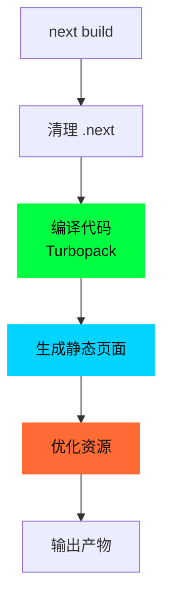

# 09 - 构建流程

> 🟡 中级 | 深入 next build 流程和优化策略

## 目录

- [构建流程](#构建流程)
- [产物结构](#产物结构)
- [优化策略](#优化策略)
- [Bundle Analyzer](#bundle-analyzer)

## 构建流程



### 执行步骤

```bash
next build

# 1. 清理输出目录
Cleaning .next directory...

# 2. 编译应用
Compiling...

# 3. 生成静态页面
Generating static pages (10/10)

# 4. 优化
Optimizing production build...

# 5. 输出报告
Route (app)                    Size     First Load JS
┌ ○ /                         1.2 kB         80 kB
├ ○ /about                    800 B          75 kB
└ ● /blog/[slug]              2 kB           90 kB

○  (Static)
●  (SSG)
ƒ  (Dynamic)
```

## 产物结构

```bash
.next/
├── server/
│   ├── app/                    # App Router 页面
│   │   ├── index.html          # 静态 HTML
│   │   ├── index.rsc           # RSC Payload
│   │   └── about.html
│   └── chunks/                 # 服务端 Chunks
├── static/
│   ├── chunks/                 # 客户端 Chunks
│   │   ├── webpack.js
│   │   ├── framework.js
│   │   └── pages/
│   ├── css/                    # CSS 文件
│   └── media/                  # 图片、字体
├── cache/                      # 缓存
└── build-manifest.json         # 构建清单
```

## 优化策略

### 1. 代码分割

```typescript
// 自动按路由分割
app/
├── page.tsx          → page.chunk.js
├── about/page.tsx    → about/page.chunk.js
└── blog/[slug]/page.tsx → blog/[slug]/page.chunk.js
```

### 2. Tree Shaking

```typescript
// 只打包使用的代码
import { used } from './utils'  // unused 会被删除
```

### 3. 图片优化

```tsx
import Image from 'next/image'

<Image
  src="/photo.jpg"
  width={800}
  height={600}
  alt="Photo"
  // 自动优化:
  // - WebP/AVIF 转换
  // - 响应式尺寸
  // - 懒加载
/>
```

### 4. 字体优化

```typescript
// app/layout.tsx
import { Inter } from 'next/font/google'

const inter = Inter({ subsets: ['latin'] })

export default function Layout({ children }) {
  return (
    <html className={inter.className}>
      <body>{children}</body>
    </html>
  )
}
// 自动内联字体 CSS,避免布局偏移
```

## Bundle Analyzer

### 使用 (Next.js 16.1)

```bash
# 生成 bundle 分析报告
next build --experimental-bundle-analyzer

# 打开报告
open .next/analyze/client.html
open .next/analyze/server.html
```

### 优化建议

```typescript
// ❌ 导入整个库
import _ from 'lodash'

// ✅ 按需导入
import debounce from 'lodash/debounce'

// ❌ 大体积库
import moment from 'moment'  // 300KB

// ✅ 轻量级替代
import { format } from 'date-fns'  // 10KB
```

---

**Sources:**
- [Next.js Building](https://nextjs.org/docs/app/building-your-application/deploying)
- [Next.js 16.1 - Bundle Analyzer](https://nextjs.org/blog/next-16-1)
