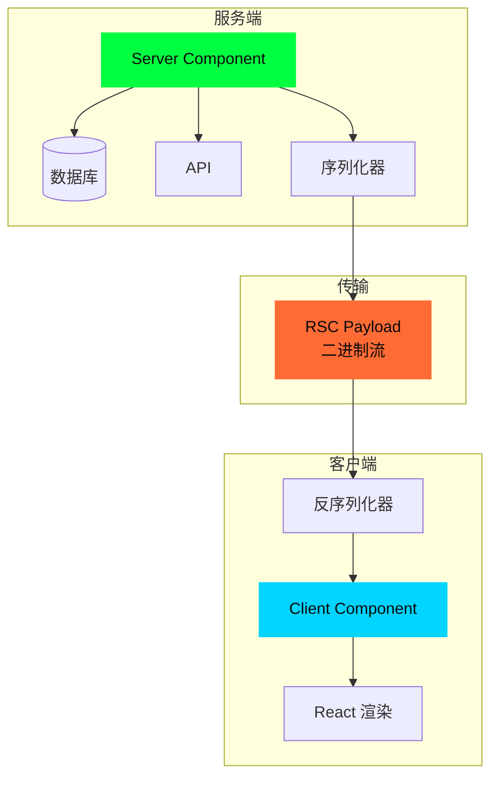
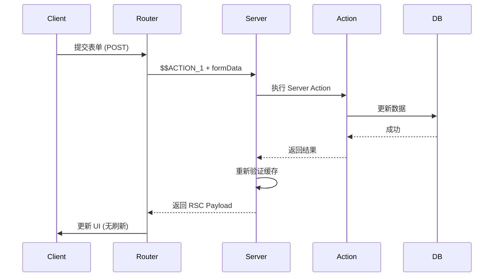

# 10 - React Server Components

> 🔴 高级 | 深入 RSC 架构、序列化协议和流式传输

## 目录

- [RSC 架构](#rsc-架构)
- [序列化协议](#序列化协议)
- [客户端引用](#客户端引用)
- [Server Actions](#server-actions)
- [流式传输](#流式传输)
- [性能优化](#性能优化)

## RSC 架构

### 核心概念



### Server vs Client Components

| 特性 | Server Component | Client Component |
|------|-----------------|------------------|
| **标记** | 默认 | `'use client'` |
| **执行位置** | 服务端 | 客户端 |
| **访问后端** | ✅ 直接访问 | ❌ 需要 API |
| **交互性** | ❌ 无状态/事件 | ✅ useState/onClick |
| **包大小** | ✅ 不发送到客户端 | ❌ 发送到客户端 |
| **SEO** | ✅ 完全支持 | ⚠️ 需要 SSR |
| **数据获取** | ✅ async/await | ⚠️ useEffect + fetch |

### 组件边界

```tsx
// app/page.tsx (Server Component - 默认)
import { ClientComponent } from './client'

export default async function Page() {
  const data = await db.query('SELECT * FROM posts')

  return (
    <div>
      {/* Server Component */}
      <ServerList data={data} />

      {/* Client Component */}
      <ClientComponent>
        {/* ❌ 错误: 不能传递 Server Component 作为 children */}
        {/* <ServerComponent /> */}

        {/* ✅ 正确: 传递序列化数据 */}
        {data.map(item => <div key={item.id}>{item.title}</div>)}
      </ClientComponent>
    </div>
  )
}

// app/client.tsx (Client Component)
'use client'

import { useState } from 'react'

export function ClientComponent({ children }: {
  children: React.ReactNode
}) {
  const [count, setCount] = useState(0)

  return (
    <div>
      <button onClick={() => setCount(c => c + 1)}>
        Count: {count}
      </button>
      {children}
    </div>
  )
}
```

## 序列化协议

### RSC Payload 格式

RSC Payload 是一种自定义的二进制序列化格式:

```
M1:{"id":"./src/app/page.tsx","name":"default","chunks":["client1"],"async":false}
J0:["$","div",null,{"children":[["$","h1",null,{"children":"Hello"}],["$","@1",null,{"count":0}]]}]
```

**格式说明**:
- `M{id}`: 模块定义
- `J{id}`: JSON 数据
- `$`: React 元素标记
- `@{id}`: 客户端引用

### 源码实现

**位置**: `packages/next/src/server/app-render/use-flight-response.tsx`

```typescript
// RSC Payload 解析器
export function parseRSCPayload(payload: string): React.ReactNode {
  const lines = payload.split('\n')
  const chunks: Map<string, any> = new Map()

  for (const line of lines) {
    if (!line) continue

    // 解析行格式: "M1:..."
    const colonIndex = line.indexOf(':')
    const prefix = line.slice(0, colonIndex)
    const data = line.slice(colonIndex + 1)

    const type = prefix[0]  // M, J, etc.
    const id = prefix.slice(1)

    switch (type) {
      case 'M': {
        // 模块定义
        const module = JSON.parse(data)
        chunks.set(id, module)
        break
      }

      case 'J': {
        // JSON 数据
        const json = JSON.parse(data, reviverFunction)
        chunks.set(id, json)
        break
      }

      case 'E': {
        // 错误
        const error = JSON.parse(data)
        throw new Error(error.message)
      }
    }
  }

  // 返回根元素
  return chunks.get('0')
}

// 特殊值恢复函数
function reviverFunction(key: string, value: any): any {
  if (typeof value === 'string') {
    // 客户端引用: "@1"
    if (value.startsWith('@')) {
      const id = value.slice(1)
      return createClientReference(id)
    }

    // React 元素: "$"
    if (value === '$') {
      return Symbol.for('react.element')
    }
  }

  return value
}
```

### 序列化示例

**输入组件**:

```tsx
// Server Component
export default async function Page() {
  const data = await fetchData()

  return (
    <div>
      <h1>Title</h1>
      <ClientButton count={data.count} />
    </div>
  )
}
```

**输出 RSC Payload**:

```
M1:{"id":"./src/app/client-button.tsx","name":"ClientButton","chunks":["client-button"],"async":false}
J0:["$","div",null,{"children":[["$","h1",null,{"children":"Title"}],["$","@1",null,{"count":42}]]}]
```

**解析后**:

```javascript
{
  $$typeof: Symbol(react.element),
  type: 'div',
  props: {
    children: [
      {
        $$typeof: Symbol(react.element),
        type: 'h1',
        props: { children: 'Title' }
      },
      {
        $$typeof: Symbol(react.element),
        type: ClientButtonReference,  // 客户端组件引用
        props: { count: 42 }
      }
    ]
  }
}
```

## 客户端引用

### 工作原理

```mermaid
graph LR
    subgraph "构建时"
        Source[源文件<br/>client.tsx] --> Extract[提取导出]
        Extract --> Manifest[生成清单<br/>client-reference-manifest.json]
    end

    subgraph "运行时"
        Server[服务端] --> Serialize[序列化引用<br/>@1]
        Serialize --> Client[客户端]
        Client --> LoadChunk[加载 Chunk<br/>client.js]
        LoadChunk --> Resolve[解析引用]
    end

    Manifest --> Server
    Manifest --> Client

    style Extract fill:#00FF41,stroke:#00FF41,color:#0A0A0A
    style Serialize fill:#00D4FF,stroke:#00D4FF,color:#0A0A0A
    style LoadChunk fill:#FF6B35,stroke:#FF6B35,color:#0A0A0A
```

### 客户端引用清单

**构建产物**: `client-reference-manifest.json`

```json
{
  "./src/app/client-button.tsx": {
    "id": "./src/app/client-button.tsx",
    "name": "ClientButton",
    "chunks": [
      "app/client-button.js"
    ],
    "async": false
  }
}
```

### 创建客户端引用

**位置**: `packages/next/src/client/components/app-router.tsx`

```typescript
// 创建客户端引用 (占位符)
function createClientReference(id: string): React.ComponentType {
  const manifest = getClientReferenceManifest()
  const moduleExport = manifest[id]

  if (!moduleExport) {
    throw new Error(`Client reference not found: ${id}`)
  }

  // 返回代理组件
  const ClientProxy = (props: any) => {
    // 在渲染时加载真实组件
    const [Component, setComponent] = useState<React.ComponentType | null>(null)

    useEffect(() => {
      // 动态导入客户端组件
      Promise.all(
        moduleExport.chunks.map(chunk =>
          import(/* webpackChunkName: "[request]" */ chunk)
        )
      ).then(() => {
        const mod = require(moduleExport.id)
        setComponent(() => mod[moduleExport.name])
      })
    }, [])

    if (!Component) {
      return null  // 或 loading 状态
    }

    return <Component {...props} />
  }

  return ClientProxy
}
```

### 'use client' 指令

```typescript
// app/button.tsx
'use client'  // 标记为客户端组件

import { useState } from 'react'

export function Button() {
  const [count, setCount] = useState(0)

  return (
    <button onClick={() => setCount(c => c + 1)}>
      Count: {count}
    </button>
  )
}

// 编译后 (简化)
// 1. 生成客户端 bundle
// app/button.js
import { useState } from 'react'
export function Button() { /* ... */ }

// 2. 生成服务端引用
// app/button.server.js
module.exports = createClientReference('./app/button.tsx#Button')
```

## Server Actions

### 架构



### 定义 Server Action

```typescript
// app/actions.ts
'use server'

import { revalidatePath } from 'next/cache'
import { db } from '@/lib/db'

// Server Action
export async function createPost(formData: FormData) {
  const title = formData.get('title') as string
  const content = formData.get('content') as string

  // 验证
  if (!title || !content) {
    return { error: 'Missing fields' }
  }

  // 数据库操作
  const post = await db.post.create({
    data: { title, content }
  })

  // 重新验证
  revalidatePath('/blog')

  return { success: true, post }
}
```

### 使用 Server Action

```tsx
// app/new-post/page.tsx
import { createPost } from './actions'

export default function NewPost() {
  return (
    <form action={createPost}>  {/* 直接传递 Server Action */}
      <input name="title" placeholder="Title" />
      <textarea name="content" placeholder="Content" />
      <button type="submit">Create</button>
    </form>
  )
}

// 或者在客户端组件中使用
'use client'

import { useFormState, useFormStatus } from 'react-dom'
import { createPost } from './actions'

export function NewPostForm() {
  const [state, formAction] = useFormState(createPost, null)

  return (
    <form action={formAction}>
      <input name="title" />
      <textarea name="content" />
      <SubmitButton />
      {state?.error && <div>{state.error}</div>}
    </form>
  )
}

function SubmitButton() {
  const { pending } = useFormStatus()

  return (
    <button type="submit" disabled={pending}>
      {pending ? 'Creating...' : 'Create'}
    </button>
  )
}
```

### Server Action 协议

**请求格式**:

```http
POST /blog/new HTTP/1.1
Content-Type: multipart/form-data
Next-Action: $$ACTION_1

------WebKitFormBoundary
Content-Disposition: form-data; name="title"

Hello World
------WebKitFormBoundary
Content-Disposition: form-data; name="content"

This is a post
------WebKitFormBoundary--
```

**响应格式** (RSC Payload):

```
J0:{"success":true,"post":{"id":1,"title":"Hello World"}}
```

### 源码实现

**位置**: `packages/next/src/server/app-render/action-handler.ts`

```typescript
// 简化的 Server Action 处理器
export async function handleServerAction(
  req: Request,
  actionId: string
): Promise<Response> {
  // 1. 解析表单数据
  const formData = await req.formData()

  // 2. 查找 action 函数
  const action = getServerAction(actionId)

  if (!action) {
    return new Response('Action not found', { status: 404 })
  }

  // 3. 执行 action
  try {
    const result = await action(formData)

    // 4. 序列化结果为 RSC Payload
    const payload = serializeRSCPayload(result)

    // 5. 返回响应
    return new Response(payload, {
      headers: {
        'Content-Type': 'text/x-component',
        'X-Action-Redirect': result.redirect || ''
      }
    })
  } catch (error) {
    // 错误处理
    const errorPayload = serializeRSCPayload({
      error: error.message
    })

    return new Response(errorPayload, {
      status: 500,
      headers: { 'Content-Type': 'text/x-component' }
    })
  }
}

// 获取 Server Action
function getServerAction(actionId: string): ServerAction | null {
  // 从 actions manifest 中查找
  const manifest = getServerActionsManifest()
  return manifest[actionId] || null
}
```

### Server Actions Manifest

**构建产物**: `server-reference-manifest.json`

```json
{
  "$$ACTION_1": {
    "id": "./src/app/actions.ts",
    "name": "createPost",
    "chunks": []
  },
  "$$ACTION_2": {
    "id": "./src/app/actions.ts",
    "name": "updatePost",
    "chunks": []
  }
}
```

## 流式传输

### Suspense 流式渲染

```tsx
// app/dashboard/page.tsx
import { Suspense } from 'react'

export default function Dashboard() {
  return (
    <div>
      <h1>Dashboard</h1>

      <Suspense fallback={<Skeleton />}>
        <AsyncContent />
      </Suspense>
    </div>
  )
}

// 异步组件
async function AsyncContent() {
  const data = await fetchData()  // 异步数据获取
  return <div>{data}</div>
}
```

### 流式传输协议

```
# Chunk 1: Shell
0:["$","div",null,{"children":[["$","h1",null,{"children":"Dashboard"}],["$","$L1",null,{}]]}]

# Chunk 2: Suspense 内容 (异步)
1:["$","div",null,{"children":"Content"}]
```

### 源码实现

**位置**: `packages/next/src/server/app-render/create-component-tree.tsx`

```typescript
// 流式渲染组件树
export async function renderComponentTreeToStream(
  tree: React.ReactElement
): Promise<ReadableStream> {
  const encoder = new TextEncoder()

  return new ReadableStream({
    async start(controller) {
      let chunkId = 0

      // 渲染为 RSC 流
      const rscStream = renderToReadableStream(tree, {
        // 当 Suspense 解析时调用
        onShellReady() {
          // 发送 Shell
          const shell = serializeChunk(chunkId++, tree)
          controller.enqueue(encoder.encode(shell))
        },

        // 当 Suspense 内容准备好时调用
        onAllReady() {
          controller.close()
        },

        onError(error) {
          console.error('Stream error:', error)
        }
      })

      // 处理流
      const reader = rscStream.getReader()

      while (true) {
        const { done, value } = await reader.read()

        if (done) break

        // 发送 Suspense 内容
        controller.enqueue(encoder.encode(value))
      }
    }
  })
}

// 序列化 Chunk
function serializeChunk(id: number, value: any): string {
  const json = JSON.stringify(value, replacerFunction)
  return `${id}:${json}\n`
}

// 替换函数 (处理特殊值)
function replacerFunction(key: string, value: any): any {
  // Promise -> Suspense 占位符
  if (value instanceof Promise) {
    return `$L${generateId()}`  // Lazy reference
  }

  // Client Component -> 客户端引用
  if (isClientComponent(value)) {
    return `@${generateClientReferenceId(value)}`
  }

  return value
}
```

## 性能优化

### 1. 减少序列化体积

```tsx
// ❌ 传递大对象
<ClientComponent data={largeObject} />  // 整个对象序列化

// ✅ 传递必要数据
<ClientComponent id={largeObject.id} />  // 仅 id
```

### 2. 预加载客户端组件

```tsx
// app/layout.tsx
import { preloadClientComponent } from 'next/client'
import { Button } from './button'

export default function Layout({ children }) {
  // 预加载客户端组件
  preloadClientComponent(Button)

  return (
    <div>
      <nav>
        <Button />  {/* 已预加载,立即可用 */}
      </nav>
      {children}
    </div>
  )
}
```

### 3. 代码分割

```tsx
// 动态导入客户端组件
import dynamic from 'next/dynamic'

const HeavyComponent = dynamic(() => import('./heavy'), {
  loading: () => <Spinner />
})

export default function Page() {
  return <HeavyComponent />  // 按需加载
}
```

### 4. 缓存 Server Actions

```typescript
'use server'

import { unstable_cache } from 'next/cache'

// 缓存 action 结果
export const getCachedData = unstable_cache(
  async () => {
    const data = await db.query('...')
    return data
  },
  ['cached-data'],  // 缓存键
  {
    revalidate: 60,  // 60 秒后重新验证
    tags: ['data']   // 缓存标签
  }
)
```

## 调试技巧

### 1. 查看 RSC Payload

```bash
# 客户端导航请求
curl http://localhost:3000/about \
  -H "RSC: 1" \
  -H "Next-Router-Prefetch: 1"

# 响应 (RSC Payload)
M1:{"id":"...","name":"ClientButton","chunks":["client-button"]}
J0:["$","div",null,{"children":...}]
```

### 2. React DevTools

```
# 安装 React DevTools
# 查看 Components 面板
# - Server Components 标记为 "Server"
# - Client Components 正常显示
```

### 3. 日志 Server Actions

```typescript
'use server'

export async function createPost(formData: FormData) {
  console.log('[Server Action] createPost called')
  console.log('FormData:', Object.fromEntries(formData))

  const result = await db.post.create(...)

  console.log('[Server Action] result:', result)
  return result
}
```

### 4. 错误边界

```tsx
// app/error.tsx
'use client'

export default function Error({ error, reset }: {
  error: Error
  reset: () => void
}) {
  return (
    <div>
      <h2>Something went wrong!</h2>
      <pre>{error.message}</pre>
      <button onClick={reset}>Try again</button>
    </div>
  )
}
```

## 限制与注意事项

### Server Components 限制

```typescript
// ❌ 不能使用
'use client'  // 标记为 Client Component 才能用

import { useState } from 'react'  // ❌ Hooks
import { useEffect } from 'react'  // ❌ Hooks

export default function ServerComponent() {
  const [state, setState] = useState(0)  // ❌ 错误

  useEffect(() => {  // ❌ 错误
    // ...
  }, [])

  function handleClick() {  // ❌ 错误 (没有交互性)
    // ...
  }

  return <button onClick={handleClick}>Click</button>
}
```

### Client Components 限制

```typescript
// ❌ 不能导入 Server-only 模块
'use client'

import { db } from '@/lib/db'  // ❌ 错误 (db 仅服务端)

export default function ClientComponent() {
  const data = await db.query('...')  // ❌ 错误
  return <div>{data}</div>
}

// ✅ 通过 props 传递数据
// page.tsx (Server Component)
export default async function Page() {
  const data = await db.query('...')
  return <ClientComponent data={data} />
}
```

## 下一步

- [03 - 渲染机制](./03-rendering.md) - SSR 与 RSC 集成
- [05 - 数据获取](./05-data-fetching.md) - Server Components 数据流
- [06 - 缓存系统](./06-caching.md) - RSC Payload 缓存

---

**Sources:**
- [React Server Components RFC](https://github.com/reactjs/rfcs/blob/main/text/0188-server-components.md)
- [Next.js Server Components](https://nextjs.org/docs/app/building-your-application/rendering/server-components)
- [Server Actions Documentation](https://nextjs.org/docs/app/building-your-application/data-fetching/server-actions-and-mutations)
