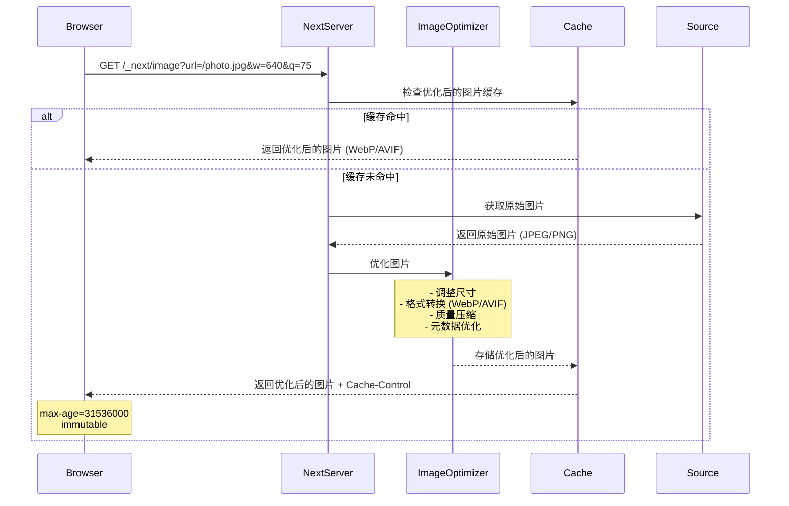
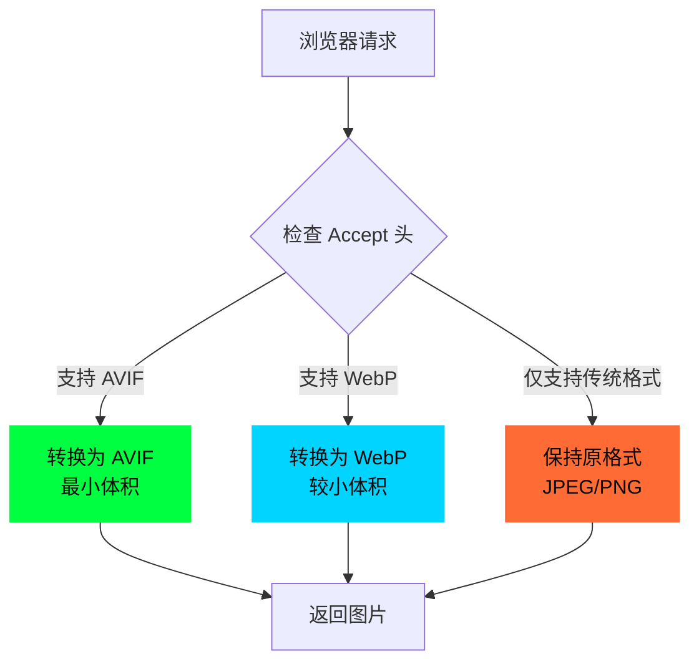
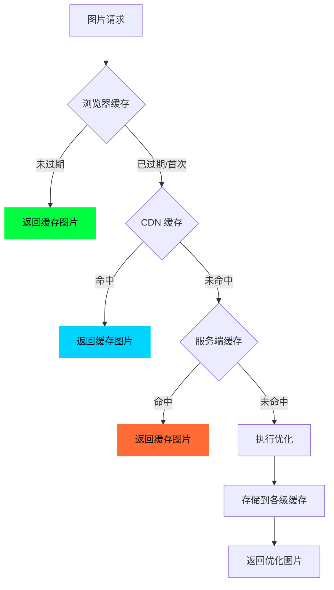

# 11 - next/image 图片优化深度解析

> 🟡 中级 | 理解 Next.js 图片优化的完整实现机制

## 目录

- [核心概念](#核心概念)
- [Image 组件 API](#image-组件-api)
- [图片优化流程](#图片优化流程)
- [响应式图片处理](#响应式图片处理)
- [懒加载实现](#懒加载实现)
- [图片格式转换](#图片格式转换)
- [占位符策略](#占位符策略)
- [源码实现](#源码实现)
- [性能优化](#性能优化)
- [最佳实践](#最佳实践)

## 核心概念

Next.js 的 `Image` 组件提供**自动化图片优化**，无需手动配置即可获得：

- ✅ **自动响应式图片**: 根据设备生成多尺寸
- ✅ **现代格式转换**: 自动转换为 WebP/AVIF
- ✅ **懒加载**: 视口外图片延迟加载
- ✅ **防止布局偏移**: 自动保留空间 (CLS = 0)
- ✅ **按需优化**: 请求时动态优化，非构建时
- ✅ **本地/远程支持**: 支持静态资源和外部 URL

### 与原生 `` 的对比

| 特性 | `` | `<Image>` |
|------|---------|-----------|
| 响应式图片 | 手动 `srcset` | 自动生成 |
| 格式转换 | 需预处理 | 自动 WebP/AVIF |
| 懒加载 | `loading="lazy"` | 智能懒加载 + 预加载 |
| 布局稳定性 | 手动设置宽高 | 自动防止 CLS |
| 优化时机 | 构建时 | 按需 (首次请求) |
| 缓存 | 浏览器缓存 | CDN + 服务端缓存 |

## Image 组件 API

### 基础用法

```typescript
import Image from 'next/image'

// 本地图片 (静态导入)
import profilePic from './profile.jpg'

export default function Page() {
  return (
    <>
      {/* 本地图片 - 自动获取宽高 */}
      <Image
        src={profilePic}
        alt="Profile picture"
        placeholder="blur"  // 自动生成模糊占位符
      />

      {/* 远程图片 - 需指定宽高 */}
      <Image
        src="https://example.com/photo.jpg"
        alt="Remote photo"
        width={800}
        height={600}
        priority  // LCP 图片优先加载
      />

      {/* 填充容器 */}
      <div style={{ position: 'relative', width: '100%', height: 400 }}>
        <Image
          src="/hero.jpg"
          alt="Hero image"
          fill
          style={{ objectFit: 'cover' }}
        />
      </div>
    </>
  )
}
```

### 核心属性

| 属性 | 类型 | 说明 | 必需 |
|------|------|------|------|
| `src` | `string \| StaticImport` | 图片路径 | ✅ |
| `alt` | `string` | 替代文本 | ✅ |
| `width` | `number` | 原始宽度 (px) | 条件* |
| `height` | `number` | 原始高度 (px) | 条件* |
| `fill` | `boolean` | 填充父容器 | - |
| `sizes` | `string` | 响应式尺寸提示 | - |
| `quality` | `number` | 图片质量 (1-100) | - |
| `priority` | `boolean` | 禁用懒加载 (LCP 图片) | - |
| `placeholder` | `'blur' \| 'empty'` | 占位符类型 | - |
| `blurDataURL` | `string` | 自定义模糊图 (base64) | - |
| `loading` | `'lazy' \| 'eager'` | 加载策略 | - |
| `unoptimized` | `boolean` | 禁用优化 | - |

> *条件必需：`fill={true}` 时不需要 `width/height`，否则必需（静态导入除外）

### 布局模式

```typescript
// 1. 固定尺寸 (Intrinsic)
<Image src="/photo.jpg" width={800} height={600} alt="Fixed" />

// 2. 填充容器 (Fill)
<div className="relative h-64 w-full">
  <Image src="/photo.jpg" fill alt="Fill" />
</div>

// 3. 响应式 (Responsive)
<Image
  src="/photo.jpg"
  width={800}
  height={600}
  sizes="(max-width: 768px) 100vw, 800px"
  alt="Responsive"
/>
```

## 图片优化流程

### 完整流程图



### 优化器配置

**next.config.ts**:
```typescript
import type { NextConfig } from 'next'

const config: NextConfig = {
  images: {
    // 设备尺寸断点 (srcset 生成)
    deviceSizes: [640, 750, 828, 1080, 1200, 1920, 2048, 3840],

    // 图片尺寸断点
    imageSizes: [16, 32, 48, 64, 96, 128, 256, 384],

    // 支持的图片格式
    formats: ['image/webp', 'image/avif'],

    // 允许的远程域名
    remotePatterns: [
      {
        protocol: 'https',
        hostname: 'example.com',
        port: '',
        pathname: '/images/**',
      },
    ],

    // 最小缓存时间 (秒)
    minimumCacheTTL: 60,

    // 禁用静态导入
    disableStaticImages: false,

    // 危险操作：允许所有域名 (不推荐)
    // dangerouslyAllowSVG: true,
    // unoptimized: true,  // 完全禁用优化
  },
}

export default config
```

### 图片 URL 结构

```
/_next/image
  ?url=/photo.jpg      # 图片路径
  &w=640               # 宽度
  &q=75                # 质量 (1-100)
```

**示例**:
```
/_next/image?url=%2Fhero.jpg&w=1920&q=75
/_next/image?url=https%3A%2F%2Fexample.com%2Fphoto.jpg&w=640&q=80
```

## 响应式图片处理

### srcset 生成

`Image` 组件自动生成 `srcset` 属性：

```html

```

### sizes 属性

告诉浏览器图片在不同断点下的**显示宽度**：

```typescript
// 默认值
sizes="100vw"  // 图片宽度 = 视口宽度

// 响应式布局
sizes="(max-width: 768px) 100vw, (max-width: 1200px) 50vw, 33vw"
/*
  移动端 (≤ 768px): 占满视口
  平板 (769-1200px): 占 50% 视口
  桌面 (> 1200px): 占 33% 视口
*/

// 固定宽度
sizes="800px"  // 图片始终显示为 800px 宽
```

### 选择算法

浏览器根据 `sizes` 和 `srcset` 选择最合适的图片：

```
1. 计算图片显示宽度 (根据 sizes)
2. 计算设备像素比 (DPR)
3. 目标宽度 = 显示宽度 × DPR
4. 选择 ≥ 目标宽度的最小图片
```

**示例**:
```
视口宽度: 375px (iPhone)
DPR: 3x
sizes: "100vw"

显示宽度 = 375px
目标宽度 = 375 × 3 = 1125px
选择图片 = /_next/image?url=/photo.jpg&w=1200&q=75 (≥ 1125px 的最小尺寸)
```

## 懒加载实现

### IntersectionObserver 机制

```typescript
// packages/next/src/client/image-component.tsx (简化版)

function ImageComponent({ src, loading = 'lazy', ...props }) {
  const imgRef = useRef<HTMLImageElement>(null)
  const [isVisible, setIsVisible] = useState(loading === 'eager')

  useEffect(() => {
    if (loading === 'eager') return

    const observer = new IntersectionObserver(
      (entries) => {
        entries.forEach((entry) => {
          if (entry.isIntersecting) {
            setIsVisible(true)
            observer.disconnect()
          }
        })
      },
      {
        rootMargin: '200px',  // 提前 200px 开始加载
      }
    )

    if (imgRef.current) {
      observer.observe(imgRef.current)
    }

    return () => observer.disconnect()
  }, [loading])

  return (
    
  )
}
```

### 预加载策略

**LCP (Largest Contentful Paint) 图片**:
```typescript
// 首屏大图应使用 priority
<Image
  src="/hero.jpg"
  alt="Hero"
  width={1920}
  height={1080}
  priority  // 禁用懒加载 + 预加载
/>

// 生成的 HTML 包含预加载提示
<link
  rel="preload"
  as="image"
  imageSrcSet="
    /_next/image?url=/hero.jpg&w=640&q=75   640w,
    /_next/image?url=/hero.jpg&w=1920&q=75 1920w
  "
  imageSizes="100vw"
/>
```

**可见区域预加载**:
```typescript
// Link 悬停时预加载
<Link href="/product/123" prefetch>
  <Image src="/product.jpg" alt="Product" />  {/* 自动预加载 */}
</Link>
```

## 图片格式转换

### 格式协商

Next.js 根据 `Accept` 请求头选择最佳格式：



### 格式对比

| 格式 | 体积 | 兼容性 | 质量 | 使用场景 |
|------|------|--------|------|----------|
| **AVIF** | 最小 (比 JPEG 小 50%) | Chrome 85+, Safari 16.4+ | 极佳 | 现代浏览器 |
| **WebP** | 较小 (比 JPEG 小 25-35%) | Chrome 32+, Safari 14+ | 优秀 | 主流浏览器 |
| **JPEG** | 基准 | 所有浏览器 | 良好 | 照片、渐变 |
| **PNG** | 较大 | 所有浏览器 | 无损 | 透明图、图标 |
| **GIF** | 大 | 所有浏览器 | 有限 | 动画 (推荐用 video) |
| **SVG** | 矢量 | 所有浏览器 | 无损 | 图标、Logo |

### 质量控制

```typescript
// 全局配置
export default {
  images: {
    formats: ['image/avif', 'image/webp'],  // AVIF 优先
  },
}

// 组件级别
<Image
  src="/photo.jpg"
  alt="High quality"
  quality={90}  // 默认 75，范围 1-100
  width={800}
  height={600}
/>

// 不同场景的质量建议
const qualityPresets = {
  thumbnail: 60,   // 缩略图
  standard: 75,    // 标准 (默认)
  highRes: 90,     // 高分辨率
  lossless: 100,   // 无损 (PNG)
}
```

## 占位符策略

### blur 占位符

**静态导入（自动生成）**:
```typescript
import photo from './photo.jpg'

<Image
  src={photo}
  alt="Photo"
  placeholder="blur"  // 自动从原图生成低质量占位符
/>

// 编译时生成的占位符数据
{
  src: '/_next/static/media/photo.a8f3d9e2.jpg',
  height: 800,
  width: 600,
  blurDataURL: 'data:image/jpeg;base64,/9j/4AAQSkZJRg...' // 8×6 px
}
```

**远程图片（手动指定）**:
```typescript
// 方法 1: 使用 plaiceholder 库
import { getPlaiceholder } from 'plaiceholder'

async function getBase64(imageUrl: string) {
  const res = await fetch(imageUrl)
  const buffer = await res.arrayBuffer()
  const { base64 } = await getPlaiceholder(Buffer.from(buffer))
  return base64
}

export default async function Page() {
  const blurDataURL = await getBase64('https://example.com/photo.jpg')

  return (
    <Image
      src="https://example.com/photo.jpg"
      alt="Photo"
      width={800}
      height={600}
      placeholder="blur"
      blurDataURL={blurDataURL}
    />
  )
}

// 方法 2: 手动生成 (纯色)
const shimmer = (w: number, h: number) => `
  <svg width="${w}" height="${h}" xmlns="http://www.w3.org/2000/svg">
    <rect width="${w}" height="${h}" fill="#f0f0f0"/>
  </svg>
`

const toBase64 = (str: string) =>
  typeof window === 'undefined'
    ? Buffer.from(str).toString('base64')
    : window.btoa(str)

<Image
  src="https://example.com/photo.jpg"
  alt="Photo"
  width={800}
  height={600}
  placeholder="blur"
  blurDataURL={`data:image/svg+xml;base64,${toBase64(shimmer(800, 600))}`}
/>
```

### 占位符渲染

```typescript
// packages/next/src/client/image-component.tsx (简化)

function ImageWithPlaceholder({ placeholder, blurDataURL, src, ...props }) {
  const [isLoaded, setIsLoaded] = useState(false)

  return (
    <div style={{ position: 'relative' }}>
      {/* 占位符层 */}
      {placeholder === 'blur' && !isLoaded && (
        
      )}

      {/* 实际图片 */}
       setIsLoaded(true)}
        style={{
          opacity: isLoaded ? 1 : 0,
          transition: 'opacity 0.3s',
        }}
        {...props}
      />
    </div>
  )
}
```

## 源码实现

### 关键源码路径

```
packages/next/
├── src/
│   ├── client/
│   │   └── image-component.tsx       # Image 组件实现
│   ├── server/
│   │   ├── image-optimizer.ts        # 图片优化核心
│   │   └── lib/
│   │       └── squoosh/              # 图片处理库 (WebAssembly)
│   └── shared/
│       └── lib/
│           └── image-config.ts       # 默认配置
└── image-types/
    └── global.d.ts                   # 静态导入类型
```

### Image 组件核心逻辑

```typescript
// packages/next/src/client/image-component.tsx (简化)

export default function Image({
  src,
  width,
  height,
  fill,
  sizes,
  quality = 75,
  priority = false,
  loading,
  placeholder = 'empty',
  blurDataURL,
  unoptimized = false,
  ...rest
}: ImageProps) {
  // 1. 解析 src (字符串 或 StaticImport)
  const { src: resolvedSrc, width: imgWidth, height: imgHeight } =
    typeof src === 'object'
      ? { src: src.src, width: src.width, height: src.height }
      : { src, width, height }

  // 2. 生成 srcset
  const widthInt = imgWidth ? parseInt(imgWidth) : undefined
  const heightInt = imgHeight ? parseInt(imgHeight) : undefined
  const deviceSizes = [640, 750, 828, 1080, 1200, 1920, 2048, 3840]
  const imageSizes = [16, 32, 48, 64, 96, 128, 256, 384]

  const allSizes = [...deviceSizes, ...imageSizes].sort((a, b) => a - b)
  const srcSet = allSizes
    .filter((size) => size >= widthInt!)
    .map((size) => {
      const url = `/_next/image?url=${encodeURIComponent(resolvedSrc)}&w=${size}&q=${quality}`
      return `${url} ${size}w`
    })
    .join(', ')

  // 3. 懒加载逻辑
  const isLazy = !priority && (loading === 'lazy' || !loading)
  const [isVisible, setIsVisible] = useState(!isLazy)

  useEffect(() => {
    if (!isLazy) return

    const observer = new IntersectionObserver(
      (entries) => {
        if (entries[0]?.isIntersecting) {
          setIsVisible(true)
          observer.disconnect()
        }
      },
      { rootMargin: '200px' }
    )

    const el = imgRef.current
    if (el) observer.observe(el)

    return () => observer.disconnect()
  }, [isLazy])

  // 4. 渲染
  return (
    
  )
}
```

### 图片优化器实现

```typescript
// packages/next/src/server/image-optimizer.ts (简化)

import { createHash } from 'crypto'
import { encode } from 'next/dist/compiled/@squoosh/lib'

interface ImageOptimizerOptions {
  buffer: Buffer
  quality: number
  width: number
  contentType: string
}

export async function optimizeImage({
  buffer,
  quality,
  width,
  contentType,
}: ImageOptimizerOptions) {
  // 1. 生成缓存 key
  const hash = createHash('sha256')
    .update(buffer)
    .update(String(quality))
    .update(String(width))
    .digest('hex')

  const cacheKey = `image-${hash}`

  // 2. 检查缓存
  const cached = await getFromCache(cacheKey)
  if (cached) return cached

  // 3. 解码原图
  const image = await decode(buffer)

  // 4. 调整尺寸
  const resized = await resize(image, { width })

  // 5. 编码为目标格式
  let optimized: Buffer
  if (contentType === 'image/avif') {
    optimized = await encode(resized, { avif: { quality } })
  } else if (contentType === 'image/webp') {
    optimized = await encode(resized, { webp: { quality } })
  } else {
    // 保持原格式
    optimized = await encode(resized, { mozjpeg: { quality } })
  }

  // 6. 存储缓存
  await saveToCache(cacheKey, optimized, {
    'Content-Type': contentType,
    'Cache-Control': 'public, max-age=31536000, immutable',
  })

  return optimized
}
```

### API 路由处理

```typescript
// packages/next/src/server/next-server.ts (简化)

async function handleImageRequest(req: IncomingMessage, res: ServerResponse) {
  const { url, w, q } = parseImageUrl(req.url!)

  // 1. 获取原图
  const upstreamBuffer = await fetchImage(url)

  // 2. 协商格式
  const accept = req.headers.accept || ''
  const contentType = accept.includes('image/avif')
    ? 'image/avif'
    : accept.includes('image/webp')
    ? 'image/webp'
    : 'image/jpeg'

  // 3. 优化图片
  const optimizedBuffer = await optimizeImage({
    buffer: upstreamBuffer,
    quality: parseInt(q) || 75,
    width: parseInt(w),
    contentType,
  })

  // 4. 返回响应
  res.setHeader('Content-Type', contentType)
  res.setHeader('Cache-Control', 'public, max-age=31536000, immutable')
  res.end(optimizedBuffer)
}
```

## 性能优化

### 缓存策略



**缓存配置**:
```typescript
// next.config.ts
export default {
  images: {
    minimumCacheTTL: 60,  // 最小缓存时间 (秒)
  },
}

// 响应头
Cache-Control: public, max-age=31536000, immutable
```

### 性能指标

| 指标 | 优化前 (原生 img) | 优化后 (Image) | 改善 |
|------|-------------------|---------------|------|
| **图片体积** | 500 KB (JPEG) | 150 KB (AVIF) | -70% |
| **首屏加载** | 所有图片并发加载 | 懒加载 + 优先级 | -50% 带宽 |
| **CLS** | 0.25 (布局偏移) | 0 (无偏移) | 100% |
| **缓存命中率** | 浏览器缓存 | 浏览器 + CDN + 服务端 | +90% |

### 监控建议

```typescript
// app/layout.tsx
import { SpeedInsights } from '@vercel/speed-insights/next'

export default function RootLayout({ children }) {
  return (
    <html>
      <body>
        {children}
        <SpeedInsights />  {/* 自动监控 LCP/CLS */}
      </body>
    </html>
  )
}
```

**关键指标**:
- **LCP (Largest Contentful Paint)**: < 2.5s (使用 `priority` 优化)
- **CLS (Cumulative Layout Shift)**: < 0.1 (使用 `width/height` 防止)
- **FID (First Input Delay)**: < 100ms (懒加载减少主线程阻塞)

## 最佳实践

### 1. 选择合适的布局模式

```typescript
// ✅ 固定尺寸 - 已知宽高
<Image src="/logo.png" width={200} height={50} alt="Logo" />

// ✅ 填充容器 - 响应式背景
<div className="relative h-96 w-full">
  <Image
    src="/hero.jpg"
    fill
    style={{ objectFit: 'cover' }}
    sizes="100vw"
    alt="Hero"
  />
</div>

// ✅ 响应式 - 多尺寸布局
<Image
  src="/product.jpg"
  width={800}
  height={600}
  sizes="(max-width: 768px) 100vw, (max-width: 1200px) 50vw, 800px"
  alt="Product"
/>

// ❌ 避免：不指定 sizes (默认 100vw 可能浪费带宽)
<Image src="/thumb.jpg" width={100} height={100} alt="Thumbnail" />
// ✅ 应该指定精确的 sizes
<Image
  src="/thumb.jpg"
  width={100}
  height={100}
  sizes="100px"
  alt="Thumbnail"
/>
```

### 2. 优化 LCP 图片

```typescript
// ✅ 首屏大图使用 priority
export default function HomePage() {
  return (
    <>
      {/* Hero 图片 - LCP 候选 */}
      <Image
        src="/hero.jpg"
        alt="Hero"
        width={1920}
        height={1080}
        priority  // 禁用懒加载 + 添加 preload
        quality={90}  // LCP 图片可提高质量
      />

      {/* 其他图片 - 懒加载 */}
      <Image src="/feature1.jpg" width={400} height={300} alt="Feature" />
      <Image src="/feature2.jpg" width={400} height={300} alt="Feature" />
    </>
  )
}
```

### 3. 正确配置远程图片

```typescript
// next.config.ts
export default {
  images: {
    remotePatterns: [
      {
        protocol: 'https',
        hostname: 'cdn.example.com',
        pathname: '/images/**',  // 限制路径
      },
      {
        protocol: 'https',
        hostname: '*.cloudinary.com',  // 支持通配符
      },
    ],

    // ❌ 避免：允许所有域名 (安全风险)
    // domains: ['*'],
  },
}
```

### 4. 静态导入 vs 动态路径

```typescript
// ✅ 静态导入 - 自动获取宽高和占位符
import hero from '@/public/hero.jpg'

<Image
  src={hero}
  alt="Hero"
  placeholder="blur"  // 自动生成
/>

// ✅ 动态路径 - 手动指定宽高
<Image
  src="/hero.jpg"
  alt="Hero"
  width={1920}
  height={1080}
  placeholder="blur"
  blurDataURL="data:image/jpeg;base64,..."  // 手动提供
/>

// ❌ 避免：动态路径不指定宽高 (除非使用 fill)
<Image src="/hero.jpg" alt="Hero" />  // 错误！
```

### 5. 响应式图片最佳实践

```typescript
// 响应式网格布局
function ProductGrid({ products }: { products: Product[] }) {
  return (
    <div className="grid grid-cols-1 md:grid-cols-2 lg:grid-cols-3 gap-4">
      {products.map((product) => (
        <div key={product.id} className="relative aspect-square">
          <Image
            src={product.image}
            alt={product.name}
            fill
            sizes="(max-width: 768px) 100vw, (max-width: 1024px) 50vw, 33vw"
            style={{ objectFit: 'cover' }}
            quality={80}
          />
        </div>
      ))}
    </div>
  )
}

// Art Direction (不同断点不同图片)
<picture>
  <source media="(max-width: 768px)" srcSet="/hero-mobile.jpg" />
  <source media="(max-width: 1200px)" srcSet="/hero-tablet.jpg" />
  <Image src="/hero-desktop.jpg" alt="Hero" width={1920} height={1080} />
</picture>
```

### 6. 避免常见错误

```typescript
// ❌ 错误：忘记指定 alt
<Image src="/photo.jpg" width={800} height={600} />

// ✅ 正确：始终提供有意义的 alt
<Image src="/photo.jpg" width={800} height={600} alt="Product photo" />

// ❌ 错误：fill 模式父容器无定位
<div>
  <Image src="/bg.jpg" fill alt="Background" />
</div>

// ✅ 正确：父容器需要 position: relative
<div className="relative h-96">
  <Image src="/bg.jpg" fill alt="Background" />
</div>

// ❌ 错误：过高的质量 (浪费带宽)
<Image src="/thumb.jpg" width={100} height={100} quality={100} alt="Thumb" />

// ✅ 正确：缩略图使用较低质量
<Image src="/thumb.jpg" width={100} height={100} quality={60} alt="Thumb" />
```

### 7. 性能优化清单

```typescript
// ✅ 优化清单
const imageOptimizationChecklist = {
  // 1. LCP 图片优先加载
  priority: true,  // 仅首屏最大图片

  // 2. 精确的 sizes 属性
  sizes: '(max-width: 768px) 100vw, 50vw',  // 根据实际布局

  // 3. 合适的质量设置
  quality: {
    hero: 90,      // 大图高质量
    content: 75,   // 内容图默认
    thumbnail: 60, // 缩略图低质量
  },

  // 4. 占位符策略
  placeholder: 'blur',  // 静态导入自动生成
  blurDataURL: '...',   // 远程图片手动提供

  // 5. 懒加载配置
  loading: 'lazy',  // 默认，首屏外图片

  // 6. 格式优化
  formats: ['image/avif', 'image/webp'],  // 现代格式优先

  // 7. 缓存配置
  minimumCacheTTL: 60,  // 最小缓存时间

  // 8. 远程图片白名单
  remotePatterns: [/* 精确配置 */],
}
```

## 下一步

- [03 - 渲染机制](./03-rendering.md) - 理解图片在 SSR/SSG 中的渲染
- [06 - 缓存系统](./06-caching.md) - 深入图片缓存策略
- [09 - 构建流程](./09-build-process.md) - 静态导入在构建时的处理

---

**Sources:**
- [Next.js Image Optimization](https://nextjs.org/docs/app/building-your-application/optimizing/images)
- [next/image API Reference](https://nextjs.org/docs/app/api-reference/components/image)
- [Image Component Source Code](https://github.com/vercel/next.js/blob/canary/packages/next/src/client/image-component.tsx)
- [Image Optimizer Source Code](https://github.com/vercel/next.js/blob/canary/packages/next/src/server/image-optimizer.ts)
