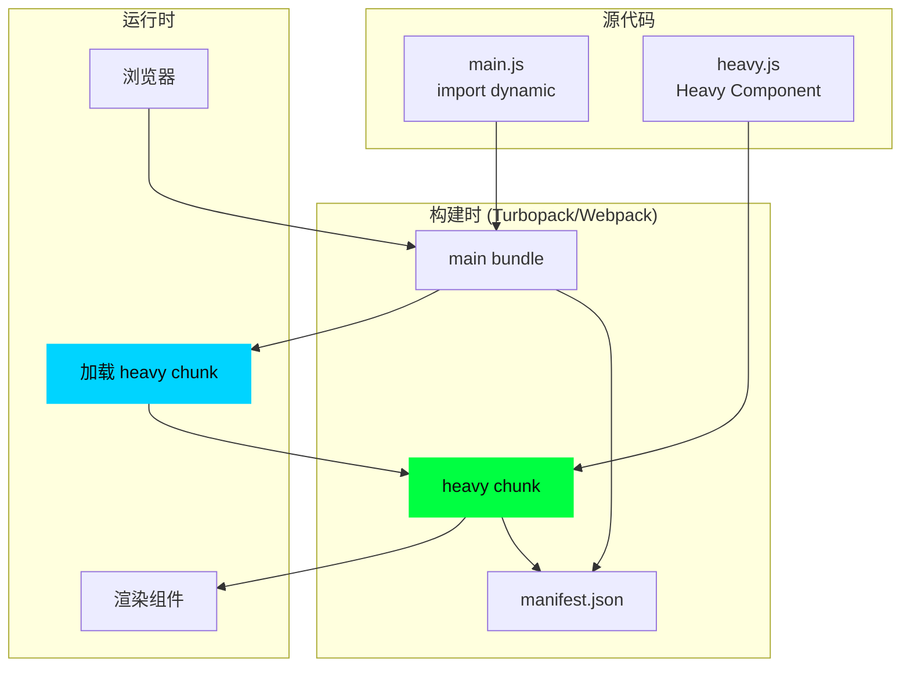
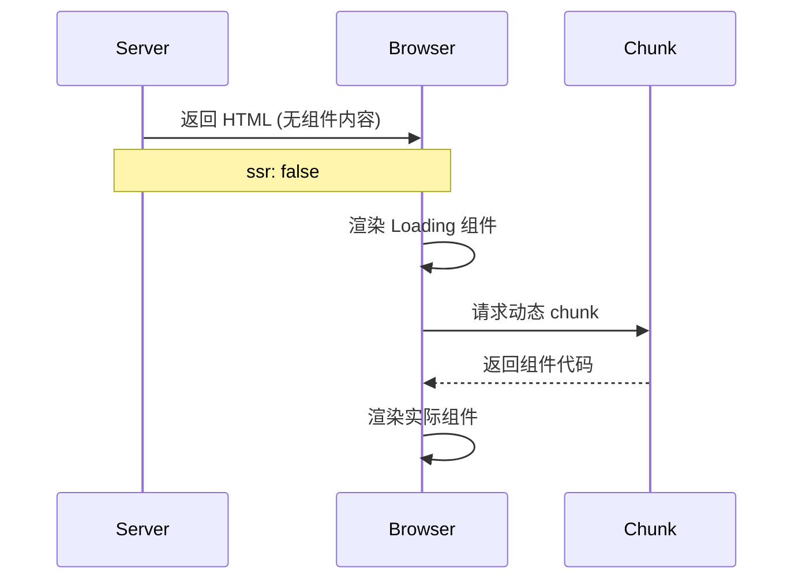

# 12 - next/dynamic 动态导入深度解析

> 🟡 中级 | 理解 Next.js 动态导入的完整实现机制

## 目录

- [核心概念](#核心概念)
- [dynamic API](#dynamic-api)
- [代码分割机制](#代码分割机制)
- [SSR 处理](#ssr-处理)
- [加载状态管理](#加载状态管理)
- [Suspense 集成](#suspense-集成)
- [源码实现](#源码实现)
- [性能优化](#性能优化)
- [最佳实践](#最佳实践)

## 核心概念

`next/dynamic` 是 Next.js 提供的**动态导入 (Dynamic Import)** 工具，基于 React 的 `lazy()` 和 Webpack 的代码分割能力，提供：

- ✅ **自动代码分割**: 将组件拆分为独立 chunk
- ✅ **按需加载**: 仅在需要时加载组件
- ✅ **SSR 支持**: 灵活控制服务端渲染
- ✅ **加载状态**: 内置 loading 组件支持
- ✅ **错误边界**: 加载失败处理
- ✅ **预加载**: 支持 prefetch 优化

### 与 React.lazy 的对比

| 特性 | `React.lazy` | `next/dynamic` |
|------|-------------|---------------|
| 代码分割 | ✅ | ✅ |
| SSR 支持 | ❌ (需要手动处理) | ✅ (自动处理) |
| Loading 状态 | 需要 Suspense | 内置 + Suspense |
| 命名导出 | ❌ | ✅ |
| SSR 控制 | - | ✅ `ssr: false` |
| 预加载 | - | ✅ `preload()` |

## dynamic API

### 基础用法

```typescript
import dynamic from 'next/dynamic'

// 1. 最简单的动态导入
const DynamicComponent = dynamic(() => import('./components/heavy'))

export default function Page() {
  return (
    <div>
      <DynamicComponent />
    </div>
  )
}

// 2. 带 loading 状态
const DynamicWithLoading = dynamic(
  () => import('./components/heavy'),
  {
    loading: () => <div>Loading...</div>,
  }
)

// 3. 禁用 SSR
const NoSSR = dynamic(
  () => import('./components/client-only'),
  { ssr: false }
)

// 4. 命名导出
const DynamicNamed = dynamic(
  () => import('./components/utils').then(mod => mod.UtilComponent)
)
```

### API 参数

```typescript
function dynamic<P = {}>(
  loader: () => Promise<React.ComponentType<P>>,
  options?: DynamicOptions<P>
): React.ComponentType<P>

interface DynamicOptions<P> {
  // Loading 组件
  loading?: () => React.ReactNode

  // 是否在服务端渲染 (默认 true)
  ssr?: boolean

  // Suspense 模式 (推荐)
  suspense?: boolean
}
```

### 完整示例

```typescript
// components/heavy-component.tsx
export interface HeavyComponentProps {
  data: string[]
}

export default function HeavyComponent({ data }: HeavyComponentProps) {
  return (
    <div>
      {data.map((item, i) => (
        <div key={i}>{item}</div>
      ))}
    </div>
  )
}

// app/page.tsx
import dynamic from 'next/dynamic'
import { Suspense } from 'react'

// 类型安全的动态导入
const HeavyComponent = dynamic<{ data: string[] }>(
  () => import('./components/heavy-component'),
  {
    loading: () => (
      <div className="flex items-center justify-center p-8">
        <div className="animate-spin rounded-full h-8 w-8 border-t-2" />
      </div>
    ),
  }
)

export default function Page() {
  return (
    <div>
      <h1>Page Content</h1>

      {/* 延迟加载重型组件 */}
      <HeavyComponent data={['Item 1', 'Item 2']} />
    </div>
  )
}
```

## 代码分割机制

### 分割原理



### Webpack Magic Comments

```typescript
// 自定义 chunk 名称
const DynamicComponent = dynamic(
  () => import(
    /* webpackChunkName: "heavy-component" */
    './components/heavy'
  )
)

// 预加载 (prefetch)
const PrefetchComponent = dynamic(
  () => import(
    /* webpackPrefetch: true */
    './components/prefetch'
  )
)

// 预加载 (preload)
const PreloadComponent = dynamic(
  () => import(
    /* webpackPreload: true */
    './components/preload'
  )
)
```

**区别**:
- `webpackPrefetch`: 浏览器空闲时加载 (低优先级)
- `webpackPreload`: 父 chunk 加载时并行加载 (高优先级)

### 构建产物

**输入**:
```typescript
// app/page.tsx
const Heavy = dynamic(() => import('./heavy'))
```

**输出** (简化):
```
.next/
├── static/
│   └── chunks/
│       ├── app/
│       │   └── page.js              # 主 bundle
│       ├── heavy.js                 # 动态 chunk
│       └── webpack-runtime.js       # 加载器
└── server/
    └── chunks/
        └── heavy.js                 # 服务端 chunk
```

**页面 HTML**:
```html
<script src="/_next/static/chunks/app/page.js"></script>

<!-- 动态导入时注入 -->
<link rel="prefetch" href="/_next/static/chunks/heavy.js" />
```

## SSR 处理

### SSR 默认行为

```typescript
// 默认在服务端渲染
const Component = dynamic(() => import('./component'))

// 服务端渲染流程:
// 1. SSR: 在服务端执行 import() 并渲染组件
// 2. HTML: 包含组件的初始 HTML
// 3. Hydration: 客户端加载 chunk 并水合
```

### 禁用 SSR

```typescript
// 仅在客户端渲染
const ClientOnly = dynamic(
  () => import('./client-component'),
  { ssr: false }
)

// 使用场景:
// - 依赖浏览器 API (window, document)
// - 第三方库不支持 SSR
// - 性能优化 (减少 SSR 负担)
```

**渲染流程**:


### 混合 SSR 策略

```typescript
'use client'

import dynamic from 'next/dynamic'
import { useEffect, useState } from 'react'

// 服务端渲染占位符，客户端渲染实际内容
const Map = dynamic(
  () => import('./map'),
  {
    ssr: false,
    loading: () => <div className="h-96 bg-gray-200 animate-pulse" />
  }
)

export default function LocationPage() {
  const [mounted, setMounted] = useState(false)

  useEffect(() => {
    setMounted(true)
  }, [])

  return (
    <div>
      <h1>Location</h1>

      {/* 避免 SSR 水合不匹配 */}
      {mounted && <Map />}
    </div>
  )
}
```

## 加载状态管理

### Loading 组件

```typescript
// 简单 Loading
const Component = dynamic(
  () => import('./component'),
  {
    loading: () => <div>Loading...</div>
  }
)

// 带动画的 Loading
const ComponentWithSpinner = dynamic(
  () => import('./component'),
  {
    loading: () => (
      <div className="flex items-center justify-center min-h-[200px]">
        <div className="relative w-12 h-12">
          <div className="absolute inset-0 border-4 border-gray-200 rounded-full" />
          <div className="absolute inset-0 border-4 border-green-500 rounded-full border-t-transparent animate-spin" />
        </div>
      </div>
    )
  }
)

// 骨架屏 Loading
const ComponentWithSkeleton = dynamic(
  () => import('./component'),
  {
    loading: () => (
      <div className="space-y-4 p-4">
        <div className="h-8 bg-gray-200 rounded animate-pulse" />
        <div className="h-4 bg-gray-200 rounded w-3/4 animate-pulse" />
        <div className="h-4 bg-gray-200 rounded w-1/2 animate-pulse" />
      </div>
    )
  }
)
```

### 错误处理

```typescript
'use client'

import dynamic from 'next/dynamic'
import { Component as ReactComponent } from 'react'

// 错误边界组件
class ErrorBoundary extends ReactComponent<
  { children: React.ReactNode },
  { hasError: boolean }
> {
  state = { hasError: false }

  static getDerivedStateFromError() {
    return { hasError: true }
  }

  render() {
    if (this.state.hasError) {
      return (
        <div className="p-4 bg-red-50 border border-red-200 rounded">
          <h2 className="text-red-800">Failed to load component</h2>
          <button
            onClick={() => this.setState({ hasError: false })}
            className="mt-2 px-4 py-2 bg-red-600 text-white rounded"
          >
            Retry
          </button>
        </div>
      )
    }

    return this.props.children
  }
}

// 使用错误边界
const DynamicComponent = dynamic(() => import('./may-fail'))

export default function Page() {
  return (
    <ErrorBoundary>
      <DynamicComponent />
    </ErrorBoundary>
  )
}
```

### 加载超时处理

```typescript
'use client'

import dynamic from 'next/dynamic'
import { useState, useEffect } from 'react'

function DynamicComponentWithTimeout() {
  const [showTimeout, setShowTimeout] = useState(false)

  useEffect(() => {
    const timer = setTimeout(() => {
      setShowTimeout(true)
    }, 5000) // 5 秒超时

    return () => clearTimeout(timer)
  }, [])

  const Component = dynamic(
    () => import('./slow-component'),
    {
      loading: () => (
        <div>
          {showTimeout ? (
            <div className="text-red-600">
              Loading is taking longer than expected...
            </div>
          ) : (
            <div>Loading...</div>
          )}
        </div>
      )
    }
  )

  return <Component />
}
```

## Suspense 集成

### 使用 Suspense

```typescript
import dynamic from 'next/dynamic'
import { Suspense } from 'react'

// 使用 suspense 选项
const DynamicComponent = dynamic(
  () => import('./component'),
  { suspense: true }
)

export default function Page() {
  return (
    <div>
      <h1>Page Content</h1>

      <Suspense fallback={<div>Loading...</div>}>
        <DynamicComponent />
      </Suspense>
    </div>
  )
}
```

### 嵌套 Suspense

```typescript
import dynamic from 'next/dynamic'
import { Suspense } from 'react'

const Header = dynamic(() => import('./header'), { suspense: true })
const Sidebar = dynamic(() => import('./sidebar'), { suspense: true })
const Content = dynamic(() => import('./content'), { suspense: true })

export default function Dashboard() {
  return (
    <div className="grid grid-cols-[240px_1fr] min-h-screen">
      {/* 独立加载区域 */}
      <Suspense fallback={<SidebarSkeleton />}>
        <Sidebar />
      </Suspense>

      <div>
        <Suspense fallback={<HeaderSkeleton />}>
          <Header />
        </Suspense>

        <Suspense fallback={<ContentSkeleton />}>
          <Content />
        </Suspense>
      </div>
    </div>
  )
}

// 骨架屏组件
function SidebarSkeleton() {
  return <div className="w-60 bg-gray-100 animate-pulse" />
}

function HeaderSkeleton() {
  return <div className="h-16 bg-gray-100 animate-pulse" />
}

function ContentSkeleton() {
  return <div className="p-8 space-y-4">
    <div className="h-8 bg-gray-200 rounded animate-pulse" />
    <div className="h-4 bg-gray-200 rounded animate-pulse" />
  </div>
}
```

### Suspense 流式渲染

```typescript
// app/page.tsx (Server Component)
import { Suspense } from 'react'
import dynamic from 'next/dynamic'

// 动态导入异步服务端组件
const AsyncData = dynamic(() => import('./async-data'))

export default function Page() {
  return (
    <div>
      <h1>Instant Content</h1>

      {/* 流式传输 */}
      <Suspense fallback={<div>Loading data...</div>}>
        <AsyncData />
      </Suspense>
    </div>
  )
}

// components/async-data.tsx (Server Component)
async function AsyncData() {
  const data = await fetch('https://api.example.com/data')
  const json = await data.json()

  return <div>{JSON.stringify(json)}</div>
}

export default AsyncData
```

## 源码实现

### 关键源码路径

```
packages/next/
├── src/
│   ├── shared/
│   │   └── lib/
│   │       └── dynamic.tsx              # dynamic() 核心实现
│   ├── client/
│   │   └── components/
│   │       └── async-component.tsx      # 异步组件包装器
│   └── server/
│       └── app-render/
│           └── create-component-tree.tsx # SSR 处理
```

### dynamic 核心实现

```typescript
// packages/next/src/shared/lib/dynamic.tsx (简化版)

import React, { lazy, Suspense } from 'react'

export interface DynamicOptions<P = {}> {
  loading?: () => React.ReactNode
  ssr?: boolean
  suspense?: boolean
}

export default function dynamic<P = {}>(
  loader: () => Promise<{ default: React.ComponentType<P> }>,
  options?: DynamicOptions<P>
): React.ComponentType<P> {
  const {
    loading: LoadingComponent,
    ssr = true,
    suspense = false,
  } = options || {}

  // 1. 创建 lazy 组件
  const LazyComponent = lazy(loader)

  // 2. 包装组件
  const DynamicComponent = (props: P) => {
    // 3. SSR 控制
    if (!ssr && typeof window === 'undefined') {
      // 服务端不渲染
      return LoadingComponent ? <LoadingComponent /> : null
    }

    // 4. Suspense 模式
    if (suspense) {
      return <LazyComponent {...props} />
    }

    // 5. 传统模式 (带 loading)
    return (
      <Suspense fallback={LoadingComponent ? <LoadingComponent /> : null}>
        <LazyComponent {...props} />
      </Suspense>
    )
  }

  // 6. 添加元数据 (用于 Next.js 内部)
  DynamicComponent.displayName = 'DynamicComponent'

  return DynamicComponent
}
```

### 客户端加载逻辑

```typescript
// packages/next/src/client/components/async-component.tsx (简化)

import { useEffect, useState } from 'react'

interface LoadableState<T> {
  loading: boolean
  loaded: T | null
  error: Error | null
}

export function useLoadable<T>(
  loader: () => Promise<T>
): LoadableState<T> {
  const [state, setState] = useState<LoadableState<T>>({
    loading: true,
    loaded: null,
    error: null,
  })

  useEffect(() => {
    let cancelled = false

    loader()
      .then((loaded) => {
        if (!cancelled) {
          setState({ loading: false, loaded, error: null })
        }
      })
      .catch((error) => {
        if (!cancelled) {
          setState({ loading: false, loaded: null, error })
        }
      })

    return () => {
      cancelled = true
    }
  }, [loader])

  return state
}

// 使用示例
function AsyncComponent({ loader }: {
  loader: () => Promise<React.ComponentType>
}) {
  const { loading, loaded: Component, error } = useLoadable(loader)

  if (loading) return <div>Loading...</div>
  if (error) return <div>Error: {error.message}</div>
  if (!Component) return null

  return <Component />
}
```

### SSR 模块预加载

```typescript
// packages/next/src/server/app-render/create-component-tree.tsx (简化)

import { preloadModule } from 'next/dist/compiled/react-server-dom-webpack'

export async function renderComponentTreeToStream(tree: React.ReactElement) {
  // 1. 收集动态导入的模块
  const dynamicImports = collectDynamicImports(tree)

  // 2. 服务端预加载模块
  await Promise.all(
    dynamicImports.map((moduleId) =>
      preloadModule(moduleId)
    )
  )

  // 3. 渲染为流
  const stream = renderToReadableStream(tree, {
    // 模块映射 (用于客户端加载)
    moduleMap: createModuleMap(dynamicImports),
  })

  return stream
}

// 收集动态导入
function collectDynamicImports(tree: React.ReactElement): string[] {
  const imports: string[] = []

  React.Children.forEach(tree, (child) => {
    if (React.isValidElement(child)) {
      // 检查是否是 dynamic 组件
      if (child.type.__dynamicModuleId) {
        imports.push(child.type.__dynamicModuleId)
      }

      // 递归子节点
      if (child.props.children) {
        imports.push(...collectDynamicImports(child.props.children))
      }
    }
  })

  return imports
}
```

### Webpack 配置

```typescript
// packages/next/src/build/webpack-config.ts (简化)

export default function createWebpackConfig() {
  return {
    optimization: {
      splitChunks: {
        chunks: 'all',
        cacheGroups: {
          // 动态导入自动分割
          default: {
            minChunks: 2,
            priority: -20,
            reuseExistingChunk: true,
          },

          // 第三方库分组
          vendors: {
            test: /[\\/]node_modules[\\/]/,
            priority: -10,
            reuseExistingChunk: true,
          },
        },
      },
    },

    module: {
      rules: [
        {
          test: /\.tsx?$/,
          use: {
            loader: 'next-babel-loader',
            options: {
              // 支持动态导入语法
              plugins: [
                '@babel/plugin-syntax-dynamic-import',
              ],
            },
          },
        },
      ],
    },
  }
}
```

## 性能优化

### 预加载策略

```typescript
'use client'

import dynamic from 'next/dynamic'
import { useEffect } from 'react'

// 方法 1: 鼠标悬停预加载
const HeavyModal = dynamic(() => import('./heavy-modal'))

export function TriggerButton() {
  const preload = () => {
    // 动态导入会返回 Promise
    const componentPromise = import('./heavy-modal')
    // 浏览器开始下载 chunk
  }

  return (
    <button
      onMouseEnter={preload}  // 悬停时预加载
      onClick={() => {
        // 点击时立即可用 (已预加载)
      }}
    >
      Open Modal
    </button>
  )
}

// 方法 2: 视口预加载
export function LazySection() {
  const [shouldLoad, setShouldLoad] = useState(false)

  useEffect(() => {
    const observer = new IntersectionObserver(
      (entries) => {
        if (entries[0]?.isIntersecting) {
          setShouldLoad(true)
        }
      },
      { rootMargin: '200px' }  // 提前 200px 开始加载
    )

    observer.observe(document.querySelector('#lazy-trigger')!)

    return () => observer.disconnect()
  }, [])

  return shouldLoad ? <HeavyComponent /> : null
}

// 方法 3: 路由预加载
import { useRouter } from 'next/navigation'

export function NavLink({ href }: { href: string }) {
  const router = useRouter()

  const preloadRoute = () => {
    router.prefetch(href)  // 预加载路由 + 动态组件
  }

  return (
    <a
      href={href}
      onMouseEnter={preloadRoute}
      onClick={(e) => {
        e.preventDefault()
        router.push(href)
      }}
    >
      Navigate
    </a>
  )
}
```

### 分割粒度优化

```typescript
// ❌ 过度分割 - 每个小组件都动态导入
const Button = dynamic(() => import('./button'))
const Icon = dynamic(() => import('./icon'))
const Text = dynamic(() => import('./text'))

// 网络请求过多,反而降低性能

// ✅ 合理分割 - 大型功能模块动态导入
const Dashboard = dynamic(() => import('./dashboard'))  // 100KB+
const Chart = dynamic(() => import('./chart'))          // 50KB+
const Editor = dynamic(() => import('./editor'))        // 80KB+

// 减少网络请求,提升性能
```

### 条件加载

```typescript
'use client'

import dynamic from 'next/dynamic'
import { useState } from 'react'

// 仅在用户交互后加载
export default function ConditionalLoad() {
  const [showEditor, setShowEditor] = useState(false)

  // 延迟定义 (仅在需要时导入)
  const Editor = showEditor
    ? dynamic(() => import('./editor'))
    : null

  return (
    <div>
      {!showEditor && (
        <button onClick={() => setShowEditor(true)}>
          Open Editor
        </button>
      )}

      {Editor && <Editor />}
    </div>
  )
}
```

### Bundle 分析

```bash
# 使用 Next.js Bundle Analyzer
npm install @next/bundle-analyzer

# next.config.ts
const withBundleAnalyzer = require('@next/bundle-analyzer')({
  enabled: process.env.ANALYZE === 'true',
})

module.exports = withBundleAnalyzer({
  // Next.js 配置
})

# 运行分析
ANALYZE=true npm run build
```

**优化建议**:
- ✅ 动态导入 > 100KB 的组件
- ✅ 动态导入第三方库 (如图表、编辑器)
- ✅ 动态导入不常用的功能
- ❌ 不要动态导入小于 10KB 的组件

## 最佳实践

### 1. 识别动态导入场景

```typescript
// ✅ 应该使用 dynamic 的场景

// 1. 大型第三方库
const Chart = dynamic(() => import('react-chartjs-2'), {
  ssr: false,  // 图表库通常不需要 SSR
})

// 2. 仅客户端功能
const VideoPlayer = dynamic(() => import('./video-player'), {
  ssr: false,  // 视频播放器依赖浏览器 API
})

// 3. 条件渲染的重型组件
const AdminPanel = dynamic(() => import('./admin-panel'))

function Dashboard({ isAdmin }: { isAdmin: boolean }) {
  return (
    <div>
      {isAdmin && <AdminPanel />}  {/* 仅管理员加载 */}
    </div>
  )
}

// 4. 路由级代码分割
const routes = {
  '/dashboard': dynamic(() => import('./pages/dashboard')),
  '/settings': dynamic(() => import('./pages/settings')),
  '/profile': dynamic(() => import('./pages/profile')),
}
```

```typescript
// ❌ 不应该使用 dynamic 的场景

// 1. 小型组件 (< 10KB)
// const Button = dynamic(() => import('./button'))  // ❌ 过度分割

// 2. 核心 UI 组件
// const Header = dynamic(() => import('./header'))  // ❌ 首屏必需

// 3. 布局组件
// const Layout = dynamic(() => import('./layout'))  // ❌ 每页都用
```

### 2. Loading 组件设计

```typescript
// ✅ 匹配实际内容的骨架屏
const ProductCard = dynamic(
  () => import('./product-card'),
  {
    loading: () => (
      <div className="border rounded-lg p-4 space-y-4">
        <div className="h-48 bg-gray-200 rounded animate-pulse" />
        <div className="h-4 bg-gray-200 rounded w-3/4 animate-pulse" />
        <div className="h-4 bg-gray-200 rounded w-1/2 animate-pulse" />
      </div>
    )
  }
)

// ❌ 避免：不匹配的 Loading
const ProductCard = dynamic(
  () => import('./product-card'),
  {
    loading: () => <div>Loading...</div>  // 会导致布局偏移
  }
)
```

### 3. TypeScript 类型安全

```typescript
// ✅ 定义 Props 类型
interface ChartProps {
  data: number[]
  labels: string[]
  type: 'line' | 'bar'
}

const Chart = dynamic<ChartProps>(
  () => import('./chart'),
  {
    loading: () => <div className="h-64 bg-gray-100 animate-pulse" />
  }
)

// 使用时有完整类型检查
<Chart
  data={[1, 2, 3]}
  labels={['A', 'B', 'C']}
  type="line"  // 自动补全和类型检查
/>
```

### 4. 命名导出处理

```typescript
// components/utils.tsx
export function UtilA() { return <div>Util A</div> }
export function UtilB() { return <div>Util B</div> }
export function UtilC() { return <div>Util C</div> }

// ✅ 仅导入需要的命名导出
const UtilA = dynamic(
  () => import('./components/utils').then(mod => mod.UtilA)
)

const UtilB = dynamic(
  () => import('./components/utils').then(mod => mod.UtilB)
)

// ❌ 避免：导入整个模块
const Utils = dynamic(() => import('./components/utils'))
// 这会导入 UtilA, UtilB, UtilC 全部代码
```

### 5. 服务端组件优先

```typescript
// ✅ App Router 中优先使用服务端组件
// app/page.tsx (Server Component)
export default async function Page() {
  const data = await fetchData()

  return (
    <div>
      <ServerComponent data={data} />

      {/* 仅在需要交互时使用 Client Component */}
      <ClientInteractiveComponent />
    </div>
  )
}

// ✅ 动态导入仅用于客户端组件
// components/client-interactive.tsx
'use client'

import dynamic from 'next/dynamic'

const Editor = dynamic(() => import('./editor'), {
  ssr: false  // 编辑器仅客户端
})

export default function ClientInteractiveComponent() {
  return <Editor />
}
```

### 6. 错误边界集成

```typescript
// ✅ 完整的错误处理
'use client'

import dynamic from 'next/dynamic'
import { ErrorBoundary } from 'react-error-boundary'

const HeavyComponent = dynamic(() => import('./heavy'))

export default function Page() {
  return (
    <ErrorBoundary
      fallback={
        <div className="p-4 bg-red-50 border border-red-200 rounded">
          <h2>Failed to load component</h2>
          <button onClick={() => window.location.reload()}>
            Reload
          </button>
        </div>
      }
      onError={(error) => {
        console.error('Dynamic import failed:', error)
        // 发送错误到监控服务
      }}
    >
      <HeavyComponent />
    </ErrorBoundary>
  )
}
```

### 7. 性能监控

```typescript
'use client'

import dynamic from 'next/dynamic'
import { useEffect, useState } from 'react'

export function DynamicComponentWithMetrics() {
  const [loadTime, setLoadTime] = useState<number | null>(null)

  const Component = dynamic(
    () => {
      const start = performance.now()

      return import('./component').then((mod) => {
        const end = performance.now()
        setLoadTime(end - start)
        return mod
      })
    },
    {
      loading: () => <div>Loading...</div>
    }
  )

  useEffect(() => {
    if (loadTime !== null) {
      console.log(`Component loaded in ${loadTime.toFixed(2)}ms`)

      // 发送到分析服务
      analytics.track('dynamic_component_load', {
        component: 'MyComponent',
        loadTime,
      })
    }
  }, [loadTime])

  return <Component />
}
```

## 常见问题

### 1. 水合不匹配

```typescript
// ❌ 问题：SSR 和客户端内容不一致
const ClientOnly = dynamic(() => import('./client-only'))

export default function Page() {
  return <ClientOnly />
  // SSR: null (ssr: false)
  // Client: 实际组件
  // 导致水合错误
}

// ✅ 解决：使用 mounted 状态
'use client'

import { useEffect, useState } from 'react'
import dynamic from 'next/dynamic'

const ClientOnly = dynamic(() => import('./client-only'), { ssr: false })

export default function Page() {
  const [mounted, setMounted] = useState(false)

  useEffect(() => {
    setMounted(true)
  }, [])

  if (!mounted) return null  // SSR 和首次客户端渲染都返回 null

  return <ClientOnly />  // 仅在客户端 mount 后渲染
}
```

### 2. 重复加载

```typescript
// ❌ 问题：每次渲染都创建新的动态组件
function Component() {
  const Dynamic = dynamic(() => import('./heavy'))  // ❌ 每次都是新实例
  return <Dynamic />
}

// ✅ 解决：在模块顶层定义
const Dynamic = dynamic(() => import('./heavy'))  // ✅ 单例

function Component() {
  return <Dynamic />
}
```

### 3. TypeScript 类型推断失败

```typescript
// ❌ 问题：命名导出类型丢失
const Component = dynamic(
  () => import('./component').then(mod => mod.NamedExport)
)
// Component 类型为 ComponentType<any>

// ✅ 解决：显式类型标注
interface ComponentProps {
  name: string
}

const Component = dynamic<ComponentProps>(
  () => import('./component').then(mod => mod.NamedExport)
)
// Component 类型为 ComponentType<ComponentProps>
```

## 下一步

- [03 - 渲染机制](./03-rendering.md) - 理解 SSR 与动态导入的集成
- [09 - 构建流程](./09-build-process.md) - 深入代码分割的构建过程
- [06 - 缓存系统](./06-caching.md) - 动态 chunk 的缓存策略

---

**Sources:**
- [Next.js Dynamic Imports](https://nextjs.org/docs/app/building-your-application/optimizing/lazy-loading)
- [React.lazy Documentation](https://react.dev/reference/react/lazy)
- [Webpack Code Splitting](https://webpack.js.org/guides/code-splitting/)
- [next/dynamic Source Code](https://github.com/vercel/next.js/blob/canary/packages/next/src/shared/lib/dynamic.tsx)
